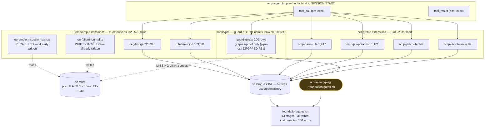

# MAP — what this repo is, what runs, and what to do next

Six parallel non-author inventories, 2,338 lines of receipt, every node below derived by a
command. Read this before `README.md` if you are trying to understand the system rather than use
a tool.

| slice | receipt | headline |
|---|---|---|
| hook / learning / ee | [map-hook-ee](docs/demos/upstream-repro/map-hook-ee-20260920.md) | ee is healthy here; the integration already exists in a third surface |
| skillranker | [map-skillranker](docs/demos/upstream-repro/map-skillranker-20260920.md) | fork obsolete 11m17s before it was written |
| work/ packages | [map-work-packages](docs/demos/upstream-repro/map-work-packages-20260920.md) | 53 dirs: KEEP 39 / ALIGN 12 / DISCARD 2 |
| docs corpus | [map-docs](docs/demos/upstream-repro/map-docs-20260920.md) | 9.2% of receipts are cited by anything |
| git arc | [map-git-arc](docs/demos/upstream-repro/map-git-arc-20260920.md) | 40.4% of commits sit in abandoned scopes |
| instruments | [map-instruments](docs/demos/upstream-repro/map-instruments-20260920.md) | 38 wired, and nothing runs the driver |

## The system as it actually runs

## The five findings that change what we do

1. **Nothing runs the driver.** 38 wired instruments hang off `foundation/gates.sh`;
   `crontab -l | grep -cE 'gates\.sh|lane-status'` → **0**. Every green suite this week was green
   because someone typed it. Not a broken gate — a gate with a human scheduler, and it should be
   described that way.
2. **Hooks bind at session start.** Install ≠ active. A muse session still appending 47 minutes
   after an install emitted 3,740 rows from other extensions and **zero** from the new one. Every
   naive zero-row read is invalid without checking session age.
3. **There is a third install surface.** `~/.omp/omp-extensions/` holds 11 extensions and
   **323,575 of ~328k rows** — and already contains both ee legs. Work was dispatched to build an
   integration that exists.
4. **ee is healthy in this repo.** `EE-E040` is the *home* store. The real broken link is
   `remember → preflight`, which does not match even in the healthy store.
5. **40.4% of commits are in abandoned scopes** — and the largest, `duel-2` (207 commits), is
   **not free to delete**: `lane-status.sh:87` reads its receipt JSON as the default sidecar.

## Action plan, in dependency order

| # | action | why now | blocker |
|---|---|---|---|
| 1 | Close `remember → preflight` matching | it is the only broken link in the loop; both legs exist | none — ee is healthy here |
| 2 | Reconcile pipe-exit: fp-rate KEEP vs R51 DROPPED vs R48 REFUSE | three rulings, one class, and drift made the disagreement executable | a ruling, not code |
| 3 | Give `gates.sh` a trigger, or state in the README that it is hand-run | finding 1 | choose: git hook, cron, or honesty |
| 4 | Index the 206 receipts | 9.2% cited; the rest reachable only by `ls` | none |
| 5 | Retire `duel-2`'s live dependency, then archive 207 commits of scope | unblocks the largest abandoned area | move the sidecar JSON first |
| 6 | Post one comment on upstream skillranker#3; delete the fork | 5 findings upstream has not touched | Joshua approves deletion |

## What NOT to do, with reasons

- **Do not split any code file.** Census: largest source file is **469 lines** against a 2,000
  soft threshold. Code is `LEAVE ALONE` (B11). The monolith is prose — `PLAN.md` is 5,448 lines.
- **Do not discard docs by inbound-reference count.** Measured: orphanhood tracks **age, not
  worth** (12% → 25% → 32% by first-commit day), and in 6 of 7 supersession pairs the
  authoritative later file is the orphan. Use named-successor supersession instead.
- **Do not build a Jev seat for guardrails, compaction, or routing.** All three measured and
  lost: regexes beat the model 12/12 vs 11/12; the compaction ceiling fell 19 points short;
  routing saved 0.0447% and cost 16.4% more on the quickstart fixture.

## NO-CLAIM

Six slices, each read-only, each with its own NO-CLAIM section — read those before relying on a
number here. Counts are as-of 2026-09-20 and every corpus in this system is live-monotonic: the
commit count moved 1,040 → 1,114 during the inventory itself.
