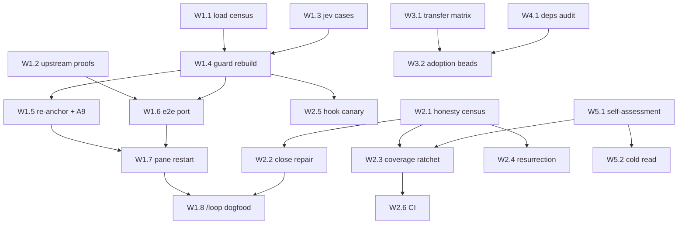

# Planning Packet — deep application of omp-kit and franken-assessments to the jev session

Round 0 draft, 2026-09-22, AmberWillow (pane 1, `anthropic/claude-opus-5-5`). Written under
`skill://planning-workflow`. Scope set by Joshua the same evening: **the `jev` NTM session only** —
panes `jev:0.1`–`jev:0.6`, their omp profiles, their launch directory, and the jev repo. No other
NTM session is read, measured, or written by this plan.

What is being built: an omp harness in which the six jev panes actually run under the rules the two
archives describe — rules that are *loaded*, fire on the right inputs, stay silent on the wrong ones,
and have a planted-negative proof — plus the franken-assessments' 44-repo evidence turned on our own
lane, so that jev is held to the same protocol it applies to its mentor. "Working" means: every
mechanism we claim is present has a receipt showing it fired in a live jev pane on a known-bad input
and stayed silent on a known-good one, and every mechanism we decline has a Rule 12 refusal with
cost, missed defect class, and loss.

> **Mission (AGENTS.md, verbatim):** Validate Jev → build tools from what survives → **liven omp
> surfaces with them** → **dogfood them in our own systems** → **share the process, the updates and
> the findings publicly** as we go. This plan serves stages three, four and five.

## 1. Problem
<!-- CHECK: PROBLEM -->

The first drive (`foundation/kit/DRIVE.md`, panes 2–5, 2026-09-22 local) applied the starter-kit's
checkers and demotion rules and installed omp-kit into `.omp/`. It left the harness in a state that
*looks* applied and is not. Measured this evening, before a single line of this plan:

1. **kit-guard is loaded in zero worker panes.** It landed at `572e3eb` (2026-09-22 20:07:38 -0600).
   Panes 2–6 started 2026-09-21 (pane 2 at 12:18:16, panes 3–6 at 21:57:19–21:57:33) and omp loads
   extensions at session start. Pane 2's own screen says so: "Already-open panes will not see the
   extension until they restart." Command: `ps -p <omp-pid> -o lstart=` per pane vs
   `git log -1 --format=%ci 572e3eb`.
2. **kit-guard protects the wrong paths in this repo.** `core.hooksPath` is
   `/Users/josh/Developer/jev/githooks` (read from `.git/config:8`). The guard's `GATE_PATHS`
   matches `.githooks/` (with a dot) and `.git/hooks/`, so `githooks/pre-commit` and
   `githooks/commit-msg-verification-level.sh` — the hooks git actually runs — are writable by any
   agent. The local patch added `foundation/kit/check-*.sh` and `foundation/gates.d/[0-9]*.sh` but
   not `foundation/gates.sh` (the aggregator) nor `foundation/gates.d/44-native-surface.exemptions`
   (an exemptions list is the cheapest gate-weakening surface in the tree). Meanwhile
   `(^|/)templates/` blocks every `templates/` directory, including inside vendored clones.
3. **The guard blocks reads it should allow.** Pane 1 was interrupted live tonight by
   `kit-no-verify` while composing a read-only inspection of `core.hooksPath`. The rule's bare
   `core\.hooksPath` condition, and kit-guard's `bashVerdict` regex of the same shape, cannot tell
   `--get` from a re-point. That is a real model (`claude-opus-5-5`) interrupted in a real session
   on a false positive — the first L3 frame for TTSR in this lane, and it fired the wrong way.
4. **The compaction re-anchor points at a file that does not exist.** kit-guard's
   `REANCHOR_AFTER_COMPACTION` tells the agent to re-read `docs/definition-of-done.md`; `ls` says
   it is absent. jev's DoD is `AGENTS.md` §4.
5. **A9 would fire on every AGENTS.md edit.** kit-guard requires 12 pattern names verbatim; AGENTS.md
   has 9. Missing: `close-pump abuse`, `scope-splitting`, `bench-path hardcoding` (grep of each name).
6. **False closes are 14/68, not 3/5.** `.beads/issues.jsonl` has 99 rows (68 closed, 13
   in_progress, 14 blocked, 4 open). 14 closed rows carry a `close_reason` under 20 characters —
   the threshold `kit-jsonl-close` uses. The first drive sampled 5 and filed 3 repair beads
   (`jev-qex`, `jev-6fo`, `jev-lqz`); 11 are unfiled. This is the franken_node "bead-completion
   illusion" pattern (synthesis: 739 false-closed beads) at our scale.
7. **jev has no CI.** No `.github/`; the `.gitignore` allowlist would ignore one if written. By the
   RULEBOOK's own classes jev is **C4** ("no test CI"), the class the synthesis counts at 11/44 and
   calls the program's first load-bearing weakness: "the pin is usually unverifiable". Every jev
   gate is local and `--no-verify`-bypassable; the kit README says plainly that local gates are
   advisory and CI is the backstop.
8. **Nobody has run the kit's own proofs here.** The omp-kit ships `tests/e2e-live.sh` (10 live
   scenarios, mock model, isolated HOME), `tests/run-ttsr-tests.sh` (25 cases),
   `tests/kit-guard.test.ts` (39 tests) and `tests/omp-continue.test.sh` (11). None is in the jev
   tree or has a jev receipt. Rule 13 clause 1: run the upstream question before writing our own.
9. **The franken-assessments were applied only as a checker port.** The pack is 44 packets, a
   RULEBOOK, 14 transferable concepts, 23 execution-readiness gates, 11 negative patterns and a
   starter-kit. The first drive used the starter-kit's two scripts and the demotion template. The
   RULEBOOK has never been pointed at jev, the 14 concepts have never been scored against jev, and
   the jev claims that cite franken repos as prior art (`AGENTS.md:642`, `85-promotion-contract.sh:17`)
   have never been checked against what the packets say those repos actually execute.

The single most important outcome: **a stranger can open one receipt per mechanism and see it fire
on a planted bad input in a live jev pane.** Everything else is secondary.

## 2. Non-goals — what this is NOT
<!-- CHECK: NON-GOALS -->

- This plan does **not** touch any NTM session other than `jev`. No census, no install, no doctor
  run in `cfsios` or `omp-test` (Joshua, 2026-09-22: "focus on your own ntm session jev").
- It does **not** write to `~/.omp/agent/` or any `~/.omp/profiles/<name>/agent/` path. Project
  scope (`jev/.omp/`) reaches every jev pane regardless of profile because every jev pane launches
  in the repo root (verified per pane in W1.1). A profile-root write is a substrate change and is
  out of scope unless W1.1 proves project scope does not reach a pane.
- It does **not** run `starter-kit/scripts/init.sh`. It would install a second pre-commit hook over
  `githooks/`, seed 28 duplicate beads, and create `docs/`, `registries/`, `templates/` layouts that
  collide with `foundation/`. Decided in the first drive; restated so nobody re-litigates it.
- It does **not** copy the 44 packets or the synthesis into the tree. They are third-party
  assessment text; we cite them by archive sha256 and path.
- It does **not** reassess any franken repo. The packets are the oracle for those repos; we do not
  re-grade them, and a disagreement with a packet is recorded as a finding with evidence, not as a
  corrected packet.
- It does **not** reach a legal conclusion about the MIT+OpenAI/Anthropic rider. It records the
  verbatim scope and our exposure as facts and escalates the decision (Appendix D).
- It does **not** weaken any existing jev gate to make a kit mechanism fit. Where a kit mechanism
  and a jev gate disagree, the stricter one stands until two-direction evidence says otherwise (D3).
- It does **not** spend a Jev API key. Nothing here needs one.

## 3. State-of-the-art survey
<!-- CHECK: SOTA -->

Inputs, pinned. A change to either archive invalidates every measurement below.

| input | pin | what we take | what we refuse |
|---|---|---|---|
| `omp-kit (1).zip` | sha256 prefix `cea66f8bcb616737`, 25,314 B, built for omp 18.2.10 | 6 TTSR rules, `after-gap`/`0`, kit-guard's event wiring (`tool_call`, `tool_result`, `session_compact`, `agent_end`), `omp-continue.sh` loop gate, the four test suites | the hardcoded starter-kit layout in `GATE_PATHS` and `REANCHOR_AFTER_COMPACTION`; retry: when jev adopts the starter-kit layout wholesale |
| `franken-assessments-44-v8.zip` | sha256 prefix `70628b1f9a6d6f61`; RULEBOOK v1.0 2026-09-22 | RULEBOOK §4 packet protocol, evidence tiers, 14 cross-pollination concepts, 23 readiness gates, 11 negative patterns, starter-kit CHECKLIST A1–B14 | `init.sh` (above); the site/`shareable/` bundle (presentation, not mechanism) |
| omp | `omp/18.2.10` (`omp --version`), matches the kit's build target | `omp://` docs for ttsr, extensions, hooks, rpc | — |
| jev | HEAD `572e3eb` at plan time | `foundation/kit/*` ports (`cef0e02`, `a53190f`, `8d99b9d`), `githooks/`, `foundation/gates.sh` + 18 stage scripts | — |

Prior art inside the tree, read before building (Rule 13 clause 1): `foundation/kit/DRIVE.md`
(first drive), `notes/kit-gap-v8.tsv` (28 rows, 13 HAVE / 12 PARTIAL / 3 GAP), `notes/v8-checker-challenge.md`,
`notes/omp-continue-fit-p3.md`, `notes/omp-continue-fit-v2-p3.md`, `notes/demotion-scope-p3.tsv`,
`notes/false-close-sample-p2.tsv`. Known stale row: `kit-gap-v8.tsv` B5 cites `.git/hooks/commit-msg`
and says "no pre-commit hook"; `core.hooksPath` is `githooks/`, which has a `pre-commit` with two
lanes and no claim canary. W3.1 corrects it.

## 4. Work packets
<!-- CHECK: PACKETS -->

Five workstreams. Every packet names goal, anchor (the file or measurement it starts from), target
(files it may write), oracle (what decides pass/fail), fixture (happy / edge / adversarial), risk,
and acceptance. IDs are stable; beads are created from them in Phase C with the same ids in the
title. **Wave 1 packets are measurement only**: they write under `notes/deep/` and change no gate.

### W1 — omp-kit made real in the jev session (owner of record: pane 2, RedMaple, grok-4.7)

**W1.1 Load census (wave 1).** Goal: for each of the six jev panes, is each kit mechanism *loaded*,
not merely present on disk? Anchor: Problem items 1–3. Target: `notes/deep/omp-kit-load-census.tsv`
(pane, pid, profile, launch dir, start time, rules discovered, disabled rules, ttsr.repeatMode and
repeatGap as that profile resolves them, kit-guard listed in `get_available_commands`). Oracle:
`tests/doctor.sh` from the kit run with the pane's own `--profile`, plus `omp --profile 
 ttsr list`;
a fresh `--mode=rpc --max-time` session per profile is the loaded-at-start proxy, and the pane's
start time vs the install commit is the live-pane answer. Fixture: happy = pane 1 (started after the
rules commit); edge = a profile with `ttsr.disabledRules` (grok disables `absence-from-one-probe`,
muse disables `bash-structural-def-search`); adversarial = launch one probe from `jev/notes/` to
confirm the subdirectory trap. Risk: `--mode=rpc` spawns a session per call; bound with `--max-time`.
Acceptance: 6 rows, every cell measured or `UNMEASURED` with the command that failed; a row that
says loaded without an RPC or doctor line is a defect.

**W1.2 Upstream proofs, run here (wave 1).** Goal: run the kit author's four suites against the
jev-installed copy before writing any test of ours. Anchor: kit README "Verify". Target:
`notes/deep/omp-kit-upstream-proofs.md` with exit codes and counts. Oracle: the suites themselves;
`e2e-live.sh` needs a starter-kit path — use the extracted v8 `starter-kit/` from `/tmp`, isolated
HOME, mock model, no key. Fixture: the kit's own `ttsr-cases.tsv` (25) and scenarios (10); then
the kit's planted-failure arm (remove one rule, disable the guard block, expect 4/10 to fail).
Risk: `e2e-live.sh` launches the real `omp` binary; isolated HOME means it cannot touch a pane.
Acceptance: four exit codes and counts, plus the planted-failure count. A suite that could not run
is `NOT_RUN` with the error, never omitted.

**W1.3 jev false-positive / false-negative corpus (wave 1).** Goal: the cases the kit author could
not know. Target: `notes/deep/kit-guard-jev-cases.tsv` in the kit's `ttsr-cases.tsv` column shape
plus a `kit_guard_expect` column. Oracle: kit-guard's pure `policy.ts` functions (`bun test` harness)
and omp's TTSR matcher via `run-ttsr-tests.sh`. Required rows, each with its expectation derived
from the jev layout, not from the current behaviour:
- must **block**: write `githooks/pre-commit`; `rm githooks/commit-msg`; `chmod -x githooks/pre-commit`;
  edit `foundation/gates.sh`; edit `foundation/gates.d/44-native-surface.exemptions`;
  `git config core.hooksPath /dev/null`; `git commit --no-verify`.
- must **pass**: `git config --get core.hooksPath`; `git config --list | grep hooksPath` (both
  reads, no re-point); `git commit -m "document the -n flag"`; edit
  `upstream/typesafe-ai/skills/templates/x.md` (vendored, not a gate); edit `notes/deep/*.md`.
- must **interrupt** (TTSR): the kit's 25 plus every jev rule in `.omp/rules/` (`bash-*.md`,
  `absence-from-one-probe.md`, `jev-key-canonical-source.md`) with at least one hit and one miss.
Risk: a case list written after looking at the regex is tautological; write expectations from the
repo layout first, then run. Acceptance: every row has observed vs expected; the count of mismatches
is the number W1.4 must drive to zero, and each mismatch names the regex responsible.

**W1.4 kit-guard rebuilt config-driven (wave 3, after W1.3).** Goal: one guard whose protected set
is this repo's real gate set. Anchor: W1.3 mismatches. Target: `.omp/extensions/kit-guard/{index,policy}.ts`
and a new `.omp/kit-guard.json` (`gatePaths`, `hookDir` resolved from `git config --get core.hooksPath`
at session start, `requiredPatterns`, `reanchorFiles`, `readOnlyBashAllow`). Oracle: the W1.3 table
at 0 mismatches, `bun test` of a jev port of `kit-guard.test.ts`, and the kit's own 39 tests still
green where they apply. Fixture: W1.3 rows. Risk: the guard file itself must be in `gatePaths`, or
an agent can widen its own allowlist — and then the rebuild needs `KIT_GATE_EDIT=1`, which only a
human launches. **The first edit of the guard is therefore a human-launched session** (Appendix D).
Acceptance: 0 mismatches; the config names its own path; a planted edit to `.omp/kit-guard.json`
from a non-`KIT_GATE_EDIT` session is blocked.

**W1.5 Re-anchor and A9 made true (wave 3).** Goal: the compaction message names files that exist
and the pattern check names patterns we hold. Decision (Rule 12, adopt by default): add the three
missing names to AGENTS.md's reward-hacking list with jev definitions — `close-pump abuse` is
Problem item 6 in our own tree, `scope-splitting` and `bench-path hardcoding` have no jev instance
yet and get one line each. `reanchorFiles` = `AGENTS.md` (§4 Definition of Done), the bead, and
`GATES.md`. No second DoD file (no proliferation). Anchor: Problem items 4–5. Target: `AGENTS.md`
(reserve first), `.omp/kit-guard.json`. Oracle: `/kit-guard` command reports `12/12 present`;
a planted AGENTS.md edit that deletes one name returns the A9 `isError` frame. Acceptance: both
directions observed in a live pane (L3).

**W1.6 e2e-live ported to jev (wave 3).** Goal: the kit author's strongest proof, pointed at jev's
layout. Target: `foundation/gates.d/46-omp-kit-e2e.sh` (stage) wrapping a jev copy of `e2e-live.sh`
whose scenarios write to jev gate paths. Oracle: the mock model's recorded interrupts and the
on-disk state (no commit, gate unchanged). Fixture: the 10 upstream scenarios retargeted, plus the
W1.3 must-pass rows as silence scenarios. `--selftest`: remove one rule and require RED naming it.
Acceptance: stage green, selftest RED on the plant, gate thrift respected (one stage, wraps one
script).

**W1.7 Controlled pane restart wave (wave 4, after W1.4–W1.6).** Goal: load the rebuilt kit into
panes 2–6. One pane at a time, only while idle, each resumed onto its own session (`omp --resume`
with its existing profile), each followed by W1.1's census row for that pane. Risk: a restart loses
unflushed in-context state; mitigate by requiring the pane to write its handoff to its bead before
restart. Acceptance: census shows kit-guard loaded in 6/6, and one planted violation per pane
(the `--no-verify` bash call is cheapest) is interrupted and recorded with the pane's frame.

**W1.8 `/loop --while` dogfooded (wave 5).** Goal: the kit's continuation gate driving real work.
One pane runs `/loop --while 'sh scripts/omp-continue.sh'` on the Phase-D bead queue. Oracle:
`.omp/loop-state` shows iterations; the loop stops on `.omp/STOP`, on 3 stalled iterations, and on
a red claim gate — each stop observed once. Risk: the kit README marks `ntm send` delivery of a slash
command untested; deliver `/loop` by typing in the pane, then record whether `ntm send` works as a
separate finding. Acceptance: three stop reasons observed with `.omp/loop-state` and the stop line.

### W2 — starter-kit completion (owner of record: pane 6, QuietHarbor)

**W2.1 Honesty census (wave 1).** Goal: the three GAP rows (B11, B12, B13) as numbers, not prose.
Target: `notes/deep/honesty-census.md` + `notes/deep/false-close-census.tsv`. Measure: (a) B13 —
all 68 closed beads: `close_reason` length, whether it names a command, a commit that
`git cat-file -e` resolves, or a receipt path that exists; classify REPAIRABLE (evidence exists
elsewhere, name it) / NO-EVIDENCE / OK; also the 13 in_progress and 14 blocked rows with their last
update age. (b) B12 — README.md claim sentences (numerals, "verified", "passes", "beats") vs rows in
`foundation/kit/claims.tsv`: coverage fraction with the sentence list. (c) B11 — NEGATIVE_EVIDENCE.md
retry predicates that name a pinned SHA, version, or file: how many have their trigger observably
satisfied today (e.g. `upstream/MANIFEST.tsv` shows the pin moved). Oracle: the files; no judgment
model. Acceptance: three numbers, each with its denominator and the rows behind it.

**W2.2 False-close repair (wave 3).** Repair every REPAIRABLE close through `br` with the evidence
W2.1 named; reopen every NO-EVIDENCE close with a comment. The three existing repair beads fold in.
Oracle: rerun W2.1(a) → 0 closed rows under 20 chars that are not reopened. Guard: `kit-jsonl-close`
and `kit-close-needs-evidence` already fire on the bad shape.

**W2.3 Claim-coverage ratchet (wave 3).** Stage `foundation/gates.d/18-claim-coverage.sh`: coverage
fraction from W2.1(b) as a floor that may only rise; `--selftest` plants an unregistered numeric
README sentence and requires RED naming it. Ratchet, not a target: the first floor is whatever W2.1
measured.

**W2.4 Ledger resurrection (wave 3).** `scripts/ledger-resurrect.sh`: lists NEGATIVE_EVIDENCE rows
whose SHA/version predicate is now satisfied; cadence = every `foundation/gates.sh` run, advisory
(non-blocking) until one resurrection has been acted on. `--selftest` plants a row whose pinned SHA
moved in a fixture manifest.

**W2.5 Pre-commit canary (wave 3).** `githooks/pre-commit` gains lane 0: run
`foundation/kit/check-claim-discipline.sh` against a canary false claim and require RED before any
real check; fail closed if the checker is absent. B5 in the CHECKLIST; origin frankentui. This is a
gate edit: human-launched `KIT_GATE_EDIT=1` session after W1.4 lands (Appendix D).

**W2.6 CI backstop (wave 3).** `.github/workflows/gates.yml` running `foundation/gates.sh` and every
`--selftest` keyless on push to `main`; `.gitignore` gains `!/.github/`. Moves jev from C4 to C1/C2
— honestly C2 if a stage is red at the pin. Push is an ordinary jev push to `origin`
(`JYeswak/jev_playground`). Acceptance: a run page URL with the pin's verdict, whatever it is.

### W3 — franken mechanisms scored against jev (owner of record: pane 4, MistyTurtle)

**W3.1 Mechanism transfer matrix (wave 1).** Goal: every transferable item in the pack scored
against jev with a file:line. Rows: the 14 cross-pollination concepts, the 23 execution-readiness
gates, the 12 composite-checklist items, the 11 negative patterns, and A1–B14 re-scored (correcting
the stale B5 row). Columns: `id, source(file:section), jev_status(HAVE|PARTIAL|GAP|NA),
evidence(path:line or command), executes(yes|no|unknown), smallest_honest_version, cost,
defect_class_it_catches, falsification_experiment(adapted from the synthesis)`. The `executes`
column is the point: synthesis finding 2 is "mechanism existence is systematically ahead of
execution", and that is a claim about us until measured. Oracle: the file on disk and a command run
now; a HAVE without an `executes=yes` receipt is PARTIAL. Acceptance: every source row present
(count them), no HAVE without evidence, every GAP carries a Rule 12 adoption line or a refusal with
all three fields.

**W3.2 Adoption beads (wave 2→3).** Each GAP/PARTIAL row from W3.1 that passes Rule 12 becomes a
bead with WHAT/WHY/ACCEPTANCE. Expected first candidates, to be confirmed by W3.1 not assumed:
freshness decay on receipts (concept 2 → demotion D6 mechanical), structured skip honesty (concept 9
→ a typed `SKIP` line that `foundation/gates.sh` counts separately from PASS), result-class doctrine
(concept 8, already half-present as "a self-comparison is maintenance"), adversarial self-audit
(concept 14 → a planted-defect run against the whole `gates.sh`, not per stage).

### W4 — franken evidence turned on the jev ecosystem (owner of record: pane 3, TopazRaven)

**W4.1 Dependency and citation audit (wave 1).** Goal: every place the jev session leans on a franken
repo — as a tool, a skill a pane loads, a shape we adopted, or a sentence we cite — checked against
that repo's packet. Scope, in jev only: citations in tracked jev files (`AGENTS.md:642` frankensearch
patterns, `AGENTS.md:1576` asupersync/franken_ocr/franken_engine/frankensearch as design source,
`foundation/gates.d/85-promotion-contract.sh:17` franken_engine promotion gate,
`foundation/kit/demotion-rules.md` frankenfs/frankenredis/frankentui/frankengit origins); tools the
jev panes invoke (`fh` indexes the mirror; which franken binaries appear in jev session transcripts
under the jev launch dir); skills the jev panes load that wrap franken repos. Target:
`notes/deep/franken-deps.tsv` (`surface, franken_repo, how_we_use_it, packet_TRL, packet_NODUS,
packet_CI_class, packet_release_class, claim_we_rely_on, packet_status_of_that_claim, rider(yes/no/none),
action(keep|re-tier|pin|monitor|drop)`). Oracle: the packet text quoted with its tier. Acceptance:
every citation found by `rg -n 'franken|asupersync' <tracked jev files>` has a row or a stated
reason it is not a dependency.

**W4.2 Rider exposure, facts only (wave 1, same pane).** Quote the rider verbatim from one packet
that reads the LICENSE (not from the synthesis summary). State facts: which jev panes run models
from the two named labs (pane 1 runs `anthropic/claude-opus-5-5`; pane 2 `xai-oauth/grok-4.7`;
panes 3–6 `Muse Spark 1.3`), which jev activities touch rider-covered repos (reading, indexing via
`fh`, copying shapes). No conclusion. Goes to Appendix D for Joshua.

### W5 — the RULEBOOK pointed at jev (owner of record: pane 5, SunnyTiger)

**W5.1 jev self-assessment packet (wave 1).** Goal: jev assessed with the same 11-section protocol
jev's mentor's repos were assessed with. Target: `notes/deep/jev-assessment.md`, RULEBOOK §4
sections 4.1–4.12, the eight deepening questions, the four lenses, and the §8 QA checklist ticked
or failed item by item. Pin: HEAD at start, full hash and date in the header. Claim inventory: ≥10
claims taken from `README.md` and `VERDICT.md`, each with status and evidence tier; README-vs-code
drift checked. CI class: C4 unless W2.6 lands first. Oracle: the RULEBOOK's own QA checklist and a
second pane's cold read (W5.2). Risk: self-assessment is the author grading itself — Rule 13 clause
2; mitigated by W5.2 and by the tiers (a jev claim about jev is `[Maintainer claim]` until a
command re-runs it). Acceptance: all 13 QA boxes addressed; every claim tiered.

**W5.2 Cold read (wave 2).** A pane on a different model reads W5.1 with no other context and lists
every dangling reference and every claim whose tier it cannot reproduce. The packet is not
publishable until that list is empty or each item is answered.

### W6 — the public face: README and GitHub (owner: pane 1, AmberWillow)

Joshua, 2026-09-22: "we do have a github jev_playground that needs to be kept up to date - the
readme still reads like shit in my opinion." Mission stage five, and the only artifact a stranger
reads.

**W6.1 GitHub kept current (every wave).** `origin` is `JYeswak/jev_playground`. At plan time local
`main` is 24 commits ahead of `origin/main` (`eff2019`), 0 behind. Rule: pane 1 fast-forward pushes
`main` at the end of every wave and after every README landing; never force, never a branch. A
push that the pre-push path refuses is read, fixed, and re-pushed — never `--no-verify`.

**W6.2 README rewrite (wave 1, runs beside the panes).** Goal: a stranger understands in two
minutes what Jev is, what this lane found, what they can run in one command, and where the
evidence lives. Anchor: current `README.md` (read in full first) and `skill://readme-update`,
`skill://readme-writing`, `skill://stop-slop`. Target: `README.md` only; worklog-shaped content moves
out, not deeper. Oracle: (a) every command under "The thing to run" exits 0 from a clean checkout
with no key (`jev-cx5` acceptance); (b) every numeral in the README is registered in
`foundation/kit/claims.tsv` or cut (feeds W2.3); (c) `foundation/gates.d/97-readme-counts.sh` stays
green; (d) a cold read by a pane on a different model (wave 2) answers "what is this and what do I
run" correctly without opening another file. Fixture: the current README as the known-bad input —
the rewrite is measured against it, not against taste alone. Risk: README counts are gated by stage
97 and a numerals ratchet (stage 95); a rewrite that deletes a counted numeral must update the
registry in the same commit, never loosen the gate. Acceptance: (a)–(c) observed, (d) in round 1.

### W0 — orchestration (owner: pane 1, AmberWillow)

Plan, review rounds, bead conversion, integration, the drive log in `foundation/kit/DRIVE.md`,
EVAL.md rows at landing. Pane 1 writes no wave-1 measurement artifact; it owns W6.

## 5. Claim inventory
<!-- CHECK: CLAIM-INVENTORY -->

Claims this work will make publicly, all status **planned**, each registered in
`foundation/kit/claims.tsv` when its proof exists and not before:

| label | wording (planned) | proof slot |
|---|---|---|
| kit-loaded | "kit-guard and the six kit rules are loaded in all six jev panes" | W1.1 census after W1.7 |
| kit-trips | "each kit mechanism fired on a planted bad input and stayed silent on a known-good one in a live jev pane" | W1.3 table + W1.7 frames |
| kit-e2e | "the omp-kit end-to-end suite runs against jev's layout on every gates run" | W1.6 stage + selftest |
| false-close-zero | "no closed bead in jev closes on a reason shorter than 20 characters" | W2.1(a) rerun after W2.2 |
| claim-coverage | "N of M README claim sentences are registered" (a ratchet floor, reported as a fraction) | W2.3 stage |
| ci-pin | "jev's gates run in public CI at every push; the verdict at <sha> is <green/red>" | W2.6 run URL |
| self-assessed | "jev has been assessed with the FrankenSuite RULEBOOK v1.0" | W5.1 + W5.2 |

No claim above may appear in README.md before its row is `enforce=yes` in `claims.tsv`.

## 6. Evidence design
<!-- CHECK: EVIDENCE-DESIGN -->

Evidence classes, strongest first: a **live pane frame** (an omp interrupt or block observed in a
jev pane, pasted with pane id, pid, profile, model, and time); a **mock-model e2e run** (the kit
harness, isolated HOME); a **unit test** of `policy.ts`; a **TTSR matcher run**
(`run-ttsr-tests.sh`); a **census row** (a file-derived number with its denominator). Every receipt
records the jev commit it ran at, `omp --version`, the host (`hostname`), and the worker pane. A
receipt from before the pane restart in W1.7 is not evidence of what a restarted pane loads — the
generation changed. A receipt from `/tmp` extraction of the archives records the archive sha256.

## 7. Honesty machinery
<!-- CHECK: HONESTY-MACHINERY -->

Refuted hypotheses and rejected designs land in `NEGATIVE_EVIDENCE.md` with a retry predicate
(the `kit-weasel-retry` rule already interrupts a weasel predicate there). Demotion follows
`foundation/kit/demotion-rules.md`: D3 two-direction evidence for every gate change in W1.4, W2.3,
W2.5; D4 demotion is always allowed. Resurrection cadence becomes mechanical in W2.4 — until then,
the W2.1(c) count is the resurrection audit for this pass. Ledger preflight: `kit-weasel-retry`
(TTSR) now, W2.5's hook lane later.

## 8. Proof taxonomy [PROVISIONAL]
<!-- CHECK: PROOF-TAXONOMY -->

Admissible: the five evidence classes in §6. Non-proof, named because each has already been
mistaken for proof in this lane: a file present in `.omp/` (installed is not loaded — Problem 1);
`doctor.sh` exit 0 from a fresh launch (proves a new session would load it, not that a live pane
did); a green `--selftest` (proves the stage can go red, not that production data is clean); a
callback that says DONE; a hash compare between two archives; a count copied from a synthesis
document instead of recounted.

## 9. Release gate
<!-- CHECK: RELEASE-GATE -->

Nothing in §5 reaches README.md while any of these hold, and none is waivable: a kit mechanism
claimed present that W1.1 does not show loaded; a W1.3 mismatch open; a secret in any receipt; a
`foundation/gates.sh` stage red at the pin. Waivable only with a public, expiring waiver in
`foundation/kit/packet.md` §9 shape (owner, rationale, expiry, compensating control): W1.8 `/loop`
dogfood not yet observed (compensating control: W1.6 stage), W2.6 CI not yet pushed (compensating
control: local `gates.sh` receipt at the same commit).

## 10. Phase exit criteria
<!-- CHECK: EXIT-CRITERIA -->

- **Phase A — measure (wave 1).** Entry: this draft dispatched. Exit: W1.1, W1.2, W1.3, W2.1, W3.1,
  W4.1, W4.2, W5.1 artifacts on disk at a commit, each with its acceptance met or its failure named.
- **Phase B — review (waves 2–3 of planning).** Entry: Phase A exit. Exit: at least two review rounds
  by panes on two different model families, each producing git-diff style revisions integrated here
  with an agree/partly/disagree ledger (§11); round-to-round diff is wording, not structure.
- **Phase C — beads.** Entry: Phase B exit and §12 signed. Exit: every packet in §4 is a bead with
  WHAT/WHY/ACCEPTANCE, dependencies declared, `br dep cycles` empty, `br ready` non-empty.
- **Phase D — build and prove (waves 3–5 of work).** Entry: Phase C exit. Exit: every §5 claim at
  `enforce=yes` or explicitly dropped with a NEGATIVE_EVIDENCE row.
No phase exit may cite a result whose dependency closure contains an unresolved item from an
earlier phase.

## 11. Independent review
<!-- CHECK: REVIEW -->

Round 0: this draft, one author, not yet reviewed. Nothing has changed as a result of review yet.
Planned rounds: round 1 by pane 2 (grok-4.7) and one Muse pane; round 2 by the other model family on
the integrated draft. Each round uses the planning-workflow review prompt and returns git-diff style
changes. The change log lives in Appendix E.

## 12. Execution sign-off
<!-- CHECK: SIGN-OFF -->

Not signed. Phase A (measurement) may run on this draft because it writes only `notes/deep/` and
changes no gate. Phases C and D wait for a sign-off line here dated after round 2.

---

## Appendix A — measured baseline (2026-09-22, before wave 1)

| fact | command | value |
|---|---|---|
| kit-guard install | `git log -1 --format=%ci 572e3eb` | 2026-09-22 20:07:38 -0600 |
| worker pane starts | `ps -p <omp-pid> -o lstart=` | p2 09-21 12:18:16; p3–p6 09-21 21:57:19–33 |
| pane models | pane status lines + profile config | p1 claude-opus-5-5; p2 grok-4.7 (`--profile grok`); p3–p6 Muse Spark 1.3 (p5, p6 `--profile muse`; p3, p4 default profile, model switched in-session) |
| hook dir | `.git/config:8` | `/Users/josh/Developer/jev/githooks` |
| installed guard vs zip | `diff -r` | +2 GATE_PATHS (`foundation/kit/check-*.sh`, `foundation/gates.d/[0-9]*.sh`) |
| six rules vs zip | `cmp` | all six SAME |
| AGENTS.md patterns | grep of 12 names | 9/12; missing close-pump abuse, scope-splitting, bench-path hardcoding |
| DoD file | `ls docs/definition-of-done.md` | absent |
| beads | parse `.beads/issues.jsonl` | 99 rows: 68 closed, 13 in_progress, 14 blocked, 4 open; 14 closed with reason <20 chars |
| CI | `ls .github` | absent; `.gitignore` allowlist would ignore it |
| profile rule overrides | profile `config.yml` | grok disables `absence-from-one-probe`; muse disables `bash-structural-def-search` |
| live TTSR frame | this session | `kit-no-verify` interrupted pane 1 on a read-only `core.hooksPath` intent |

## Appendix B — dependency graph

Wave 1 has no internal edges: W1.1, W1.2, W1.3, W2.1, W3.1, W4.1+W4.2, W5.1 run in parallel.

## Appendix C — wave 1 assignment

| pane | mail | model | packets | writes only |
|---|---|---|---|---|
| 2 | RedMaple | grok-4.7 | W1.1, W1.2, W1.3 | `notes/deep/omp-kit-*.{md,tsv}`, `notes/deep/kit-guard-jev-cases.tsv` |
| 3 | TopazRaven | Muse Spark 1.3 | W4.1, W4.2 | `notes/deep/franken-deps.tsv`, `notes/deep/franken-deps.md` |
| 4 | MistyTurtle | Muse Spark 1.3 | W3.1 | `notes/deep/mechanism-transfer.tsv`, `notes/deep/mechanism-transfer.md` |
| 5 | SunnyTiger | Muse Spark 1.3 | W5.1 | `notes/deep/jev-assessment.md` |
| 6 | QuietHarbor | Muse Spark 1.3 | W2.1 | `notes/deep/honesty-census.md`, `notes/deep/false-close-census.tsv` |

Dispatch packets: `notes/deep/dispatch/p<N>-wave1.md`. Callback: `ntm send jev --pane=1 --file=<path>`
beginning `CALLBACK-P<N>-<packet>-DONE` or `-BLOCKED`, plus Agent Mail to AmberWillow.

## Appendix D — escalations to Joshua (the only three kinds AGENTS.md allows)

1. **Gate-edit sessions (irreversible-in-effect).** W1.4 edits the guard that protects itself, and
   W2.5 edits `githooks/pre-commit`. Both need an omp session launched with `KIT_GATE_EDIT=1`. The
   kit's design says a human launches that session. Proposal: Joshua launches one
   `KIT_GATE_EDIT=1 omp` pane for the duration of wave 3 and closes it after; the diffs are
   pre-reviewed in wave 2.
2. **The rider (legal).** Facts from W4.2 only. 38/44 packets carry a rider withholding rights —
   including benchmarking, testing, analyzing and indexing — from OpenAI, Anthropic, their
   affiliates and anyone acting for them (synthesis `negative-patterns.md` P2, `[Verified, High]`).
   Pane 1 runs an Anthropic model; jev's AGENTS.md directs every pane to mine the mirror with `fh`.
   This plan takes no position; it asks whether any jev activity should change.
3. **Pane restarts (disruptive).** W1.7 restarts panes 2–6 one at a time. Within the jev session and
   reversible (`omp --resume`), so this is a notice, not a request.

## Appendix E — review log

| round | reviewer | model | changes proposed | agreed | partly | disagreed |
|---|---|---|---|---|---|---|
| 0 | AmberWillow | claude-opus-5-5 | draft | — | — | — |
