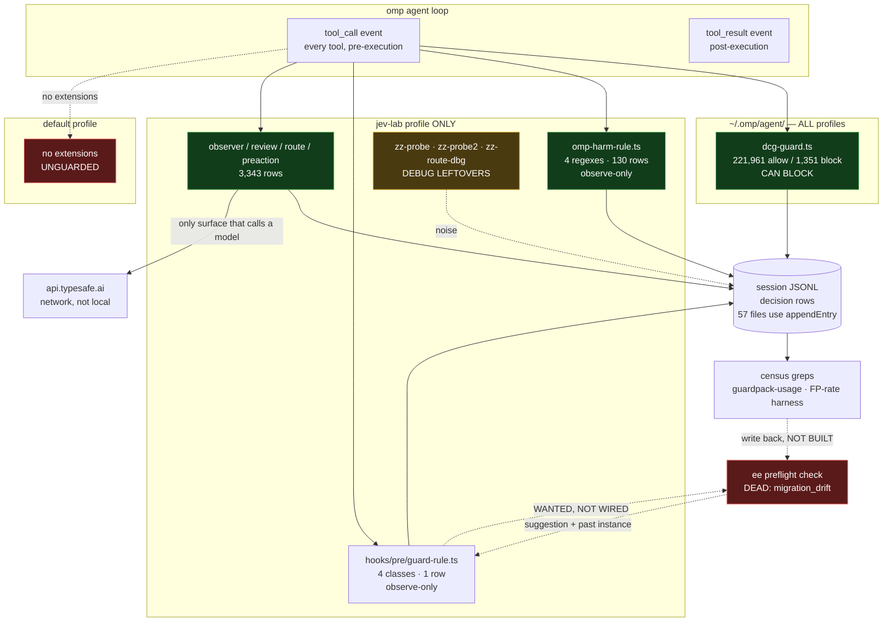

# The local stack, as measured — 2026-09-20 `[receipt]`

Every node and edge below was derived by a command, not from memory. Where something is
installed but dead, the diagram says so — **a map that draws intent rather than state is how you
get an observer with 13 passing tests and zero emitted rows.**

## Inventory commands

```bash
command -v splash jev kev frankenmermaid            # splash, frankenmermaid present; jev/kev NOT on PATH
ls ~/.omp/agent/extensions                          # dcg-guard.ts            (global, all profiles)
ls ~/.omp/profiles/*/agent/extensions               # per-profile extensions
ls ~/.omp/profiles/*/agent/hooks/pre                # jev-lab: guard-rule.ts
grep -rho '"kind":"[a-z_]*"' ~/.omp/profiles/*/agent/sessions/ | sort | uniq -c | sort -rn
```

## Measured state

| component | where | live rows |
|---|---|---:|
| `dcg-guard.ts` | `~/.omp/agent/extensions` (**global**) | `dcg_allow` **221,961** / `dcg_block` **1,351** |
| `omp-harm-rule.ts` | `codex` + `jev-lab` profiles | `harm_*` **130** |
| `omp-jev-observer/review/route/preaction` | `jev-lab` only | `tool_call_observed` **3,343** |
| `guard-rule.ts` | `jev-lab` `hooks/pre/` | `guard_fire` **1** |
| `zz-probe.ts`, `zz-probe2.ts`, `zz-route-dbg.ts` | `jev-lab` extensions | **3 debug leftovers still installed** |
| `default` profile | — | **zero extensions: the profile most work runs in is unguarded** |
| `ee` | `~/.local/bin/ee` | **DEAD** — `EE-E040 migration_drift`, malformed schema beneath it |
| `jev` / `kev` | not on PATH | called as a **network API**, not a local binary |



## Three defects the map exposes

1. **The `default` profile has zero extensions.** Every guard we built protects `jev-lab` and
   `codex`. `dcg-guard.ts` is the only thing installed globally — so outside this lane, the
   harness's own destructive-command guard is the *entire* safety surface.
2. **Three `zz-*` debug extensions are still installed in `jev-lab`.** They were probes; they
   are now permanent residents writing to the same session store we census. **Leftover
   instrumentation is indistinguishable from intended instrumentation at read time.**
3. **`ee` is the only dead node, and it is the one the whole feedback loop depends on.** Detect
   is live, write-back is a one-line call — and the recall between them is a corrupt sqlite
   schema.

## The asymmetry worth naming

`dcg` has **221,961** rows and **can block**. Everything we built tonight has **131** rows and
blocks nothing. The harness's own guard is three orders of magnitude more exercised than our
entire lane's output — which is the honest scale of what we have contributed to this stack so
far, and the reason the `default`-profile gap matters more than any refinement to `jev-lab`.

## NO-CLAIM

Row counts are as-of this run over local sessions only; all three corpora are live-monotonic.
`kev` is not on PATH and I did not find a local install — if it exists it is under a name I did
not search, and I am not claiming it is absent from the machine, only that
`command -v kev` resolves nothing.
