# Map: the documentation corpus — 407 `docs/` files + 11 root `.md`

**Slice:** every `.md` under `docs/` and every `.md` at the repository root.
**Mode:** read-only inventory. Nothing outside this file was written.
**Date:** 2026-09-20. **HEAD at scan:** `038aeb4`.

---

## 0. The one-paragraph answer

**Frozen at `038aeb4`** (the tree is shared and five sibling maps landed while I wrote this —
re-derive with `git ls-tree -r --name-only 038aeb4 -- docs | rg '\.md$'`, not with `find`):
`docs/` holds **407 markdown files** — 406 tracked at that commit totalling **50,550 lines**, plus
one untracked 106-line receipt (§3.6). The root holds **11 more**: 10 tracked (**6,444 lines** at
`038aeb4`; 6,472 in the working tree, where `NEGATIVE_EVIDENCE.md` is dirty) plus the 5-line
untracked `CLAUDE.md`.

**Thirteen** of the 407 plus **ten** of the 11 are standing contract — 17% of the volume. The other
83% is **evidence**: 206 receipts, 78 dispatch packets, 79 duel artifacts. The evidence is not the
problem. The problem is that **nothing distinguishes the two classes at the filesystem level**, so a
reader opening `docs/demos/upstream-repro/` sees 207 sibling files with no index that covers more
than 18 of them, and the only machine-checked citation surface (`STATUS.tsv`) reaches **19 of 206**.
The second finding is sharper: **inbound-reference count in this corpus measures age, not worth** —
orphan rate climbs 12% → 25% → 32% across three days — so "nothing links to it" is *not* a discard
proof here, and every DISCARD below is proved by supersession instead.

---

## 1. Commands (re-derivable by a stranger)

```sh
cd /Users/josh/Developer/jev && git rev-parse --short HEAD          # 038aeb4

# --- census ---
find docs -type f -name '*.md' | wc -l                              # 407
ls -1 *.md | wc -l                                                  # 11
find docs -type f | sed 's/.*\.//' | sort | uniq -c | sort -rn      # 407 md, 169 json, 3 tsv, 1 py, 1 mjs, 1 jsonl
for d in $(find docs -type d); do \
  printf '%s %s\n' "$(find "$d" -maxdepth 1 -name '*.md' -type f | wc -l)" "$d"; done | sort -rn

# --- what is tracked, what is not ---
comm -13 <(git ls-files 'docs/*.md' 'docs/**/*.md' | sort) <(find docs -name '*.md' -type f | sort)
git status --porcelain --untracked-files=all | rg '\.md$'

# --- inbound references, by basename, over every tracked file (1,171 files scanned) ---
#   python: for each tracked .md in scope, rg its basename across all tracked text;
#   exact reproduction of the index used below:
python3 - <<'PY'
import subprocess, os, re, collections
R='.'
tracked=subprocess.run(['git','ls-files'],capture_output=True,text=True).stdout.split()
docs=[p for p in tracked if p.endswith('.md') and (p.startswith('docs/') or '/' not in p)]
b2p=collections.defaultdict(list)
for p in docs: b2p[os.path.basename(p)].append(p)
inbound=collections.defaultdict(set)
for f in tracked:
    if not os.path.isfile(f): continue
    t=open(f,encoding='utf-8',errors='ignore').read()
    for b in set(re.findall(r'[A-Za-z0-9._\-]+\.md', t)):
        for dp in b2p.get(b,()):
            if dp!=f: inbound[dp].add(f)
print('in scope', len(docs), 'orphans', sum(1 for p in docs if not inbound[p]))
PY
#   -> in scope 416  orphans 128

# --- orphan rate versus first-commit date (the age artifact) ---
git log --name-only --format=$'\x01%ad' --date=short --diff-filter=A -- docs/
#   2026-09-18  25 files,  3 orphan (12%)
#   2026-09-19  89 files, 23 orphan (25%)
#   2026-09-20  92 files, 30 orphan (32%)

# --- STATUS.tsv as a citation surface ---
grep -vc '^#\|^candidate\|^$' docs/demos/STATUS.tsv                 # 40 verdict rows
grep -oE '[a-zA-Z0-9./_-]+\.(md|json|tsv)' docs/demos/STATUS.tsv | sort -u | wc -l   # 36 distinct
grep -oE 'docs/demos/upstream-repro/[a-zA-Z0-9./_-]+' docs/demos/STATUS.tsv | sort -u | wc -l  # 19

# --- who reads a doc: gates ---
for g in foundation/gates.d/*.sh; do printf '%s -> ' "$(basename "$g")"; \
  rg -o '(docs/[A-Za-z0-9./_-]+|[A-Z][A-Z-]+\.md|STATUS\.tsv)' "$g" | sort -u | tr '\n' ' '; echo; done

# --- dispatch packets versus the publish exclusion (PROOF grep: vgrep exits 3 on zero) ---
git ls-files 'docs/**' | rg -i dispatch | rg -v 'duel-1/dispatch/|duel-2/dispatch/' | wc -l   # 51
ls -1 docs/demos/duel-1/dispatch | wc -l ; ls -1 docs/demos/duel-2/dispatch | wc -l           # 19 ; 8
scripts/vgrep.sh -rl '/Users/josh' docs/demos/dispatch/ docs/demos/duel-2/dispatch-*.md; echo "rc=$?"  # 2 files, rc=0
sed -n '72,78p' scripts/publish-export.sh                           # the two --exclude lines

# --- duplication: filename clustering, then a distinctive number ---
#   (clustering: strip trailing -YYYYMMDD.md, group on first token)
scripts/vgrep.sh -rl --fixed-strings '0.0447' docs/ *.md | wc -l ; echo "rc=$?"   # 29, rc=0

# --- the append-only ledger ---
f=docs/demos/upstream-repro/commit-learnings-20260919.md
wc -l "$f"; wc -c "$f"                                              # 1928 lines, 115208 bytes
rg -c '^# '  "$f"; rg -c '^## ' "$f"; rg -c '^### ' "$f"            # 2 / 57 / 18
git log --format='%h %ad' --date=iso --follow -- "$f" | wc -l       # 56 commits
git show 4659058:"$f" | wc -l                                       # 35   (first)
git show 038aeb4:"$f" | wc -l                                       # 1928 (now)
wc -l docs/demos/upstream-repro/commit-learnings-20260920.md        # 215
```

---

## 2. Flowchart

```mermaid
flowchart TD
  ROOT["root *.md<br/>11 files / 6,477 lines"]
  DOCS["docs/ *.md<br/>407 files / 50,550 lines"]

  subgraph SC["STANDING CONTRACT — 23 md + 2 tsv, 17% of volume"]
    RC["root contract<br/>10 tracked md / 6,472 ln<br/>README AGENTS GATES TESTS<br/>NEGATIVE_EVIDENCE EVAL RECIPES<br/>VERDICT REVIEW-PERSONAS README-NOTES"]
    DC["docs/ contract<br/>13 md / 8,725 ln<br/>RULES INTEGRATIONS LOOP PUBLISH-SET<br/>PLAN QUEUE RULING tick ORACLE-PROGRAM<br/>GAUNTLET_SPEC_MU BEAD-TEMPLATE<br/>USAGE-MAP SDK-SURFACE"]
    TSV["STATUS.tsv 40 rows<br/>ORACLE-MANIFEST.tsv 24 ln"]
  end

  subgraph EV["EVIDENCE — 383 md, 83% of volume"]
    UR["RECEIPTS docs/demos/upstream-repro<br/>206 tracked +1 untracked / 19,783 ln<br/>19 cited by a STATUS row (9.2%)<br/>18 indexed by its own README"]
    D2["DUEL-2 artifacts 61 md / 8,471 ln<br/>17 RULE_ + 9 RUNG2/4 + 8 SPEC/TYPING + …"]
    D1["DUEL-1 artifacts 18 md / 2,829 ln"]
    SIDE["RUN sidecars 8 md beside 8 same-named .json<br/>238 ln — prose form, NOT a json subset"]
    MIS["4 receipts misfiled in docs/demos root<br/>omp-seam x2, phi-* x2 / 274 ln"]
    PROBE["docs/demos/jev-probe/NOTE-framing-leak.md"]
  end

  subgraph EPH["DISPATCH — 78 packets / 5,523 ln, ephemeral by nature"]
    DEX["EXCLUDED from publish: 27<br/>duel-1/dispatch 19 + duel-2/dispatch 8"]
    DLK["NOT excluded: 51 (65%)<br/>docs/demos/dispatch 44<br/>+ duel-2/dispatch-*.md 7<br/>2 carry operator home paths"]
  end

  subgraph OTH["OTHER — 17 md"]
    ESS["essays 3 / 2,517 ln — dont-give-up family"]
    CON["demo contracts 7 / 1,717 ln"]
    UPS["upstream bug reports docs/upstream 7 / 412 ln"]
  end

  subgraph DEAD["DEAD — 10 md, superseded, 0 gate reads, 0 STATUS cites"]
    STUB["CLAIM STUBS<br/>waved-s16..s20,s24 + wavee-s08,s09,s10,s23<br/>each says 'full receipt follows'<br/>all 10 receipts exist"]
  end

  ROOT --> SC
  DOCS --> SC
  DOCS --> EV
  DOCS --> EPH
  DOCS --> OTH
  UR -.-> DEAD

  GATES["foundation/gates.d — 13 stages"]
  GATES -->|70| RC
  GATES -->|96,97| RC
  GATES -->|85| DC
  GATES -->|80,85,96,97| TSV
  GATES -->|80,90,95| D2
  GATES -->|97 glob: not-run rows| UR
  GATES -.->|no stage reads one| EPH
  GATES -.->|no stage reads one| DEAD

  READER(["a new researcher"]) ==> SC
  READER -.->|"207 siblings, index covers 18"| UR

  classDef dead fill:#3a1111,stroke:#c33,color:#fdd,stroke-dasharray:4 3
  classDef leak fill:#3a2a11,stroke:#c93,color:#fed
  classDef keep fill:#11301a,stroke:#3a6,color:#dfe
  class DEAD,STUB dead
  class DLK,MIS leak
  class SC,RC,DC,TSV keep
```



---

## 3. The six findings

### 3.1 Orphanhood measures age, not worth — so it cannot be a discard proof here

128 of 416 tracked in-scope `.md` have **zero** inbound reference by basename across all 1,171
tracked files; 125 of those are also never named in any of the 1,140 commit messages. The obvious
read — "125 dead documents" — is **wrong**, and the data says so:

| first committed | files | orphans | rate |
|---|---:|---:|---:|
| 2026-09-18 | 25 | 3 | 12% |
| 2026-09-19 | 89 | 23 | 25% |
| 2026-09-20 | 92 | 30 | 32% |

A receipt becomes non-orphan when a *later* document cites it. The newest receipts are structurally
orphaned because nothing has been written after them yet. Seven supersession pairs make it concrete —
in **six of seven**, the *authoritative later* file is the orphan and the superseded earlier one is
the one with inbound links:

| earlier (inbound) | later, more authoritative (inbound) |
|---|---|
| `hardening-census-20260920.md` (1) | `hardening-census-rerun-20260920.md` (**0**) |
| `fresh-clone-readme-commands-20260919.md` (2) | `fresh-clone-rerun-20260919.md` (**0**) |
| `question-shape-20260919.md` (3) | `question-shape-holdout-20260919.md` (**0**) |
| `vbh1-exec-data-20260920.md` (1) | `vbh1-reconcile-20260920.md` (**0**) |
| `ee-repair-blocked-20260920.md` (1) | `ee-repair-ready-20260920.md` (**0**) |
| `readme-claim-sweep-20260920.md` (2) | `readme-claim-sweep-part2-20260920.md` (1) |
| `export-members-diff-20260920.md` (0) | `export-resweep-20260920.md` (0) |

**Consequence for the assignment's own method:** the instruction "a doc nothing links to and no
script reads is a DISCARD candidate" produces a list that is ~30% *the newest and best evidence in
the repo*. Every DISCARD below is therefore proved by **supersession by a named successor**, never
by absence of links.

### 3.2 The citation surface reaches 9.2% of the receipts

`docs/demos/STATUS.tsv` holds **40 verdict rows** citing **36 distinct artifacts**; **0 are missing
on disk** (so `scripts/lane-status.sh`'s existence check passes, correctly). Nineteen of those 36 are
`upstream-repro` receipts. Against 206 tracked receipts in that directory that is **19/206 = 9.2%**.

`docs/demos/upstream-repro/README.md` is the other index — it is the promotion surface for the
22-repo sweep and names **18** distinct receipts. It was written for the 2026-09-18/19 sweep and has
**not** absorbed the **92 receipts first committed on 2026-09-20**. Union of the two surfaces is
roughly 30 of 207. **The remaining ~85% of the receipt corpus is reachable only by `ls`.**

### 3.3 Duplication: 150 of 206 receipts share a subject; one number owns 29 artifacts

Filename clustering (strip trailing `-YYYYMMDD.md`, group on the leading token) yields **37 clusters
with more than one member, covering 150 of 206 files**; 56 are singletons. The largest:

| cluster | n | shape |
|---|---:|---|
| `jev-*` | 13 | one per upstream jev repo — **healthy**, distinct subjects |
| `waved-* / wavee-*` | 20 | wave sections: 10 CLAIM STUBS + 10 receipts — **half is dead weight** |
| `commit-*` | 10 | 2 append-only ledgers + miner + judge + hook + wired-audit — **mixed** |
| `skillranker-*` | 9 | build / port / corpus / archaeology / mirror / lifecycle — **genuine serial work** |
| `omp-jev-*` | 8 | observer ×4, foreman ×2, failure, session-adapter — **observer is over-split** |
| `harm-rule-*` | 7 | claim-repro / conformance / installer-loader / promoted / realtraffic / shipped — **7 files, one rule** |
| `toolcall-*` | 5 | groundtruth / headtohead / v3 / jev-vs-regex / multi-feature — **one abandoned family (UP-R9)** |
| `hardening-*`, `readme-*`, `question-*`, `route-*`, `sdk-*`, `compaction-*` | 4 each | |

The distinctive-number probe is worse than the filename probe. `0.0447` (the demo-1 route-backtest
figure, `RULED_OUT` at rung 4) appears in **29 artifacts**. Only 4 of them *measure* anything —
`README.md`, `VERDICT.md`, `docs/demos/RULING.md`, `STATUS.tsv`. **Sixteen** are
`docs/demos/duel-2/runs/*.json` rulings about *how to write the number*: `0447-site-table`,
`correction-spec-0447`, `site-correction-map`, `derived-form-ruling`, `basis-ruling`,
`numerals-gate-ruling`, `numerals-hold-ruling`, `numeral-adjudication`, `audit-q105-numerals`,
`audit-q105-authority`, `levers-ruling`, `norevert-confirm`, `ship-proposal`,
`ruling-q106-derivation`, `verify-q106-demo1-authority`, `ruling-verdict-status-coupling`. That is
the duplication problem in one line: **a dead candidate's decimal point generated four times more
artifacts than the candidate did.** It is also why `foundation/gates.d/95-numerals-ratchet.sh`
exists, so the cost was not wasted — but it is not receipt-shaped work and does not belong beside
receipts.

Counter-finding (the healthy pattern, worth protecting): **8 pre-registration/result pairs**, all
8 complete — `a11-join`, `a12-refusal`, `a18-offbus`, `c1-calibration`, `commit-mine`,
`dig-subset`, `mail-mine`, `repsample`. The falsifier is written and committed *before* the result.
Naming is inconsistent on both halves: the pre-registration is `-falsifier` ×7 and `-expectation`
×1 (`c1`); the result is `-result` ×6, `-yield` ×1 (`a11-join-yield`), `-breakdown` ×1
(`dig-subset-breakdown`). A grep for `falsifier` finds 7 of the 8; a grep for `result` finds 6 of
the 8. **ALIGN** — pick one suffix pair so the mechanism is greppable, not a defect in the work.

### 3.4 `commit-learnings-20260919.md` — the append-only ledger

| measure | value |
|---|---|
| lines | **1,928** |
| bytes | **115,208** |
| distinct entries (`^## ` headings) | **57** |
| plus `^### ` sub-entries | 18 |
| plus `^# ` banners | 2 (title + `THE 24-SECTION WAVE PROGRAM IS CLOSED`) |
| commits touching it | **56** |
| first / current size | **35 → 1,928 lines** |
| window | 2026-09-19 22:54:36 −0600 → 2026-09-20 12:31:17 −0600 (**13h 37m**) |
| growth rate | ~139 lines/hour, ~34 lines/commit, one entry per 14 minutes |
| sibling | `commit-learnings-20260920.md`, **215 lines / 9 entries**, cited by 2 STATUS rows (UP-R11, UP-R12) |

It is the single largest receipt in the corpus (1,928 of 19,783 upstream-repro lines = **9.7%**), it
is cited by no STATUS row, and it is named from `STATUS.tsv` only indirectly (UP-R9's reason string
says *"see commit-learnings-20260919-s14e"* — a **dangling section pointer**: the string `s14e`
does not appear anywhere in the 1,928-line file, not as a heading and not in prose. Proved with the
guard, not with a silent grep:
`scripts/vgrep.sh --expect-zero -n 's14e' docs/demos/upstream-repro/commit-learnings-20260919.md`
→ `rc=0`, i.e. the absence is the verified result). **KEEP** — 57 entries of ruled findings are not
disposable — but it has outgrown "a file" and the one citation pointing into it cannot be followed.

### 3.5 Publish-set leak (report only — not mine to fix)

`docs/PUBLISH-SET.md` rules that pane-coordination dispatch packets are internal, and
`scripts/publish-export.sh:76-77` excludes exactly two directories:

```
--exclude="docs/demos/duel-1/dispatch"    # 19 packets
--exclude="docs/demos/duel-2/dispatch"    #  8 packets
```

There are **78 dispatch packets** in `docs/`. **51 (65%) sit outside those two directories** and
ship: 44 in `docs/demos/dispatch/`, 6 named `docs/demos/duel-2/dispatch-pane*.md`, and
`docs/demos/duel-2/DISPATCH-demand-duel.md`. Two of the 51 contain `/Users/josh`
(`docs/demos/dispatch/pane3-skillranker-finish.md`, `docs/demos/dispatch/muse-a-learnings-and-arsenal.md`).
The export's `sed 's|/Users/josh|~|g'` transform rewrites them, so **the export scan does not fail** —
this is a *category* leak, not a secrets leak. The rule was written against a path, and the category
grew a third home. **ALIGN**, owner = whoever owns `PUBLISH-SET.md`.

### 3.6 One uncommitted file — found, reported, RESOLVED during this scan

At scan time `docs/demos/upstream-repro/skillranker-lifecycle-20260920.md` (106 lines) was
**untracked** (`??`) — the only untracked `.md` under `docs/`, while every other
`skillranker-*.md` was committed. Reported to peer `MapSkillranker` rather than committed by me;
it confirmed the file was a cited source for its slice's only CANTOPEN-1550 evidence and committed
it unmodified in `5f4b250`. Re-derived after the reply:
`git status --porcelain --untracked-files=all | rg '\.md$'` now shows no `??` under `docs/`
except this map itself. `NEGATIVE_EVIDENCE.md` remains dirty (` M`) — a sibling agent's in-flight
work, left alone.

The near-miss is the finding, not the file: a 106-line receipt carrying sole evidence for a ruling
sat outside git for the length of a session, and none of the 13 gate stages would have noticed.
`gates.d/20-receipt-freshness.sh` checks committed receipts; an uncommitted one is invisible to it.

---

## 4. Inventory table

### 4.1 STANDING CONTRACT — listed individually (23 md + 2 tsv)

`in` = inbound references by basename across 1,171 tracked files. `gate` = a `foundation/gates.d/`
stage or `scripts/` file reads it.

| path | what it is | verdict | reason |
|---|---|---|---|
| `README.md` | the public surface; 925 ln, 20 H2 sections | **KEEP** | `gates.d/97` machine-checks its stage/verdict counts against `gates.d/` and `STATUS.tsv`; 70 inbound (disambiguated from the 92 raw — see NO-CLAIM) |
| `AGENTS.md` | canonical workspace instructions, 1,567 ln | **KEEP** | read by `scripts/verify-frozen.sh`, `jev-probe.mjs`, `sync-docs.sh`; 56 inbound |
| `GATES.md` | gate-stage registry | **KEEP** | `gates.d/80` + `selftest-other-reasons.sh` read it; 51 inbound |
| `TESTS.md` | test registry | **KEEP** | `gates.d/70-tests-registry-sync.sh` fails on drift; 59 inbound |
| `NEGATIVE_EVIDENCE.md` | refuted-hypothesis ledger, 2,396 ln | **KEEP** | `gates.d/50` + 4 scripts read it; 80 inbound; cited as a `nonauthor-kill` by STATUS row UP-R16 |
| `VERDICT.md` | verdict vocabulary | **KEEP** | `gates.d/96` + `foundation/verdict-status-agree.py` enforce it against `STATUS.tsv` |
| `EVAL.md` | evaluation protocol, 668 ln | **KEEP** | read by `scripts/bootstrap-compaction.sh`; 40 inbound |
| `RECIPES.md` | runnable recipes, 183 ln | **KEEP** | `foundation/gates.sh` references it; 16 inbound |
| `REVIEW-PERSONAS.md` | review lenses → owned doc sets | **KEEP** | 14 inbound; the only doc that assigns doc *ownership*, which this map needs |
| `README-NOTES.md` | drain-buffer for README facts; 29 ln, currently empty below its header | **KEEP** | mechanism doc for `skill://readme-update`; deliberately a log |
| `CLAUDE.md` | 5-line pointer to `AGENTS.md`; **untracked** | **ALIGN** | correct content, but untracked means a fresh clone loses it — either track it or delete it |
| `docs/RULES.md` | the nine measurement rules, each with a commit and a runnable command | **KEEP** | `gates.d/85-promotion-contract.sh` reads it; the densest page in the repo |
| `docs/INTEGRATIONS.md` | integration surface, 296 ln | **KEEP** | 24 inbound |
| `docs/LOOP.md` | the tick loop, 233 ln | **KEEP** | 5 inbound; describes the machine that produced everything else |
| `docs/PUBLISH-SET.md` | publish allowlist + scan contract | **KEEP** | `scripts/publish-export.sh` implements it — see 3.5 for the drift |
| `docs/demos/PLAN.md` | 5,448 ln — the largest doc; conductor narrative + rulings | **KEEP** | `gates.d/85` + `lane-status.sh` + `feed-idle-panes.sh` read it; 78 inbound |
| `docs/demos/STATUS.tsv` | 40 verdict rows — the state of record | **KEEP** | read by gates 80, 85, 96, 97 and `lane-status.sh` |
| `docs/demos/ORACLE-MANIFEST.tsv` | the work queue the cron tick reads | **KEEP** | names the preregistered `win_condition` gate |
| `docs/demos/RULING.md` | 874 ln of rulings | **KEEP** | 21 inbound |
| `docs/demos/QUEUE.md` | unit queue, 659 ln | **KEEP** | 8 inbound; self-documents three staleness events against itself |
| `docs/demos/tick.md` | the per-tick protocol, 168 ln | **KEEP** | `feed-idle-panes.sh` + `noclaim-harvest.sh` read it |
| `docs/demos/ORACLE-PROGRAM.md` | oracle program spec, 282 ln | **KEEP** | pairs with `ORACLE-MANIFEST.tsv` |
| `docs/demos/GAUNTLET_SPEC_MU.md` | gauntlet spec, 309 ln | **KEEP** | 8 inbound |
| `docs/demos/BEAD-TEMPLATE.md` | bead body template | **KEEP** | `scripts/lane-status.sh` reads it |
| `docs/demos/USAGE-MAP.md` | usage-shape map, 118 ln | **KEEP** | `scripts/sync-docs.sh` reads it; 28 inbound |
| `docs/demos/SDK-SURFACE.md` | SDK surface notes, 73 ln | **KEEP** | 17 inbound |

### 4.2 Everything else — grouped, with counts

| path / group | n | what it is | verdict | reason |
|---|---:|---|---|---|
| `docs/demos/upstream-repro/*.md` (minus the 10 stubs and the README) | 196 | receipts: one ruling each | **KEEP** | 19 cited by a STATUS row, 18 indexed by the local README; the rest are the evidence behind 1,140 commits. Orphanhood is an age artifact (3.1), not a value signal |
| `docs/demos/upstream-repro/README.md` | 1 | the 22-repo promotion surface | **ALIGN** | indexes 18 of 207 siblings; silent on the 92 receipts added 2026-09-20 |
| `docs/demos/upstream-repro/*-claim.md` | 10 | CLAIM STUBS | **DISCARD** | see 4.3 — every one superseded by its own full receipt |
| `docs/demos/upstream-repro/issue-{1..6}-*.md` | 6 | upstream bug reports filed against `jev` | **ALIGN** | same genre as `docs/upstream/` (7 files) but in a different directory; one of the two should move |
| `docs/demos/upstream-repro/{*.json,*.jsonl,*.mjs,*.py}` | 5 | receipt payloads + 2 repro scripts | **KEEP** | `jev-rerank-bench-20260918.json` and `fast-jev-compaction-20260918.json` are cited by the local README; the `.mjs`/`.py` are runnable repros |
| `docs/demos/dispatch/*.md` | 44 | pane-coordination packets, 2026-09-20 wave | **ALIGN** | ephemeral by nature and no gate or script reads one, but they are the only record of what each pane was *asked*. Exclude from publish (3.5), keep locally |
| `docs/demos/duel-1/dispatch/*.md` | 19 | duel-1 packets | **KEEP** | already correctly excluded from publish |
| `docs/demos/duel-2/dispatch/*.md` | 8 | duel-2 packets | **KEEP** | already correctly excluded from publish |
| `docs/demos/duel-2/dispatch-pane*.md`, `DISPATCH-demand-duel.md` | 7 | duel-2 packets **outside** `dispatch/` | **ALIGN** | same category, wrong directory, therefore published — move under `duel-2/dispatch/` and the existing exclusion covers them for free |
| `docs/demos/duel-2/RULE_*.md` | 17 | rules produced by the duel | **KEEP** | `gates.d/80` reads `RULE_gate_wiring_COD.md` by path; `RULE_receipt_type_COD.md` is cited by `NEGATIVE_EVIDENCE.md`; `RULE_deletions_COD.md` by `PLAN.md` and `QUEUE.md` |
| `docs/demos/duel-2/{RUNG2,RUNG4,BASELINE,HELD,SUPERSESSION,DEMAND,HUNT,FALSIFY,SPEC,CLAUSE,CONCEDE,CONCURRENCE,PRICE,RECONCILE,TYPING,USAGE_SHAPE}_*.md` | 37 | duel-2 adjudication artifacts | **KEEP** | 11 of the 40 `STATUS.tsv` rows cite one of these by path as their receipt |
| `docs/demos/duel-1/WIZARD_*.md`, `DUELING_WIZARDS_REPORT.md` | 18 | duel-1 idea-duel artifacts | **KEEP** | the origin of demos 1–9; `DUELING_WIZARDS_REPORT.md` is the readable entry point |
| `docs/demos/duel-{1,2}/runs/*.json` | 152 | machine receipts | **KEEP** | gates 90 and 95 read four of them **by exact path**; deleting any is a gate break |
| `docs/demos/duel-2/runs/*.md` | 8 | prose sidecars beside same-named `.json` | **ALIGN** | verified **not** a subset of their JSON (distinct prose, 878–5,516 B) — so not duplication; but the receipt-type rule (`RULE_receipt_type_COD.md`) says type is declared, not inferred, and a bare `.md` twin declares nothing |
| `docs/demos/contracts/demo-{1..7}-*.md` | 7 | the seven demo contracts | **KEEP** | each is the `candidate` definition behind a `STATUS.tsv` row |
| `docs/demos/{omp-seam-fqo,omp-seam-live,phi-clone-sweep,phi-second-pair}-2026*.md` | 4 | dated receipts sitting in the `demos/` root beside the standing contract | **ALIGN** | 2–6 inbound each, real evidence, wrong shelf — they make `docs/demos/` read as half-contract/half-evidence |
| `docs/demos/jev-probe/NOTE-framing-leak.md` (+2 json) | 1 | the framing-leak note | **KEEP** | 5 inbound; replicated upstream by `jev-sec-bench` |
| `docs/essays/dont-give-up{,-gaps,-skill-patches}.md` | 3 | 2,517 ln of methodology essay | **KEEP** | 3–8 inbound each; the only prose explaining *why* the loop is shaped this way |
| `docs/upstream/*.md` | 7 | outbound bug reports to foundry / franken-harvest / pi / fast-jev-compaction | **KEEP** | deliverables to other repos — low inbound is **expected**, not evidence of death |
| `docs/reviews/runs/*.json` | 1 | one doc-review run | **KEEP** | harmless; the directory is the declared home for review runs |

### 4.3 DISCARD — listed individually, with the supersession proof

All ten are `docs/demos/upstream-repro/`. Each one's own text says *"Full receipt follows; this stub
is the claim only."* Each names a wave section that a full receipt later delivered. **Common proof
for all ten:** (a) a named successor receipt exists on disk and covers the same section; (b) the
stub contains no measurement; (c) not cited by any of the 40 `STATUS.tsv` rows; (d) not read by any
of the 13 gate stages. Both absences are proved with the guard so a zero cannot read as "clean":

```sh
scripts/vgrep.sh --expect-zero -rn 'claim\.md' foundation/ scripts/    # rc=0 — no gate, no script
scripts/vgrep.sh --expect-zero -rn 'claim\.md' docs/demos/STATUS.tsv   # rc=0 — no verdict row
```

| path | lines | superseded by | extra proof |
|---|---:|---|---|
| `waved-s16-claim.md` | 13 | `waved-s16-observer-dogfood-20260920.md` | **the receipt cites the stub** — this is the intended fold-in, and the only stub that got it |
| `waved-s17-claim.md` | 14 | `waved-s17-organic-precision-20260920.md` | 0 inbound |
| `waved-s18-claim.md` | 14 | `waved-s18-compact-reality-20260920.md` | 0 inbound |
| `waved-s19-claim.md` | 14 | `waved-s19-taste-contracts-20260920.md` | 0 inbound |
| `waved-s20-claim.md` | 17 | `waved-s20-integrations-20260920.md` | 0 inbound |
| `waved-s24-claim.md` | 3 | `wavee-s24-cleanup-20260920.md` | 0 inbound; **also a naming defect** — the stub says `waved`, the receipt says `wavee`, same §24 (infisical placeholder cleanup); the receipt closes it PASS with 2 hits found |
| `wavee-s08-claim.md` | 14 | `wavee-s08-prevalence-20260920.md` | 0 inbound |
| `wavee-s09-claim.md` | 15 | `wavee-s09-fields-20260920.md` | 0 inbound |
| `wavee-s10-claim.md` | 14 | `wavee-s10-persona-20260920.md` | 0 inbound |
| `wavee-s23-claim.md` | 13 | `wavee-s23-override-20260920.md` | 0 inbound |

**131 lines total** (`wc -l` over the ten paths). The stubs served a real purpose — two panes racing one queue needed an atomic
"I claimed §17" marker. The right fix is `waved-s16`'s: **the receipt absorbs its stub's
verified-facts block and the stub is deleted**, which is why s16 is the one with an inbound link.
Nine of ten skipped that step.

**Explicitly NOT discarded**, though the mechanical rule would have flagged them: the 30 orphaned
receipts first committed 2026-09-20 (`hardening-census-rerun`, `question-shape-holdout`,
`vbh1-reconcile`, `ee-repair-ready`, `export-resweep`, `level-sample15`, `laya-mlx-probe`,
`museb-delta`, `gou-ports`, `guard-dogfood`, `route-turnstart-content-free`, `uncertain-sampling`,
`vbh-program-closeout`, `denominator-audit`… ). They are orphaned because they are **new**, and
several are the *later half* of a supersession pair (3.1). Discarding them would delete the freshest
evidence in the repo.

---

## 5. NO-CLAIM

- **I did not read all 407 files.** I read ~30 in full and sampled headings/first-40-lines of ~60
  more. Every count above is mechanical (`find`, `git ls-files`, `wc`, `rg`, the Python index);
  every *characterisation* of a category is generalised from that sample and could be wrong for
  individual files inside a group row.
- **Inbound references are matched by BASENAME, not by resolved link.** A doc named in prose without
  a path (`see commit-learnings`) does not count, and prose mentions without the `.md` suffix are
  invisible to this index. There is **exactly one basename collision** among the 416 in-scope files:
  `README.md` resolves to both the root README and `docs/demos/upstream-repro/README.md`, so the
  raw index gives both a conflated 92. Disambiguated by re-reading all 92 referrers: **8** name the
  `upstream-repro/` one explicitly, **70** name a bare root `README.md`, the rest name neither
  unambiguously. Every other basename in scope is unique, so no other row is affected.
- **I did not check whether any link RESOLVES.** A markdown link `[x](y.md)` counts as inbound for
  `y.md` whether or not the relative path is correct from the referring file. A broken-link audit is
  a different instrument and I did not build one.
- **I did not run `foundation/gates.sh`** or any gate stage, per the constraint. Gate→doc bindings
  above are derived by reading the stage sources, not by observing a run. Stage 20
  (`receipt-freshness`) and stage 10 (`fixture-integrity`) name no doc in their source — I did not
  trace what they compute at runtime, so a doc dependency inside them would be missed.
- **I did not inspect the 169 `.json` receipts' contents**, only their paths and, for 7 duel-2 pairs,
  their byte sizes versus the `.md` twin. Duplication *between JSON receipts* is unmeasured.
- **`work/`, `demos/`, `foundation/`, `probes/`, `scripts/`, `compaction/` are out of my slice** —
  they appear only as *referrers* in the inbound index. I did not classify a single file in them.
- **The "which ~10 to read" ordering below is a judgement, not a measurement.** It is informed by
  inbound counts and gate bindings, but no reader was tested against it. `rules-stranger-test-20260920.md`
  exists in the corpus and presumably tests exactly this; I did not read it before writing §6, to
  avoid anchoring.
- **I did not verify that `commit-learnings-20260919.md`'s 57 `##` headings are 57 *distinct*
  subjects.** They are 57 distinct heading lines; several are continuations (`Wave C section 14
  (cont.)`, `Section 15 remainder`), so the distinct-*topic* count is lower than 57 and I did not
  reduce it.
- **I did not commit or modify** `skillranker-lifecycle-20260920.md` or `NEGATIVE_EVIDENCE.md`.
- **I did not check the 37 top-level directories** for gitignored upstream clones; the assignment
  said many are not ours and I took that as given rather than re-deriving it.
- **The corpus moved under me.** Every count is frozen at `038aeb4`. By the time I finished, five
  sibling agents had added `map-git-arc`, `map-instruments`, `map-skillranker`,
  `map-work-packages` and this file to `docs/demos/upstream-repro/`, taking the live `find` count
  to 412. Those five are **out of scope for every number above** and are not classified here — a
  re-run of §1's commands against `HEAD` will legitimately disagree with §0. Treat any figure in
  this map as a measurement of `038aeb4`, not of the tree you are holding.

---

## 6. What a new researcher should read, in order

Ten documents, ~4,100 lines. This order answers *what is this → what may I believe → how is that
enforced → what was already tried* before it shows a single receipt.

1. **`README.md`** (925 ln) — what the repo is and what it claims. Its counts are machine-checked by
   `gates.d/97`, so the numbers in it are the only prose numbers in the repo you may trust on sight.
2. **`docs/demos/STATUS.tsv`** (40 rows) — the state of record. Read the seven `#` header lines
   first: they tell you a rung is *process state, not efficacy*, which is the single most
   load-bearing disclaimer in the project. Then read the `verdict` and `reason` columns; skip scores.
3. **`docs/RULES.md`** (88 ln) — nine rules, each with the commit that earned it and a command you
   can run now. Highest signal-per-line in the repo.
4. **`VERDICT.md`** (136 ln) — the verdict vocabulary. Without it, `HELD` vs `UNASKABLE` vs
   `RULED_OUT` in `STATUS.tsv` reads as synonyms. `gates.d/96` enforces the coupling.
5. **`NEGATIVE_EVIDENCE.md`** (2,396 ln — *skim the retry-conditions*) — what was refuted and under
   what condition it may be retried. Read this **before** any receipt, or you will re-derive a dead
   idea. Skim: read each entry's retry predicate, not its body.
6. **`docs/demos/upstream-repro/README.md`** (147 ln) — the 22-repo sweep as one table. Know going
   in that it covers 18 of 207 sibling files and stops at 2026-09-19.
7. **`GATES.md`** + **`TESTS.md`** (173 + 343 ln) — what is actually enforced. Everything not in
   these two is prose. Pair with `ls foundation/gates.d/` (13 stages).
8. **`docs/LOOP.md`** (233 ln) and **`docs/demos/tick.md`** (168 ln) — the machine that produced the
   other 400 files. `tick.md` §1 is the creation gate every instrument had to pass.
9. **`docs/essays/dont-give-up.md`** (337 ln) — why the loop is shaped this way. The two companion
   essays (`-gaps`, `-skill-patches`, 2,180 ln) are for later.
10. **`docs/demos/upstream-repro/commit-learnings-20260919.md`** (1,928 ln / 57 entries) — read
    **last, and only the `##` headings first**. It is the session's running ledger; its headings are
    a table of contents for what the swarm actually learned, and you can descend into the three or
    four that matter to you.

**Deliberately not in the list:** `docs/demos/PLAN.md` (5,448 ln). It is the largest and most
load-bearing document in the repo and three gates/scripts read it, but it is conductor narrative in
commit order — it rewards someone who already holds the map, and it will bury someone who does not.
Read it eleventh.
