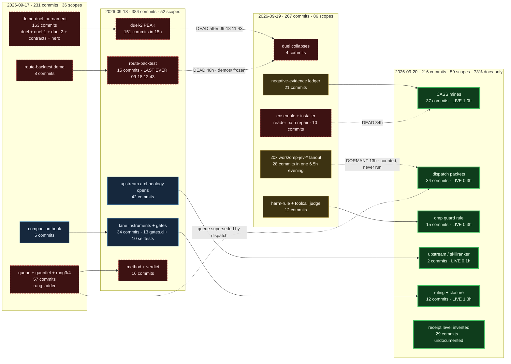

# Map: the git arc — 1140 commits in 67 hours

**Slice:** the commit history of `/Users/josh/Developer/jev` and what it says about the directions
this project has taken. Read-only. Written 2026-09-20 ~12:40 local (MDT, UTC-6).

**As-of:** `HEAD = 038aeb4` on branch `work/cass-dig-vs-invent`, 19 commits ahead of `origin/main`.
Wall-clock "now" for every `silent Nh` figure below is **2026-09-20 12:38:16 local**.

---

## 1. Commands (re-derivable by a stranger)

Everything below was produced by these, in this order, from the repo root:

```bash
cd /Users/josh/Developer/jev

# The corpus. Pre-existing miner, run as-is — NOT re-implemented.
node work/commit-mine/mine.mjs > /tmp/commits.jsonl      # 14.2s, exit 0, "mined 1098 commits"
wc -l < /tmp/commits.jsonl                               # 1098

# Why 1098 and not 1140: mine.mjs passes --no-merges.
git rev-list --count HEAD                                # 1140
git rev-list --count --no-merges HEAD                    # 1098   -> 42 merge commits

# Span.
git log --reverse --pretty='%ad %s' --date=iso | head -3
git log -1 --pretty='%ad %s' --date=iso
# 2026-09-17 17:20:58 -0600  ->  2026-09-20 12:31:17 -0600   (67.2h elapsed)

# Analysis: levels, scope tokens, per-day, per-theme, burst detection.
# Run in an IPython kernel over /tmp/commits.jsonl. The level regex mirrors mine.mjs:19
#   /[[(](pending|selftest|test|mutation|oracle|live|receipt)[\])]/i  then a \bbareword\b fallback
# The scope regex, applied after stripping a leading [level]:
#   /^([a-z]+)\(([^)]+)\)\s*[:!]/i   ->  (type, scope)

# Dependence proofs. UNPIPED exit codes; scripts/vgrep.sh exits 3 on zero matches.
git ls-files > /tmp/tracked.txt                          # 1171 (1174 incl. 3 gitlinks)
grep -E '\.(sh|mjs|js|ts|py)$' /tmp/tracked.txt > /tmp/tracked-code.txt   # 331
for t in duel-2 duel-1 gauntlet route-backtest rung4 rung3 redteam ensemble hero contracts; do
  out=$(scripts/vgrep.sh -lI -- "$t" $(cat /tmp/tracked-code.txt) 2>/dev/null); rc=$?
  printf '%-16s rc=%s code_files=%s\n' "$t" "$rc" "$(printf '%s' "$out" | grep -c .)"
done
# rung3 rc=3, redteam rc=3, hero rc=3  <- rc=3 IS the proof of zero executable references

out=$(scripts/vgrep.sh -rn -- 'work/omp-jev' foundation/ scripts/ 2>/dev/null); rc=$?; echo "rc=$rc"
# rc=0, and the ONLY two hits are scripts/denominator-sweep.sh:51 and :57 — both `wc -l` / grep counts

# Branch + PR picture.
gh pr list --state all --limit 60 --json number,state,mergedAt,headRefName,title
git rev-list --left-right --count origin/main...main            # 114  0
git rev-list --left-right --count origin/main...HEAD            #   0 19
for b in $(git for-each-ref --format='%(refname:short)' refs/heads/); do
  git rev-list --left-right --count main...$b; done

# The §4 diagram is not hand-waved — it was extracted and rendered.
node -e "const t=require('fs').readFileSync('docs/demos/upstream-repro/map-git-arc-20260920.md','utf8');
         require('fs').writeFileSync('/tmp/arc.mmd', [...t.matchAll(/\`\`\`mermaid\n([\s\S]*?)\`\`\`/g)][0][1]);"
bunx -y @mermaid-js/mermaid-cli@11 -i /tmp/arc.mmd -o /tmp/arc.svg   # exit 0, 41169-byte SVG
```

---

## 2. The shape of the corpus

| measure | value |
|---|---|
| commits total / non-merge | 1140 / **1098** (42 merges) |
| wall-clock span | 2026-09-17 17:20 → 2026-09-20 12:31 = **67.2h** |
| hours with ≥1 commit | **68 of 68** — not one idle hour in three days |
| mean commits / active hour | 16.1 |
| authors | Josh 1070, Cursor Agent 27, Joshua Nowak 1 |
| tracked files | 1174 — **510 `.md`**, 331 code (`.mjs .ts .js .sh .py`), 59 test-shaped |
| distinct scope tokens | **173**, of which **73 used exactly once** and 122 used <5 times |

### Commits per day, and what each day was about

| day | commits | docs-only | touched a test file | touched a script | distinct scopes | commits/scope | the day's work |
|---|---|---|---|---|---|---|---|
| 2026-09-17 | 231 | 55% | 8 | 12 | 36 | 6.2 | **demo-duel tournament** (163) — `duel`/`duel-1`/`duel-2`/`contracts`/`hero` pick which demos to build; `queue`+`gauntlet` rung ladder opens |
| 2026-09-18 | 384 | 43% | 17 | 54 | 52 | 7.4 | **duel-2 peak** (184) + the only real build day: `instrument` lands 13 gates & 10 selftests (54 script-touching commits, the max); `upstream` archaeology opens (42) |
| 2026-09-19 | 267 | 50% | 34 | 43 | 86 | **2.7** | fragmentation day. duel dies (4). **20 `work/omp-jev-*` packages** spawn in one 6.5h evening burst; `negative-evidence` ledger (21); most test-touching commits (34) |
| 2026-09-20 | 216 | **73%** | 14 | 26 | 59 | 3.0 | **CASS mines** (37) + `dispatch` packets (34) + `guard`. Highest docs-only fraction of the run; the `[receipt]` level is invented today |

Read the `commits/scope` column as the fragmentation signal: the lane went from ~7 commits per
named direction to ~3. It is naming twice as many directions and finishing none of them further.

---

## 3. Verification levels — the label does not predict the artifact

Level parsed from the subject, then cross-tabulated with `has_test` / `has_script` / `only_docs`
as emitted by `mine.mjs` (path-based, per its own F3 note at line 26).

| level | commits | touched a test file | frac | touched a script | frac | markdown-ONLY | frac |
|---|---:|---:|---:|---:|---:|---:|---:|
| `test` | 499 | 43 | 0.086 | 70 | 0.140 | 192 | 0.385 |
| `pending` | 219 | 2 | 0.009 | 11 | 0.050 | 171 | 0.781 |
| `live` | 218 | 25 | 0.115 | 25 | 0.115 | 113 | 0.518 |
| **`oracle`** | **98** | **0** | **0.000** | 4 | 0.041 | 79 | **0.806** |
| `selftest` | 32 | 1 | 0.031 | 22 | **0.688** | 7 | 0.219 |
| `receipt` | 29 | 1 | 0.034 | 3 | 0.103 | 22 | 0.759 |
| `mutation` | 2 | 1 | 0.500 | 0 | 0.000 | 0 | 0.000 |
| *(none)* | 1 | 0 | — | 0 | — | 0 | — |
| **ALL** | **1098** | **73** | **0.066** | **135** | **0.123** | **584** | **0.532** |

- **Touched a test OR a script: 187 / 1098 = 0.170.** Markdown-only: **0.532**.
- **The prior finding is CONFIRMED, not refuted: `oracle` commits touch a test file 0/98 = 0.000.**
  Strengthened: the median `oracle` commit touches **1 file**, 80.6% touch nothing but `.md`,
  and only 19/98 touch any non-`.md` file at all. The top paths an `oracle` commit writes are
  `docs/demos/**` (102 file-touches), `README.md` (20), `RECIPES.md` (5), `EVAL.md` (4).
  The highest-sounding rung on the ladder is the most paper-only rung on the ladder.
- The ladder is **inverted** where it should be monotone: `selftest` (0.688 script) does far more
  executable work than `oracle` (0.041), and `mutation` — 2 commits, both on
  `demos/routing-backtest`, `7/7 mutations caught` — is the only level whose artifact matches its
  name. `test` at 499 commits is the default label, not a claim: 38.5% of `[test]` commits are
  markdown-only.

### Defect found in `work/commit-mine/mine.mjs` (reported, not fixed)

`mine.mjs:18` lists six levels and omits `receipt`. 29 commits carry `[receipt]` — all of them
today, 10:39→12:12. The miner bins **26 of them as `null`** and **misattributes 3** through its
`\bbareword\b` fallback at line 22:

| subject | true level | miner says |
|---|---|---|
| `docs(map): [receipt] measured stack map - default profile is unguarded, 3 debug leftovers…` | receipt | `live` |
| `docs(guard): [receipt] live fire proven plus per-tool denominator` | receipt | `live` |
| `feat(ruling): [receipt] rung-demotion reporter plus selftest` | receipt | `selftest` |

The miner is not wrong about the *convention*: `docs/demos/BEAD-TEMPLATE.md:94` and
`docs/demos/tick.md:156` both define exactly `pending|selftest|test|mutation|oracle|live`.
`receipt` is an **undocumented seventh level invented today and already used 29 times**. That is a
live convention/practice drift, and the miner is the instrument that makes it visible only by
failing. ALIGN: either document `receipt` and add it to `mine.mjs:18`, or stop emitting it.
The bare-word fallback is the same class of defect `scripts/vgrep.sh` was built for — a selector
that silently produces a plausible-looking wrong answer.

---

## 4. Timeline of themes



Dashed red edges and red nodes are **DEAD**: a theme with no commit in >24h. Blue is **ABSORBED**
into a surviving artifact. Amber is **DORMANT** (6–24h silent). Green is **LIVE** (<6h).

---

## 5. Theme table — the alignment input

Themes are clusters of scope tokens, assigned mechanically and then checked against the
directories they touch. "silent" is hours since the theme's last commit as of 12:38 local.

| theme | commits | first | last | status | reason |
|---|---:|---|---|---|---|
| **demo-duel tournament**<br/>`duel` `duel-1` `duel-2` `contracts` `hero` `queue` `gauntlet` `rung3/4` `method` `verdict` `redteam` `plan` `foreman` | **351** (32% of all) | 09-17 18:01 | 09-19 18:16 | **ABANDONED** | 163+184 commits on days 1–2, then 4, then zero. Produced 231 tracked files under `docs/demos/duel-2/` + 53 under `duel-1/` + 7 under `contracts/`. Its *output* is still load-bearing (§6) but no one has worked the theme in 18h and its core (`duel-2`) has been silent 49h. |
| **(unscoped / one-off)** | 228 | 09-17 17:26 | 09-20 12:18 | LIVE | 73 scope tokens used exactly once. Not a theme — the fragmentation residue. Holds 37 of the 73 test-touching commits, so it is also where most real code landed. |
| **public honesty surface**<br/>`readme` `status` `evidence` `honesty` `prose` `ensemble` `installer` `integrations` `publish` | 97 | 09-17 18:17 | 09-20 11:06 | **LIVE** (1.6h) | `README.md`/`EVAL.md`/`INTEGRATIONS.md`. 69% docs-only. Runs continuously across all four days; the only theme that never went quiet. |
| **dispatch + tick**<br/>`dispatch` `tick` `lane` `wave*` `seat` | 71 | 09-17 17:20 | 09-20 12:22 | **LIVE** (0.3h) | The swarm's own work-distribution channel — `docs/demos/dispatch/` (39 commits). 86% docs-only, 0 test-touching commits in 71. `tick` (8, dead 51h) was SUPERSEDED by `dispatch`. |
| **upstream archaeology**<br/>`upstream` `upstream-repro` `skillranker` `franken` | 61 | 09-18 10:03 | 09-20 12:31 | **LIVE** (0.1h) | `docs/demos/upstream-repro/` is now 213 tracked files and the single most-touched area in the repo (292 commits). 82% docs-only, **0 test-touching commits in 61**. This is where the current session lives. |
| **lane instruments + gates**<br/>`instrument` `gates` `gate` `gate-85` `gate97` `numerals` `sidecar` | 45 | 09-17 17:37 | 09-20 08:06 | **SUPERSEDED / ABSORBED** (4.6h) | The `instrument` burst (19 commits, 09-18 02:57→07:28, 19/19 script-touching, dead 53h) did not die — it *landed* as `foundation/gates.d/{10..97}` (13 stages) and `scripts/selftest-*.sh` (10). Only 13% docs-only, the lowest of any theme. Keep; the scope token is retired, the artifact is the gate ladder. |
| **ruling / closure**<br/>`ruling` `closure` `alignment` `audit` `r47` `r48` | 39 | 09-18 00:42 | 09-20 11:25 | **LIVE** (1.3h) | 85% docs-only. `work/ruling-closure/` created today. This is the lane's adjudication mechanism, not a product. |
| **CASS mines**<br/>`mines` `cass-mines` `cass-mail` `mine` `commit-mine` | 38 | 09-19 23:20 | 09-20 11:37 | **LIVE** (1.1h) | Today's direction. `work/cass-mail-mines/` (11 commits), `work/commit-mine/` (1). 68% docs-only. Two days old. |
| **beads / process** | 28 | 09-17 17:41 | 09-20 12:01 | LIVE (0.7h) | `.beads/` (13 commits), `AGENTS.md`, `.flywheel/`. Background process plumbing, never a burst. |
| **omp-jev observers**<br/>`observer` `register` `rerank` `review` `failure` `probe` `client` | 28 | 09-17 17:53 | 09-20 10:39 | **ABANDONED-IN-PLACE** (2.1h on the token, **13h on the artifact**) | See §6 — 20 `work/omp-jev-*` packages, ~70 code files, built in one 6.5h evening, dormant since, and **not executed by any gate**. |
| **negative-evidence ledger**<br/>`negative` `negative-evidence` | 28 | 09-18 21:48 | 09-20 05:23 | DORMANT (7.3h) | `NEGATIVE_EVIDENCE.md`, 70 commits touch it. **100% docs-only.** The `negative-evidence` token (7, dead 28h) was SUPERSEDED by `negative`. Currently modified-uncommitted in the worktree. |
| **compaction hook**<br/>`compaction` `omp` `hooks` `retention` | 24 | 09-17 17:44 | 09-20 10:38 | **SELF-REFUTED, then parked** (2.1h token, 26h on `compaction/`) | `compaction/` (36 commits, 37 tracked files) + `foundation/gates.d/40-omp-compact-replay.sh`. Its own oracle at 09-19 09:57 proved *"fast-jev-compaction is 7-23x worse than doing nothing"*. It is the only theme that measured itself out of existence — that is a KEEP for the finding, not for the feature. |
| **harm-rule / omp guard**<br/>`harm-rule` `guard` `guardpack` `rules` | 23 | 09-18 13:03 | 09-20 12:18 | **LIVE** (0.4h) | `work/omp-harm-rule/` (17 commits, dormant 9.1h) → `work/omp-guard-rule/` + `work/guardpack/` created today. Active handoff; the successor is uncommitted in the worktree right now. |
| **route-backtest demo**<br/>`route-backtest` `routing-backtest` `demo-1` | 23 | 09-17 19:52 | **09-18 12:43** | **ABANDONED** (48h) | `demos/routing-backtest/` — 28 commits, has `install.sh`, `src/pricing.mjs`, `tools/mutation-harness.mjs`, and **both `[mutation]` commits in the entire history**. The most product-shaped thing in the repo and it has been frozen for two days. |
| **toolcall judge / eval**<br/>`eval` `toolcall` `judge` `scorer` `prevalence` `denominator` | 14 | 09-17 19:10 | 09-20 11:08 | LIVE (1.6h) | `work/toolcall-judge-v3/` (12 commits, dormant 8.6h), `work/jev-real-corpus-eval/` (LIVE 3.7h), `EVAL.md`. The n=7846 frozen corpus work (PR #31/#32). |

### The abandoned scope tokens, named with dates

24 scope tokens with ≥5 commits have been silent >24h. **They account for 444 commits = 40.4% of
the entire history.**

| scope | commits | first | last | burst span | silent | anything executable depend on it? |
|---|---:|---|---|---:|---:|---|
| `duel-2` | **207** | 09-17 20:42 | 09-18 11:43 | 15.0h | 49h | **YES** — see §6.1 |
| `queue` | 24 | 09-17 21:49 | 09-18 02:53 | 5.1h | 58h | no code refs; superseded by `dispatch` |
| `instrument` | 19 | 09-18 02:57 | 09-18 07:28 | 4.5h | 53h | **absorbed** into `foundation/gates.d/` |
| `gauntlet` | 17 | 09-17 21:51 | 09-18 00:25 | 2.6h | 60h | 1 code ref: `scripts/lane-status.sh:165` (a section header) |
| `duel` | 17 | 09-17 18:01 | 09-17 20:40 | 2.7h | 64h | no |
| `duel-1` | 17 | 09-17 18:02 | 09-17 19:37 | 1.6h | 65h | 2 refs: `lane-status.sh:281`, `publish-export.sh:76` (an exclude) |
| `compaction` | 16 | 09-17 17:45 | 09-19 11:07 | 41.4h | 26h | **YES** — `gates.d/40-omp-compact-replay.sh` |
| `plan` | 16 | 09-17 20:23 | 09-19 10:21 | 38.0h | 26h | `lane-status.sh:288` counts `docs/demos/PLAN.md` |
| `route-backtest` | 15 | 09-17 19:52 | 09-18 08:37 | 12.8h | 52h | self-contained under `demos/routing-backtest/` — 37 tracked files, 12 of them code |
| `method` | 11 | 09-18 02:21 | 09-18 06:24 | 4.0h | 54h | 8 code files match the word `method` — all incidental (JS method calls) |
| `rung4` | 11 | 09-17 23:57 | 09-18 01:37 | 1.7h | 59h | 1: `scripts/selftest-reason-numerals.sh` |
| `tick` | 8 | 09-17 18:09 | 09-18 09:37 | 15.5h | 51h | 26 code files — but `tick` is also a generic word; superseded by `dispatch` |
| `negative-evidence` | 7 | 09-18 21:48 | 09-19 08:49 | 11.0h | 28h | superseded by `negative` (LIVE 7.3h) |
| `redteam` | 7 | 09-17 19:11 | 09-17 19:35 | **0.4h** | 65h | **`vgrep` rc=3 — ZERO code references** |
| `lane` | 6 | 09-17 17:20 | 09-18 08:53 | 15.6h | 52h | `scripts/lane-status.sh` is the surviving artifact |
| `hero` | 6 | 09-17 18:56 | 09-17 20:13 | 1.3h | 64h | **`vgrep` rc=3 — ZERO code references** |
| `gate` | 5 | 09-17 23:01 | 09-19 10:53 | 35.9h | 26h | absorbed into `gates` |
| `oracle` | 5 | 09-18 08:38 | 09-19 10:27 | 25.8h | 26h | `work/oracle-kit/` (3 commits, dormant 13.4h) |
| `installer` | 5 | 09-19 01:02 | 09-19 03:42 | 2.7h | 33h | 16 non-md refs; fixed a real data-loss bug then stopped |
| `ensemble` | 5 | 09-18 19:49 | 09-19 03:01 | 7.2h | 34h | `ensemble/` — 5 tracked, 4 code. `foundation/gates.sh:49` names `ensemble/decorrelation.py` **in a comment only**; no gate executes it |
| `omp` | 5 | 09-18 18:53 | 09-18 19:30 | **0.6h** | 41h | superseded by `hooks` / `compaction` |
| `verdict` | 5 | 09-18 10:50 | 09-18 15:05 | 4.2h | 46h | `gates.d/96-verdict-status-agreement.sh` survives |
| `rung3` | 5 | 09-17 22:44 | 09-17 23:42 | 1.0h | 61h | **`vgrep` rc=3 — ZERO code references** |
| `contracts` | 5 | 09-17 20:28 | 09-17 20:35 | **0.1h** (all 5 in 7 minutes) | 64h | 1: `lane-status.sh:281`/`:288` counts the directory |

`redteam`, `hero`, `rung3`: `scripts/vgrep.sh -lI -- <tok> $(cat /tmp/tracked-code.txt)` exits **3**,
which is vgrep's zero-match code. That is a positive proof of absence, not a silent empty grep.

### LIVE — scope tokens with a commit in the last 6 hours

140 commits since 06:47 today, across 42 scope tokens. Composition:

| scope | commits (6h) | age |
|---|---:|---:|
| `mines` | 31 | 1.0h |
| `dispatch` | 24 | 0.3h |
| `guard` | 7 | 0.3h |
| `scripts` | 6 | 2.3h |
| `readme` / `probe` | 5 / 5 | 1.5h / 2.0h |
| `mountain` `ruling` | 4 / 4 | 1.7h / 1.2h |
| 34 others | ≤3 each | — |

**The live lane's own numbers: 109/140 = 78% markdown-only, 22/140 touched a script, and
1/140 touched a test file.** Levels in the last 6h: `pending` 52, `test` 32, `receipt` 29,
`live` 23, `selftest` 2, `oracle` 1. Areas: `docs/demos/upstream-repro/` 89 commits,
`docs/demos/dispatch/` 24, `work/cass-mail-mines/` 11, `scripts/` 9, `README.md` 8.

---

## 6. Two specific abandonment findings that an alignment decision needs

### 6.1 `duel-2` is dead as a theme but its artifacts are still read at runtime

`docs/demos/duel-2/` holds **231 tracked files** and has had **no commit in 49 hours**. It is not
inert:

```
scripts/lane-status.sh:87   SIDECAR_PATH="${JEV_SIDECAR:-docs/demos/duel-2/runs/receipt-other-reasons.json}"
scripts/lane-status.sh:281  for d in docs/demos/contracts docs/demos/duel-1 docs/demos/duel-2; do
foundation/gates.d/90-sidecar-verifier-wrapper.sh:8    cites docs/demos/duel-2/runs/ruling-sidecar-promotion-*.json
foundation/gates.d/95-numerals-ratchet.sh:35,74,127    cites + PLANTS docs/demos/duel-2/runs/*.json
foundation/gates.d/80-lane-instrument-selftests.sh:5   authorised by docs/demos/duel-2/RULE_gate_wiring_COD.md
```

`docs/demos/duel-2/runs/receipt-other-reasons.json` **exists** (3959 bytes, 2026-09-18 04:45) and is
the *default* sidecar `lane-status.sh` reads. Three foundation gates cite duel-2 rulings as their
authorisation. So: **DISCARD is not available for `docs/demos/duel-2/runs/`.** The correct move is
ALIGN — move the live sidecar + the four cited ruling JSONs out of a dead theme's directory into
something named for what it is, and archive the other ~226 files. Deleting the directory wholesale
breaks `lane-status.sh` and the provenance chain of gates 80/90/95.

### 6.2 Twenty `work/omp-jev-*` packages are counted but never executed

All 20 were created 09-19 17:21→23:50 (a 6.5h window). Measured touch counts: **4 dirs touched by
exactly 1 commit, 8 by exactly 2, 2 by 3** — i.e. **14 of 20 have been touched ≤3 times, ever**.
The 09-19 23:45 bulk commit `feat(register): wire 13 more omp-jev extensions into the score
register` is the second (and for 8 of them, last) touch. Only 4 dirs exceed 5 commits
(`omp-jev-route` 13, `observer` 10, `review` 9, `failure` 8). Every one has been dormant ~13h.
They hold ~70 tracked code files (3–13 each).

The only verification-side reference to them in the entire `foundation/` + `scripts/` tree:

```
scripts/denominator-sweep.sh:51  check "census-packages-21" 21 sh -c 'ls -d work/omp-jev-* work/omp-harm-rule | wc -l'
scripts/denominator-sweep.sh:57  check "export-yes-19" 19 sh -c '... grep -rl ... && n=$((n+1)) ...'
```

`vgrep` rc=0, 2 hits, both in one file. **Both are counts.** Line 51 counts directories; line 57
greps each package's `src/` for the *strings* `appendEntry|writeFileSync|…` and `askJev|systemOne|…`.
No gate imports, runs, or tests any of the 20 packages. The claim
*"the export hole is closed — 19 of 21 packages export, proven live"* (09-19 23:50, level `[live]`)
is backed by a string grep over source text, not by execution. That is exactly the failure class
`scripts/vgrep.sh`'s own header documents.

### 6.3 `demos/` — the product surface — is entirely cold

| dir | commits | first | last | silent |
|---|---:|---|---|---:|
| `demos/routing-backtest` | 28 | 09-17 19:49 | 09-18 12:43 | **48.0h** |
| `demos/preaction-abstention` | 7 | 09-17 22:33 | 09-18 03:02 | 57.7h |
| `demos/usage-shape` | 6 | 09-18 08:25 | 09-18 09:48 | 50.9h |
| `demos/doc-drift` | 3 | 09-17 23:36 | 09-18 03:02 | 57.7h |
| `demos/retransmit-whatif` | 2 | 09-18 09:00 | 09-18 09:07 | 51.6h |

All five demos were built on days 1–2 and not touched since. In the 47.8 hours since
`demos/routing-backtest` last moved (09-18 12:43:35), the repo produced **569 non-merge commits**,
of which **292 touched `docs/demos/upstream-repro/`** — more than half. The 351-commit
`demo-duel tournament` existed to *choose* these demos; the demos it chose have been frozen longer
than the tournament that chose them ran, and the repo has since written 569 commits about
everything except them.

---

## 7. Branch and PR picture

`gh pr list --state all --limit 60`: **43 PRs — 31 MERGED, 11 CLOSED, 1 OPEN**, across 37 distinct
head branches. Only 42 of 1140 commits are merges, so **the overwhelming majority of work is
committed straight to a branch, not through PR review.**

**Merged today (12 PRs, local 2026-09-20):** #31, #32, #33, #34, #35, #37, #38, #39, #40, #41, #42, #43.
Trajectory across the day: #31/#32 frozen-toolcall scoring (n=7846) → #33/#34/#35 CASS+mail alpha
mines → #37/#38/#39 laya-mlx RSS probe → #40/#41/#42/#43 CASS dig-vs-invent + commit-mine + ruling
falsifier. **#41 is this slice's own instrument** ("Mine every commit: the verification level is
decorative"). Also CLOSED today: #25 (`fix/pr24-rebase`, stage-85 promotion contract — landed
directly instead, see `feat(gates): land stage 85 promotion contract on main -- it was only ever on
a peer branch` at 09-20 00:31).

**Only OPEN PR:** #36 `cursor/jobhunt-jev-resume-ideas-3c1a` — *"docs(research): jobhunt Jev resume
ideas and validation recipes"*, opened 09-20 15:29Z, 1 commit ahead of main, untouched.

**Branch ledger:**

| branch | vs `main` | state |
|---|---|---|
| `work/cass-dig-vs-invent` (**HEAD**) | +133 ahead of local main, **+19 / -0 vs `origin/main`** | the live line |
| `main` (local) | — | **114 commits BEHIND `origin/main`.** Stale ref. Nobody has fast-forwarded it. |
| `fix/pr22-rebase` | -140 / +0 | dead rebase attempt, tip 09-19 |
| `fix/pr23-rebase` | -137 / +0 | dead rebase attempt |
| `fix/pr28-rebase` | -129 / +0 | dead rebase attempt |
| `fix/pr30-rebase` | -126 / +0 | dead rebase attempt |
| `try-merge` | -141 / +0 | dead merge attempt (tip is the PR #21 merge) |
| `fix/pr24-rebase` | -134 / +3 | PR #25, CLOSED unmerged |
| `fix/pr29-rebase` | -124 / +2 | orphaned |
| `consolidate/dont-give-up-essays` | -163 / +1 | PR #17 merged; branch not deleted |
| `fix/laya-pr37`, `fix/laya-rss-fill`, `fix/pr34-rebase` | 0 behind, +9/+13/+3 | merged today, not deleted |

**Six local branches (`fix/pr22|23|28|30-rebase`, `try-merge`, and `fix/pr29-rebase`) carry zero or
near-zero unique content and are 124–141 commits behind.** They are litter from a rebase campaign on
2026-09-19 that was resolved by landing the work directly on main instead. DISCARD candidates, with
the caveat that `fix/pr24-rebase` (+3) and `fix/pr29-rebase` (+2) should be diffed before deletion.

**The `main`-is-114-behind fact is the load-bearing one for any alignment decision:** anyone who
clones this repo and checks out `main` locally, or any tool that reads the local `main` ref, is
looking at a 114-commit-stale view of the project.

---

## 8. Artifact table (shared contract)

| path | what it is | verdict | reason |
|---|---|---|---|
| `work/commit-mine/mine.mjs` | the miner this slice ran | **ALIGN** | Correct and fast (14.2s/1098 commits), but `LEVELS` at line 18 omits `receipt` → 26 commits binned `null` + 3 misattributed by the bare-word fallback at line 22. Fix the list or drop the fallback. |
| `docs/demos/duel-2/` (231 files) | dead tournament's output | **ALIGN, not DISCARD** | 49h silent, but `lane-status.sh:87` reads `runs/receipt-other-reasons.json` as the default sidecar and gates 80/90/95 cite four `runs/*.json` as authorisation. Extract the 5 live files, archive the rest. |
| `docs/demos/duel-1/` (53 files) | duelist A's output | **DISCARD** | 65h silent. Only two code refs: `lane-status.sh:281` (a `for d in` file count) and `publish-export.sh:76` (an `--exclude`). Neither reads content. Removing it changes one count and one exclude. |
| `docs/demos/contracts/` (7 files) | 5 demo specs written in 7 minutes on 09-17 | **DISCARD** | 64h silent. Referenced only by `lane-status.sh:281`/`:288`, both file counts. The demos they spec are themselves cold (§6.3). |
| `demos/routing-backtest/` | the one shipping-shaped demo | **KEEP** | 48h silent, but it is the only artifact with `install.sh`, real pricing code, and a mutation harness that caught 7/7. Freezing is a scheduling fact, not a quality one. |
| `demos/{preaction-abstention,usage-shape,doc-drift,retransmit-whatif}` | four demos, 2–7 commits each | **ALIGN** | 51–58h silent, each built in one sitting. Either wire one into a gate or state in `README.md` that they are exhibits, not products. |
| `work/omp-jev-*` (20 dirs, ~70 code files) | one evening's extension fanout | **ALIGN** | Dormant 13h. `scripts/denominator-sweep.sh:51,:57` *counts* them; nothing runs them. The `[live]` "19 of 21 export, proven live" claim rests on a string grep. Either execute them in a gate or demote the claim. |
| `foundation/gates.d/` (13 stages) + `scripts/selftest-*.sh` (10) | what the `instrument` burst became | **KEEP** | The theme's scope token is dead (53h) but 36/45 of its commits touched a script and the artifact is the repo's verification spine. |
| `compaction/` (37 files) | the omp compaction hook | **KEEP the finding, ALIGN the feature** | Its own oracle (09-19 09:57, `[live]`) proved it is *7–23x worse than doing nothing*. `gates.d/40-omp-compact-replay.sh` still runs. The negative result is the valuable artifact. |
| local `main` | branch ref | **ALIGN — urgent** | 114 commits behind `origin/main`. Fast-forward it. |
| `fix/pr22-rebase` `fix/pr23-rebase` `fix/pr28-rebase` `fix/pr30-rebase` `try-merge` | rebase/merge litter | **DISCARD** | `git rev-list --left-right --count main...<b>` = 0 ahead, 126–141 behind. Zero unique content, provably. |
| `fix/pr24-rebase` (+3) `fix/pr29-rebase` (+2) `consolidate/dont-give-up-essays` (+1) | branches with unique commits | **ALIGN** | Diff the 3/2/1 unique commits before deleting; PR #25 was CLOSED unmerged. |

---

## 9. NO-CLAIM

What this receipt did **not** check:

1. **Commit *content*.** Every artifact judgement here is made from subject lines, `--name-only`
   file lists, and grep over the current tree. I did not read a single diff. A commit labelled
   `[oracle]` that touches one `.md` file might contain a genuine oracle result *in prose*; the
   0.000 test-touch figure measures the artifact, not the epistemics.
2. **Whether the tests that exist pass.** I did not run `foundation/gates.sh`, any `*.test.mjs`,
   or any selftest. `has_test` is `mine.mjs`'s path regex `(\.test\.[mc]?[jt]s$|(^|\/)tests?\/)`,
   nothing more. A commit can touch a test file and break it.
3. **`mine.mjs`'s `files` truncation.** Line 54 does `files.slice(0, 40)`. Commits touching >40
   files have their tail dropped, so `has_test`/`has_script`/`only_docs` — which are computed on
   the *full* list before slicing (lines 50–53) — are sound, but my per-area bucketing in §2/§5,
   which reads `r.files`, undercounts for the handful of large commits. The largest observed is
   60 files (`work(taste-loop)` at 09-19 21:36).
4. **Merge commits.** `mine.mjs` passes `--no-merges`, so 42 commits (3.7%) are outside every
   number in §2–§5. The PR picture in §7 is derived independently from `gh`, so it is unaffected.
5. **Untracked and gitignored content.** `git ls-files` scopes every dependence proof to tracked
   first-party files. The brief notes many of the 37 top-level dirs are gitignored upstream clones;
   if any of those reference `duel-2` or `work/omp-jev-*`, I did not see it.
6. **The uncommitted worktree.** `NEGATIVE_EVIDENCE.md`, `work/omp-guard-rule/{guard-rule.ts,
   guard-rule.test.mjs}` are modified and `work/omp-guard-rule/{PROVENANCE.md,fixtures/,
   golden.mjs,golden-output.jsonl}` + `docs/demos/upstream-repro/skillranker-lifecycle-20260920.md`
   are untracked as of writing. None of them is in the commit corpus. `MapHookLearnEE` and
   `MapInstruments` own that surface.
7. **Scope-token clustering is mine, not the repo's.** The 15 themes in §5 are my grouping of 173
   tokens. The per-token table in §5 is the primary measurement; the theme rows are a reading of it.
   173 tokens with 73 singletons means any clustering is lossy — 228 commits land in
   `(unscoped / one-off)`.
8. **"Abandoned" means no commits, not no value.** A theme can be abandoned because it was finished
   (`instrument` → the gate ladder) or because it was answered (`compaction` → a negative result).
   I distinguished these by inspecting the surviving artifact, not by asking anyone.
9. **Closed PRs.** I read titles and states, not review threads. Eleven PRs were CLOSED unmerged
   and I did not determine why for nine of them.
10. **Timezone.** `gh` returns UTC (`Z`); git and all `silent Nh` figures are local MDT (UTC-6).
    "Merged today" in §7 means `mergedAt >= 2026-09-20T06:00:00Z`.
