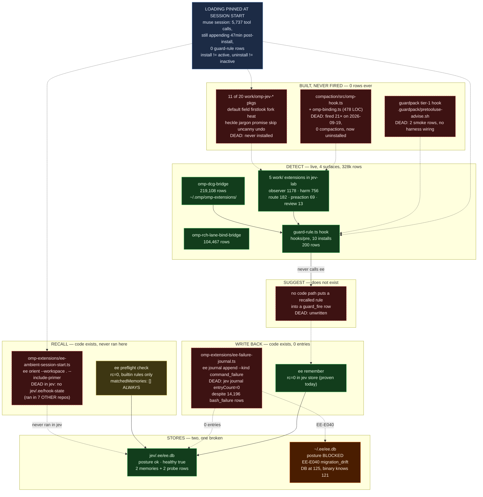

# Map: the hook / learning / `ee` feedback loop, as it actually is `[receipt]`

Inventory only, no code touched. Every count below was measured 2026-09-20
~18:38–18:55Z from live session JSONL and live binaries, exit codes unpiped.

**Headline 1, and it overturns a committed verdict:** `ee` is **not** dead.
`ee-repair-blocked-20260920.md` measured the **home** store. A *second*,
**healthy** store exists at `jev/.ee/` (created 12:22 today) and the full
`remember → search → preflight` surface returns rc=0 against it. The loop's
real blocker is not `ee`; it is that **the two extensions that would close
the loop already exist, already live in a loaded surface, and have never
run in this repo.**

**Headline 2, and it changes how every claim in this map must be read:**
**extension loading is pinned at session start.** A muse session with 5,737
tool calls was still appending 47 minutes after guard-rule was installed and
carries **zero** guard-rule rows; meanwhile it still emits rows from
extensions that are installed nowhere today. **Install ≠ active, uninstall ≠
inactive**, and a zero-row install may be untested rather than broken.

---

## 1. Commands (re-derivable by a stranger)

```bash
# live decision-row census (the assignment's command)
grep -rho '"kind":"[a-z_]*"' ~/.omp/profiles/*/agent/sessions/ ~/.omp/agent/sessions/ \
  | sort | uniq -c | sort -rn

# per-emitter census, EXCLUDING this mapping session's own transcript
#   (--private-tmp-- is where this agent ran; its tool output quotes every
#    emitter name and inflates the tail by exactly 2 rows per package)
grep -rho "com\.zeststream\.[a-z0-9.-]*\.\(decision\|diagnostic\|event\)\.v1" \
  ~/.omp/agent/sessions ~/.omp/profiles/*/agent/sessions --exclude-dir='--private-tmp--' \
  | sed 's/com\.zeststream\.//; s/\.\(decision\|diagnostic\|event\)\.v1//' \
  | sort | uniq -c | sort -rn

# install surfaces (three of them, not two)
ls -la ~/.omp/agent/hooks/pre/ ~/.omp/agent/extensions/ ~/.omp/omp-extensions/
for p in ~/.omp/profiles/*/; do find "$p/agent/hooks" "$p/agent/extensions" -type f; done

# install drift
shasum -a 256 work/omp-guard-rule/guard-rule.ts \
  ~/.omp/agent/hooks/pre/guard-rule.ts ~/.omp/profiles/*/agent/hooks/pre/guard-rule.ts
diff ~/.omp/profiles/jev-lab/agent/hooks/pre/guard-rule.ts work/omp-guard-rule/guard-rule.ts

# ee: the two stores
ee doctor --json                          # cwd=jev  -> posture ok
ee doctor --workspace /Users/josh --json  # home     -> posture blocked, EE-E040
ee migrate status --workspace /Users/josh --json
ee remember --level procedural --kind risk "<text>" --json   # cwd=jev -> rc=0
ee preflight check --cmd 'grep -c foo bar' --json            # cwd=jev -> rc=0
ee journal list --json                                       # cwd=jev -> entryCount 0
ee journal list --workspace /Users/josh --json               # home    -> EE-E040

# decision-row emitters in work/
ast-grep --lang ts -p 'pi.appendEntry($$$A)' work/ --json=compact   # 36 sites
ast-grep --lang js -p 'pi.appendEntry($$$A)' work/ --json=compact   # 1 site (observer.mjs)
rg -o '[A-Za-z_$.]+\.appendEntry' work/ --no-filename | sort | uniq -c

# guardpack live use
bash work/guardpack/guardpack-usage.sh    # rc=0, 2 warnings
rg -l 'pretooluse-advise' ~/.omp/config.yml ~/.omp/profiles/*/config.yml \
  ~/.claude/settings.json ~/.codex/config.toml   # rc=2 — NOT WIRED

# ambient-recall extension footprint
find ~/Developer ~/.ee -maxdepth 4 -name hook-state -type d

# session-pinning: is a zero-row install untested, or actually inert?
for p in ~/.omp/profiles/*/; do
  echo "$p $(find "$p/agent/sessions" -name '*.jsonl' -newermt '2026-09-20 11:05:00' | wc -l)"
done
f=~/.omp/profiles/muse/agent/sessions/-Developer-jev/2026-09-17T22-29-58-828Z_*.jsonl
grep -c tool_execution_start "$f"        # 5737
grep -o 'com\.zeststream\.[a-z0-9.-]*\.\(decision\|diagnostic\|event\)\.v1' "$f" \
  | sed 's/com\.zeststream\.//' | sort | uniq -c | sort -rn   # no omp-guard-rule
```

---

## 2. The loop



---

## 3. Installed vs ever-fired, per artifact

Row counts are **live-monotonic** (sessions grow). As-of 2026-09-20T18:55Z,
this mapping session's own transcript excluded (`--exclude-dir='--private-tmp--'`);
including it inflates every emitter name by ~2 and `omp-guard-rule` to 223.

### 3a. Install surfaces — there are THREE, not two

| path | what it is | KEEP/DISCARD/ALIGN | reason |
|---|---|---|---|
| `~/.omp/agent/hooks/pre/` | global hook dir; 1 file (`guard-rule.ts`) | KEEP | directory-discovered, proven loading (61 `guard_pass` + 1 `guard_fire` in `agent/sessions`) |
| `~/.omp/agent/extensions/` | global ext dir; 1 file (`dcg-guard.ts`, 27KB) | KEEP | it blocked a real call during this mapping run (`zeststream.shared_worktree:git-add-whole-tree`) |
| `~/.omp/omp-extensions/` | **22 files, 11 extensions + 11 tests.** Undocumented in any jev receipt. Source of 323,575 of the 328k rows | **ALIGN** | this is where `ee-ambient-session-start.ts` and `ee-failure-journal.ts` already live. Every jev receipt that says "the ee integration must be written" is wrong: it is written and sitting in a loaded surface |
| `~/.omp/profiles/*/agent/{hooks,extensions}/` | per-profile; 9 profiles carry guard-rule, jev-lab carries 8 extensions | KEEP | jev-lab is the only profile with the full jev extension set |

### 3b. Hooks and extensions — installed / fired

| path | what it is | KEEP/DISCARD/ALIGN | reason |
|---|---|---|---|
| `~/.omp/agent/hooks/pre/guard-rule.ts` | canonical (sha `f10f7e16…`) | KEEP | fired: 61 pass + 1 fire |
| `~/.omp/profiles/{claude,codex,glm,grok,muse,omp-1,omp-2,omp-3}/…/guard-rule.ts` | 8 installs, all canonical `f10f7e16…` | KEEP | claude fired 1 `guard_pass`; codex 10 diag rows. **glm / grok / omp-1 / omp-2 / omp-3 = installed, 0 rows, UNTESTED** — `find … -newermt '2026-09-20 11:05'` returns 0 sessions since install (last activity 2026-09-05, 2026-09-14, and 2026-08-21 ×3). Not "never fired"; never given a chance. **muse = installed, 0 rows, and DID run** — see the session-pinning row below |
| **(finding) hook loading is pinned at session start** | `muse/…/-Developer-jev/2026-09-17T22-29-58-828Z_…jsonl` — 48MB, **5,737 tool calls**, still being appended at 18:52Z, 47 min after the 18:05Z install | **ALIGN — changes how every install in this map is verified** | That one session emits 3,740 dcg-bridge + 3,647 rch-lane-bind + 54 harm-rule + 36 jev-route + observer/review/commit/preaction rows, and **zero guard-rule rows**. A session started 2026-09-17 carries the extension set resolved at *its* start: a hook installed mid-flight is invisible to it, and extensions since **removed** keep firing (muse has no `agent/extensions/` dir today, yet the session still emits `omp-jev-commit`). **Install ≠ active, and uninstall ≠ inactive. Only a session started after the install tests the install** |
| `~/.omp/profiles/jev-lab/…/guard-rule.ts` | **DRIFTED** — sha `d26727a0…`, receipt pins src `e2479f1` vs others `3108697` | **ALIGN (defect)** | `diff` shows it still carries `if (command.includes('\| head') …) return { cls: 'pipe-exit' }` — the class **dropped under R51**. The one live profile is running the one stale copy, and it is the copy that fires a retired class |
| `~/.omp/agent/extensions/dcg-guard.ts` | 27KB blocker, `pi.on("tool_call")` | KEEP | **emits zero `appendEntry` rows** — `rg -c appendEntry` = 0. It blocks but is invisible in the ledger. The 219,108 `omp-dcg-bridge` rows come from `omp-extensions/dcg-tool-bridge.ts`, a different file |
| `~/.omp/omp-extensions/dcg-tool-bridge.ts` | 219,108 rows (`dcg_allow` 222,277 / `dcg_block` 1,355 by kind) | KEEP | largest emitter in the system |
| `~/.omp/omp-extensions/rch-lane-bind-bridge.ts` | 104,467 rows (`lane_allow` 109,169 / `lane_block` 30) | KEEP | second largest |
| `~/.omp/omp-extensions/ee-ambient-session-start.ts` | **the RECALL leg.** `pi.on("session_start")` → `ee orient --workspace . --include-primer --fast --json`, 10s timeout, state in `<cwd>/.ee/hook-state`, off via `EE_AMBIENT_CONTEXT=0` | **ALIGN — highest-value item in this map** | `find` shows `hook-state` in franken-harvest, uds, clutterfreespaces.ios, zesttube, bequant-ai-native, control-plane, zeststream-cast, and `~/.ee` — **but not `jev/.ee/`**. It has run in 7 repos and never once in jev. It emits no `appendEntry`, so it is invisible to every row census we have taken |
| `~/.omp/omp-extensions/ee-failure-journal.ts` | **the WRITE-BACK leg.** `pi.on("tool_result")` → on non-zero bash exit, `ee journal append --kind command_failure --exit-code N`. `EE_BIN` hardcoded `/Users/josh/.local/bin/ee` | **ALIGN** | `ee journal list` in jev = `entryCount: 0` against 14,196 `bash_failure` rows. In the home workspace the same call returns `EE-E040`. Installed, loaded, zero output |
| `~/.omp/profiles/jev-lab/…/omp-jev-observer.ts` | 1,178 rows | KEEP | largest jev-authored emitter |
| `…/omp-harm-rule.ts` (jev-lab + codex) | 756 rows | KEEP | the axis-partner of guard-rule (destructive shape vs epistemic correctness) |
| `…/omp-jev-route.ts` | 182 rows | KEEP | fired |
| `…/omp-jev-preaction.ts` | 69 rows | KEEP | fired |
| `…/omp-jev-review.ts` | 13 rows | KEEP | fired, thin |
| `…/zz-route-dbg.ts` | 4 rows; debug scaffold | **DISCARD** | name says `zz-…-dbg`; 4 rows total; no work/ source (`ls work/zz-route-dbg` absent); superseded by `omp-jev-route` (182 rows). Debug scaffold left installed |
| `…/zz-probe.ts`, `…/zz-probe2.ts` | 17 and 10 LOC, emit `com.zeststream.probe.event.v1`, 224 rows combined | **DISCARD** | one-shot loader probes (`kind:"abs-import"`, `marker`). Their question — *does directory discovery load an extension?* — was answered and is now re-answered continuously by 328k production rows. No work/ source |

### 3c. `work/` decision-row emitters

`ast-grep --lang ts -p 'pi.appendEntry($$$A)' work/` → **36 call sites in 20 packages**; `--lang js` → 1 more (`work/omp-jev-observer/src/observer.mjs`). **37 sites / 21 packages.** `rg -l appendEntry work/` returns 57 files — the extra 36 are tests and mock `pi` objects (`rg -o '[A-Za-z_$.]+\.appendEntry'` → `pi.appendEntry` ×38, `host.appendEntry` ×1; ast-grep's 36 vs rg's 38 is two multi-line/`.mjs` sites).

Kinds declared in `work/` sources: `tool_call_observed`, `guard_pass`, `guard_fire`, `guard_error`, `harm_fire`, `harm_error`, `dcg_allow`, `failure_scored`, `random_audit`, `ctx_event_keys`, `summary`, `error`, `uncertain`.

| path | what it is | KEEP/DISCARD/ALIGN | reason |
|---|---|---|---|
| `work/omp-guard-rule/guard-rule.ts` (77 LOC) | canonical source of the hook; 3 classes post-R51 | KEEP | 200 live rows; the only artifact in this slice with source→install→row→golden→test all present |
| `work/omp-guard-rule/guard-rule.test.mjs` (85 LOC) | incl. `test("R51: piped commands no longer fire")` | KEEP | the negative arm that would have caught the jev-lab drift, had it run against the installed copy |
| `work/omp-guard-rule/golden.mjs` + `golden-output.jsonl` + `fixtures/session-pinned.jsonl` + `PROVENANCE.md` | golden replay, 6 tool_call events, volatile fields scrubbed | KEEP | `PROVENANCE.md` states the regenerate gate (`UPDATE_GOLDENS=1` + diff review, CI never auto-updates) |
| `work/omp-guard-rule/install-guard-rule.sh` (117 LOC) | writes hook + `INSTALL-RECEIPT.txt` (source sha + shasum + rollback line) | **ALIGN** | the receipt format is right and it is what *proved* the jev-lab drift. What it lacks is a **verify** mode: nothing re-checks installed-shasum against source, so drift is discoverable only by hand |
| `work/guardpack/install-guardpack.sh` (132 LOC) | 3-tier portable installer (PreToolUse hook / wrapper tools / gate stages) | **ALIGN** | installed into `~/.guardpack` and `jev/.guardpack`. Its tier-1 hook still carries **all four** classes including `pipe-exit` — same R51 drift as jev-lab, second instance |
| `work/guardpack/guardpack-usage.sh` (51 LOC) | usage telemetry; exit 3 = installed-never-fired, exit 4 = not installed | **KEEP — best-designed artifact in this slice** | it encodes exactly the installed-but-never-fired distinction this whole map is about, and it self-discloses ("a warning is not a prevented defect"). Live result: rc=0, **2 warnings, both at `17:32:10Z`, both repo `jev`** — one second apart = a single smoke invocation, not use |
| `jev/.guardpack/pretooluse-advise.sh` (1.7KB, installed) | tier-1 advisory hook | **ALIGN (defect)** | `rg -l pretooluse-advise` across `~/.omp/config.yml`, `~/.omp/profiles/*/config.yml`, `~/.claude/settings.json`, `~/.codex/config.toml` → **rc=2, no match**. The installer's own banner warns "Unwired is the default failure" and that is exactly the state |
| `work/omp-jev-{observer,route,preaction,review,failure,dispatch,foreman,rerank,commit}` (9) | emitted 1,178 / 182 / 69 / 13 / 67 / 42 / 40 / 38 / 4 rows | KEEP | fired. Note only 5 are *currently* installed — failure/dispatch/foreman/rerank/commit have rows but no current install: installed, used, removed |
| `work/omp-jev-{default,field,firstlook,fork,heat,heckle,jargon,promise,skip,uncanny,undo}` (11) | built packages with `pi.appendEntry` call sites | **DISCARD (11 of 20)** | **zero rows, ever**, across `~/.omp/agent/sessions` + all 12 profile session dirs, excluding this session's transcript. Not installed in any of the 3 surfaces. Proof: absent from the per-emitter census; independently confirmed by a second per-package pass. Built and never wired — 55% of the omp-jev fleet |
| `compaction/src/omp-hook.ts` (232 LOC) + `omp-binding.ts` (246 LOC) | `pi.on('session_before_compact')`, typed `OmpHookApi`, env binding | **DISCARD or ALIGN — decide explicitly** | **fired 21 times on 2026-09-19 and compacted nothing.** `~/.jev-compact.log`: 12 `refused: no messages on the event envelope` (envelope keys are `type,preparation,branchEntries,customInstructions,signal` — there is no `messages` field), 7 `passthrough: below minimum reduction`, 2 `shape`. Not installed in any surface today. `pane2-ee-feedback-loop.md` cites it as "a tested, live registration pattern" — **it is a tested registration pattern against an event envelope that does not exist.** Anything copying it inherits the refusal |

### 3d. `ee` — state today, quoted

| surface | result | evidence |
|---|---|---|
| binary | `ee 0.15.2`, `/Users/josh/.local/bin/ee`, rc=0 | `ee --version` |
| **`jev/.ee/ee.db`** | **`"posture":"ok","healthy":true`** — runtime ok, workspace ok, database "schema is current", search_index ready | `ee doctor --json` from `/Users/josh/Developer/jev` |
| `~/.ee/ee.db` | **`"posture":"blocked","healthy":false`** | `ee doctor --workspace /Users/josh --json` |
| the error, verbatim | `Database readiness check failed: EE-E040 migration_drift: applied migration 122 drifted; expected <unknown> (<unknown>), found typed_pack_item_identity (blake3:efc0e1116ff86621a8c00a93aaa48432feb6abf2685361b8cf2e124269be723c)` | ibid |
| journal, home | `"code":"migration_required" … "Failed to migrate journal database: EE-E040 migration_drift: applied migration 122 drifted…"` | `ee journal list --workspace /Users/josh --json` |
| `migrate status`, home | `"latestCompiledSchemaVersion":121,"needsMigration":false,"pendingCount":0,"upToDate":true` — **`schemaVersion: null`** | reproduces `ee-repair-ready`'s finding: DB at 122–125, binary knows 121, and `migrate status` still says "up to date". A green status line over a blocked DB |

**The four legs, measured:**

| leg | mechanism | state |
|---|---|---|
| **detect** | `guard-rule.ts` `pi.on('tool_call')` | **LIVE** — 200 rows, 10 installs |
| **recall** | `ee preflight check` | **LIVE BUT EMPTY.** rc=0; returns builtin rules only (`builtin:rm_rf_root`, `builtin:file_deletion`). `matchedMemories: []` **even after** storing `--level procedural --kind risk` memory `mem_01M301VMH9E2PVR9ZTZ8D2KN7W` whose text names `grep -c` — then re-running `ee preflight check --cmd 'grep -c foo bar'`: still `matches 0 matchedMemories 0`. **`ee remember` output does not reach `ee preflight`.** `ee tripwire list` = `total_count: 0`. This is the round trip `pane2-ee-feedback-loop.md` demands as Unit 1's proof, and it does **not** close — for a reason unrelated to EE-E040 |
| **suggest** | guard row carries `suggestion` field | **DOES NOT EXIST.** `guard-rule.ts` never calls `ee`; the row schema has `kind/class/command/toolCallId/error/model/timestamp`, no `suggestion` |
| **write back** | `ee-failure-journal.ts` → `ee journal append`; or `ee remember` | **`ee remember` PROVEN LIVE** (rc=0, `mem_01M301TZEGEV5AGHYKC4T9EYP2`, writes to `jev/.ee/ee.db`). **`ee journal append` via the hook has produced 0 entries in jev and is EE-E040-dead in home** |

### 3e. Receipts in this slice

| path | what it is | KEEP/DISCARD/ALIGN | reason |
|---|---|---|---|
| `alignment-operating-model-20260920.md` | franken_alignment (mirror `9208598`) mapped onto our practice | KEEP | see §4 |
| `ee-repair-blocked-20260920.md` | Unit 1 BLOCKED verdict | **ALIGN — superseded in part** | its chain is honest and its steps reproduce, but every command ran against the **home** workspace. Its conclusion "a memory that cannot be written to is not a component" is **false for `jev/.ee/`**, where `remember` returns rc=0 today. Needs a one-line as-of amendment naming the workspace, or it will keep blocking work that is not blocked |
| `ee-repair-ready-20260920.md` | rebuilt-on-copy; found DB at 125 vs binary 121; swap withheld | KEEP | correctly refuses the irreversible swap; its diagnosis reproduces exactly (`migrate status` still lies green) |
| `guard-dogfood-20260920.md` | live-fire proof, jev-lab session `2026-09-20T17-49-12` | **ALIGN** | the quoted row is `"class": "pipe-exit"` — **the retired class**. The dogfood proof and the drifted install are the same artifact. Still valid as *loading* proof; invalid as proof of the shipped classifier |
| `guard-fp-rate-20260920.md` | n=100 seeded, 67 hand-labelled; pipe-exit FP 0.053 **KEEP**, grep-as-proof 0.000 KEEP, stage-all/commit-backtick UNDERPOWERED | **ALIGN — unresolved contradiction** | this receipt rules `pipe-exit` **KEEP** on a measured 5.3% FP rate. `NEGATIVE_EVIDENCE.md:2370` (R51) rules it **DROPPED** on a 55.2% fire rate. Both are in the tree; the shipped code follows R51; two installs follow the fp-rate receipt. **Nothing in the repo reconciles them** |
| `hardening-20260920.md` | 4 selftests wired + 3 refusals (R46/R47/R48) with named triggers | KEEP | R48's refusal ("the misread lives in transient tool calls") is the same territory guard-rule's `pipe-exit` class covers — a third unreconciled position |
| `hardening-census-20260920.md`, `hardening-census-rerun-20260920.md` | wired-vs-prose census + delta re-run | KEEP | the re-run reports movement honestly ("4 → 4, unchanged") |
| `hardening-stranger-grade-20260920.md` | author grading own page, every command executed | KEEP | 3 selftests RUN with counts and rc |

---

## 4. `alignment-operating-model-20260920.md` — adopted / refused / undecided

Source: `/Volumes/ZestData/dicklesworthstone-mirror/franken_alignment` @ `9208598`, README + design plan. Found via the franken-harvest MCP index.

**ADOPT (1):** `DecisionClosure` — one composable object that is simultaneously authorization, tamper-evident record, replayable baseline, calibration sample, and regression test. We produce all five by hand as five artifacts; they drifted 3× in one session (`STATUS.tsv` fell behind 3×, a digest pinned to a live file took the lane RED, README counts went stale 2×).

**REFUSE (3, with reasons):**
- Conserved rights (`held + available + spent == total`) — *not applicable*, we authorize no live effects.
- Effect Gate / one-shot permits — *not applicable*, same reason; "pretending otherwise would be ceremony".
- Progressive ATP, Z-sets, codecs, dominator trees — *refuse*, "no observed defect here justifies the machinery".

**PARTIAL / GAP (4):**
- Graduated Autonomy Ledger — *partially ours* (rungs 1–5, promotion refused 45×), **missing demotion**.
- Model Passport / identity liveness — *real gap, cheap to close*; we pin fixtures, not the model epoch.
- Risk-Theater Detector — *ours is the manual version* (honesty pass, every third tick).
- Commit–reveal congresses — *weak analogue*; our reviewer sees our verdict first, "precisely the herd behaviour salted commit–reveal exists to prevent".

**NOT DECIDED:** the doc ranks 3 actions (closure object, demotion rule, model-epoch pin). **None is implemented, none is refused, none has an owner or a bead.** They are the undecided set.

**Loop-relevant:** adopting `DecisionClosure` would collapse *this slice's* worst defect class too — the guard-rule install receipt, its shasum, the golden, and the fp-rate verdict are four artifacts that drifted apart into an install firing a retired class while a passing test proved it retired.

---

## 5. The ordered minimum to make the loop live

Each step names its blocker. Steps 1–5 need nothing from a broken `ee`.

| # | step | blocker | `ee`-broken? |
|---|---|---|---|
| **0** | **Adopt one verification rule before any of the below: a hook install is unproven until a session started *after* it emits a row.** Measured: the muse session with 5,737 tool calls was still appending 47 min after the install and shows 0 guard-rule rows, because its extension set was resolved at its 2026-09-17 start. | **None — a rule, not code.** Without it, steps 1/4/5/6 will each be "verified" against a long-running session that cannot see them, and will each read as failure. This is also why 5 packages (failure, dispatch, foreman, rerank, commit) hold rows while being installed nowhere today. | no |
| **1** | **Re-install `guard-rule.ts` into `jev-lab` from canonical source, then start a NEW session to verify.** `bash work/omp-guard-rule/install-guard-rule.sh jev-lab`; `shasum -a 256` must equal `f10f7e16f9375c41ff25ad5d4c84265fedf13b4512a444e4c41be3611050a38f` across all 10 installs; a fresh session must then emit a `guard_pass`. | **None.** One command plus one fresh session (step 0). The only profile with post-install sessions running jev work is on the only stale copy, and it fires `pipe-exit`, retired under R51. | no |
| **2** | **Reconcile R51 vs `guard-fp-rate-20260920.md` on `pipe-exit`, in one ruling.** Either re-add the class (fp-rate measured 0.053 FP over n=100, disposition KEEP) or amend the fp-rate receipt to record that its KEEP was overturned. | **A decision, not code.** Two committed receipts give opposite verdicts on the same class; step 1 silently enacts one of them. Also touches `hardening-20260920.md` R48. | no |
| **3** | **Add `--verify` to `install-guard-rule.sh`** — compare installed shasum to `INSTALL-RECEIPT.txt` across all profiles, exit 3 on drift; add it as a `scripts/selftest-*.sh` arm so stage 80's glob picks it up. | **None.** Drift existed for ~7h and was found only by hand-diffing during this mapping run. | no |
| **4** | **Wire guardpack tier-1, or delete the installed copy.** Point a harness PreToolUse bash hook at `jev/.guardpack/pretooluse-advise.sh`, or `rm -r jev/.guardpack` and stop counting it as installed. | **None.** Currently the worst state: installed, unwired, 2 smoke rows in one second. Its own installer calls this "the default failure". Note: its class list also carries `pipe-exit` → gated on step 2. | no |
| **5** | **Run `ee orient` once in jev to create `jev/.ee/hook-state`, then start a NEW session and confirm `ee-ambient-session-start` fires.** The extension is already in a loaded surface; it has produced `hook-state` in 7 other repos and never in jev. Check `EE_AMBIENT_CONTEXT` is not disabled in the jev lane's env. Verify by the state file, **not** by a row census — it emits no `appendEntry`. | **None — this is the single highest-value step and it is unblocked.** The recall leg is *installed and working elsewhere*. Nobody here has noticed, because it emits no `appendEntry` row and every census we run is a row census. Needs step 0: a running session will never load it. | **no — and this is the correction to the "ee is dead" posture** |
| **6** | **Make the write-back land: confirm `ee-failure-journal.ts` produces entries in `jev/.ee/`.** 14,196 `bash_failure` rows, `ee journal list` = `entryCount: 0`. Instrument once (`--json` to a log, or check `EE_BIN` resolution and the `event.details.exitCode` parse) and re-measure. | **Partly `ee`.** In the **jev** store `ee journal append` should work (`remember` proves writes land). In the **home** store it is hard-dead: `EE-E040`. Since the hook passes no `--workspace`, **its behaviour depends entirely on the session cwd** — a jev session writes to the healthy store, any session outside a workspace writes to the broken one. **⚠ `ee`-broken for every non-jev cwd.** | **partly** |
| **7** | **Close `remember → preflight`, or rule it unclosable.** Today `ee remember --kind risk` does **not** surface in `ee preflight check`. Find the actual rule surface (`ee tripwire`? `ee claim`? workspace rules config?) and prove one authored rule matches one command. | **Not EE-E040 — an unknown surface.** `pane2-ee-feedback-loop.md` Unit 1 names this round trip as the STOP gate for everything downstream, and it fails **in the healthy store**. The blocked receipt attributed this to migration drift; that attribution is wrong. **This is the real Unit-1 blocker and it is newly identified here.** | **no — and the old diagnosis was wrong** |
| **8** | **Seed 4 command-shaped rules** (pipe-then-read-rc, grep-as-proof, env-vs-argv, digest-pinned-to-live-file), each with a corrected command, per `pane2` Unit 2. Do **not** bulk-import all ~50 `NEGATIVE_EVIDENCE` entries. | **Step 7.** Seeding a surface that does not recall is wallpaper. | no |
| **9** | **Add `suggestion` to the guard row.** On `guard_fire`, call `ee preflight check --cmd-base64 <cmd>` (the base64/stdin flags exist precisely so an outer dcg guard cannot false-match); on a match, put the corrected command in the decision row. Hard requirement from `pane2`: if `ee` is slow or absent the hook still fires with `suggestion: null`. | **Steps 7 + 8.** The code is trivial; without recall content it emits `suggestion: null` forever. | no |
| **10** | **Decide `compaction/src/omp-hook.ts`: fix the envelope contract or mark DEAD.** 21 fires, 0 compactions, 12 refusals because the event envelope carries `type,preparation,branchEntries,customInstructions,signal` and no `messages`. | **A contract mismatch with the harness.** Independent of `ee`. Until decided, `pane2-ee-feedback-loop.md` keeps citing it as the "tested, live registration pattern" to copy — and it is tested against an envelope shape that does not occur. | no |
| **11** | **Delete the 11 never-fired `omp-jev-*` packages and the 3 `zz-*` installs**, or file the reason each stays. | **None.** 11 of 20 packages, 0 rows ever. | no |
| **12** | **Home store `~/.ee/ee.db`: escalate or quarantine.** Per `ee-repair-ready`, needs a binary knowing ≥125 or a schema owner blessing a 125→121 downgrade. | **`ee`, genuinely.** ⚠ **Cannot be done here.** Backup at `/tmp/ee-backup-20260920/`. Interim mitigation: pass `--workspace` explicitly wherever a hook calls `ee`, so cwd cannot route a write into the broken store (this is step 6's real fix). | **YES — blocked** |

**Only steps 6 (partially) and 12 (fully) are blocked by `ee`.** The prevailing "the loop is blocked on a dead `ee`" posture is not supported by today's measurements: **the recall leg is installed and working in 7 other repos, and the write leg returns rc=0 in this repo's own store.**

---

## 6. NO-CLAIM

- **Row counts are live-monotonic.** As-of 2026-09-20T18:55Z with this session's transcript excluded. Re-running will not reproduce these integers; the *ordering* and the *zero/non-zero* distinctions are the durable content. The 2-row tail entries in an unfiltered census are this session quoting emitter names — I excluded `--private-tmp--` and say so rather than pinning a number I know rots.
- **I did not run** `foundation/gates.sh`, any selftest, `guard-rule.test.mjs`, `golden.mjs`, the test suite, or `install-guard-rule.sh`. Drift is asserted from `shasum` + `diff` only.
- **I did not read** the full bodies of `dcg-guard.ts` (27KB), `ee-ambient-session-start.ts` (11KB), `adapter.ts`, or the 8 other `~/.omp/omp-extensions/` extensions — only their hook registration, emit types, constants, and env gating. `ee-ambient-session-start`'s *effect* (what it injects at session_start) is **inferred from its argv** (`ee orient --workspace . --include-primer --fast --json`) and its state-dir footprint, **not observed firing**.
- **"Never fired" means "no row in `~/.omp/**/agent/sessions`", and that test has two known blind spots.** (a) An extension that writes only to an external store — exactly `ee-ambient-session-start` — is invisible to it; that is *why* I checked `hook-state` separately, and why I distrust any row census as a completeness oracle here. There may be other ledger-invisible emitters I did not think to probe. (b) Because loading is pinned at session start (§3b), a zero-row install may be **untested** rather than broken. I separated those two only for the 8 guard-rule profile installs (via `find -newermt`); for the 11 never-fired `omp-jev-*` packages I did **not** need to, since they are installed in none of the three surfaces — but I did not verify they were absent from every surface at every past moment, only now.
- **`ee` store mutations I made** (disclosed, not cleaned up): 2 memories written to `jev/.ee/ee.db` — `mem_01M301TZEGEV5AGHYKC4T9EYP2` and `mem_01M301VMH9E2PVR9ZTZ8D2KN7W`, both prefixed `PROBE map-hook-ee-20260920`. Left in place as evidence; deleting them would be an unreviewed write to a shared store. `~/.ee/` never written.
- **Step 7's root cause is unknown.** I proved `remember → preflight` does not close; I did **not** find the surface that would close it. `ee tripwire list` = 0 and `ee config show` were the only alternatives probed.
- **§4 is a reading of one README + one plan at one revision.** I ran none of franken_alignment's tests and did not open the mirror myself; I am reporting the receipt's mapping, and the receipt's own NO-CLAIM says the mapping is "an argument about our practices, not a verified claim about theirs".
- **Profiles `omp-test`, `omp-test2`, `omp-test3`** carry no hooks and no sessions; not investigated further.

`[receipt]` used.
