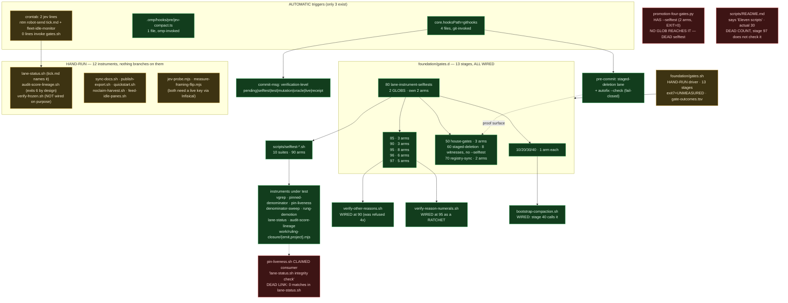

# Map — the verification machinery (instruments slice), 2026-09-20

Scope: `foundation/gates.sh`, all 13 stages in `foundation/gates.d/*.sh`, all 30 entries in
`scripts/`, the 4 files in `githooks/`, `.omp/hooks/pre/`, and `work/ruling-closure/` (named
explicitly in the assignment). Inventory only — nothing in this slice was edited.

Measured at HEAD `038aeb4`. Every number below is re-derivable with a command printed in §1.

---

## 1. Exact commands run

```bash
cd /Users/josh/Developer/jev

# inventory
ls foundation/gates.d/ ; ls scripts/ ; ls githooks/ ; ls .omp/hooks/pre/
ls scripts | wc -l                                  # -> 30
ls foundation/gates.d/[0-9]*-*.sh | wc -l           # -> 13
wc -l foundation/gates.sh foundation/gates.d/*.sh scripts/* githooks/* .omp/hooks/pre/*

# THE discovery question: what does stage 80 currently glob up?
bash foundation/gates.d/80-lane-instrument-selftests.sh ; echo "EXIT=$?"   # -> EXIT=0, 24.2s

# the four newest guards + rung-demotion + ruling-closure, each ALONE
for s in selftest-vgrep selftest-pinned-denominator selftest-pin-liveness \
         selftest-denominator-sweep selftest-rung-demotion selftest-ruling-closure; do
  bash scripts/$s.sh ; echo "EXIT=$?"
done

# the two "gates nothing" instruments — current state
bash scripts/vgrep.sh -rn --include='*.sh' --include='*.py' --include='*.mjs' \
  -e 'verify-other-reasons' -e 'verify-reason-numerals' foundation/ githooks/ scripts/ .omp/ work/
./scripts/verify-other-reasons.sh   ; echo "EXIT=$?"   # -> EXIT=0
./scripts/verify-reason-numerals.sh ; echo "EXIT=$?"   # -> EXIT=12
bash foundation/gates.d/95-numerals-ratchet.sh         # -> PASS, 3 live hits all registered

# stage 60 has no --selftest guard; it IS the causal lane. Run it to count witnesses.
bash foundation/gates.d/60-staged-deletion-lane.sh     # -> 2 triggers + 6 satisfying witnesses

# hand-run-only selftest that no glob reaches
python3 scripts/promotion-four-gates.py --selftest ; echo "EXIT=$?"   # -> EXIT=0, 2 arms

# wiring facts
git config --get core.hooksPath      # -> /Users/josh/Developer/jev/githooks
crontab -l | grep -i jev             # -> 2 jev lines: ntm robot-send tick, fleet-idle-monitor
crontab -l | grep -cE 'feed-idle-panes|noclaim-harvest|lane-status|gates.sh'   # -> 0
bash scripts/vgrep.sh -n 'pin-liveness' scripts/lane-status.sh   # -> rc=3 ZERO MATCHES
bash scripts/vgrep.sh -rn 'promotion-four-gates' foundation/     # -> rc=3 ZERO MATCHES
bash scripts/vgrep.sh -o -E 'scripts/[a-z-]+\.(sh|mjs|py)' docs/demos/tick.md | sort -u
```

`vgrep.sh` was used for every grep that carries a claim here; the two `rc=3` results above are
reported as **INCONCLUSIVE-then-confirmed-by-reading the file**, not as "clean".

---

## 2. What stage 80 currently discovers

One run, `EXIT=0`, 24.2s. Its closing line is derived from the globs, never written down:

```
80-lane-instrument-selftests: 10 instrument suite(s) + 11 stage selftest(s) PASS
```

**Scan set A — `scripts/selftest-*.sh` glob (10 suites, 90 arms total):**

| suite | arms | PASS line |
|---|---|---|
| `selftest-denominator-sweep.sh` | 3 | `3 ok, 0 failed` |
| `selftest-lane-status-integrity.sh` | 18 | `all four gates discriminate on all 18 arms` |
| `selftest-other-reasons.sh` | 17 | `discriminates on all 17 arms; real files never written` |
| `selftest-pin-liveness.sh` | 8 | `8 ok, 0 failed` |
| `selftest-pinned-denominator.sh` | 11 | `11 ok, 0 failed` |
| `selftest-reason-numerals.sh` | 9 | `discriminates on all 9 arms; real STATUS never written` |
| `selftest-ruling-closure.sh` | 6 | `6 ok, 0 failed` |
| `selftest-rung-demotion.sh` | 2 | `2 ok, 0 failed` |
| `selftest-score-lineage.sh` | 8 | `discriminates on all 8 arms` |
| `selftest-vgrep.sh` | 8 | `8 ok, 0 failed` |

**Scan set B — `gates.d/*.sh` that contain the `"${1:-}" = --selftest` guard (11 stages, 34 arms):**
10 (1), 20 (1), 30 (1), 40 (1), 50 (3), 70 (2), 85 (3), 90 (3), 95 (8), 96 (6), 97 (5).

Two stages are absent from scan set B, both correctly:
- **80 itself** — explicitly skipped (`case … in 80-*) continue`), never recurses. Its own 2 arms
  (missing suite → `ABSENT`, mode-dropped suite → `UNEXEC`) run only under `gates.sh --selftest`.
- **60** — has **no** `--selftest` guard, because it *is* the causal lane: every run exercises
  8 witnesses in both directions (`2 triggers + 6 satisfying`). Under `gates.sh --selftest` it
  ignores the flag and runs the same 8. Not a gap.

**Grand total under stage 80: 124 arms** (90 instrument + 34 stage), plus 8 at stage 60 and 2 at
stage 80 reachable only via `gates.sh --selftest` = **134 arms** in the suite.

---

## 3. The six guards run ALONE

| instrument | selftest | arms | exit |
|---|---|---|---|
| `scripts/vgrep.sh` | `selftest-vgrep.sh` | 8 | 0 |
| `scripts/pinned-denominator.sh` | `selftest-pinned-denominator.sh` | 11 | 0 |
| `scripts/pin-liveness.sh` | `selftest-pin-liveness.sh` | 8 | 0 |
| `scripts/denominator-sweep.sh` | `selftest-denominator-sweep.sh` | 3 | 0 |
| `scripts/rung-demotion.sh` | `selftest-rung-demotion.sh` | 2 | 0 |
| `work/ruling-closure/{emit,project}.mjs` | `selftest-ruling-closure.sh` | 6 | 0 |

All six are hermetic (temp dirs; the real `STATUS.tsv`, sidecar and `closures/` are never written)
— which is the precondition stage 80's header says had to be met before any of them could be wired.

---

## 4. The two "gates nothing" instruments — the premise is STALE

The assignment states both gate nothing. **Both were promoted and both are wired today.**

| instrument | claimed state | measured state 2026-09-20 |
|---|---|---|
| `scripts/verify-other-reasons.sh` | hand-run, promotion refused 4× | **WIRED** — `foundation/gates.d/90-sidecar-verifier-wrapper.sh:75` runs `./scripts/verify-other-reasons.sh` and maps rc10→exit 7 UNMEASURED, rc13→RED, rc0→PASS. Live run `EXIT=0`, 38 inputs, `manifest_digest a3bf5c88bb0de3f0`. |
| `scripts/verify-reason-numerals.sh` | hand-run, ruled KEEP_HAND_RUN_ONLY | **WIRED** — `foundation/gates.d/95-numerals-ratchet.sh:117` runs it as a **ratchet** against `foundation/numerals-ruled.tsv`. Underlying script live `EXIT=12` (3 unopenable numerals, by design advisory); stage 95 live `PASS  3 live hit(s), all registered; 3 ruled row(s)`. |

The 5th ruling (`ruling-sidecar-promotion-20260918T160000Z.json`, f862ec0) flipped the first;
`numerals-hold-ruling-20260918T161328Z.json` (20df1d7) flipped the second. Anyone re-reading the
older rulings without re-running the greps will re-derive the stale claim — worth a line in the
top-level README.

---

## 5. Topology



---

## 6. Instrument table

`wired?` uses the repo's own boundary test: **does running code branch on its exit status?**
A selftest that stage 80 globs up counts as wiring for the instrument it drives, because a RED
there fails the suite.

| instrument | wired? | arms | retirement condition | verdict |
|---|---|---|---|---|
| `foundation/gates.sh` | **HAND-RUN** (no cron, no hook; stage 80's header says so explicitly) | n/a (driver, 13 stages) | **NONE** | KEEP |
| `gates.d/10-fixture-integrity.sh` | WIRED | 1 | **NONE** | KEEP |
| `gates.d/20-receipt-freshness.sh` | WIRED | 1 (sha-mismatch arm admitted uncovered) | **NONE** | ALIGN — add the sha-mismatch arm |
| `gates.d/30-no-secrets.sh` | WIRED | 1 | **NONE** | KEEP |
| `gates.d/40-omp-compact-replay.sh` | WIRED | 1 | **NONE** | KEEP |
| `gates.d/50-house-gates.sh` | WIRED | 3 | **NONE** (argued refusal for the 4th house gate, not a retirement) | KEEP |
| `gates.d/60-staged-deletion-lane.sh` | WIRED | 8 (2 trigger + 6 satisfying) | **NONE** | KEEP |
| `gates.d/70-tests-registry-sync.sh` | WIRED | 2 | **NONE** | KEEP |
| `gates.d/80-lane-instrument-selftests.sh` | WIRED | 2 own + drives 124 | **NONE** | KEEP — the load-bearing discovery stage |
| `gates.d/85-promotion-contract.sh` | WIRED | 3 | *"when a promotion gate exists inside foundation/gates.sh itself and this standalone stage becomes redundant."* | KEEP |
| `gates.d/90-sidecar-verifier-wrapper.sh` | WIRED | 3 | *"retire or demote only after a replacement verifier consumes the same sidecar contract with equal or stronger arms and a recorded migration; NEVER delete because the current run is green"* | KEEP |
| `gates.d/95-numerals-ratchet.sh` | WIRED | 8 | *"retire only when a successor opens numerals with equal or stronger arms AND carries the register forward; NEVER because the current run is green"* | KEEP |
| `gates.d/96-verdict-status-agreement.sh` | WIRED | 6 | *"a mechanically GENERATED verdict document, or a stronger semantic sync; never because the current run is green"* | KEEP |
| `gates.d/97-readme-counts.sh` | WIRED | 5 | *"when these counts are GENERATED into the README rather than typed, this stage has nothing left to check and should be deleted rather than kept green"* | KEEP |
| `scripts/vgrep.sh` | WIRED (selftest globbed) | 8 | *"when no verification path in this repo calls bare grep for proof. Measure with `grep -rc 'grep -[cq]' scripts/ foundation/`: it was 35 sites at creation."* | KEEP |
| `scripts/pinned-denominator.sh` | WIRED (selftest + called by sweep) | 11 | *"when no published share in this repo carries a bare denominator without a pinned regeneration command beside it … retire only when a second session lands zero new drift defects."* | KEEP |
| `scripts/pin-liveness.sh` | WIRED (selftest only) | 8 | *"when receipts are immutable by construction (write-once, content-addressed paths). Then liveness is impossible and this check is dead weight."* | **ALIGN** — its stated consumer `lane-status.sh` does not call it (0 matches) |
| `scripts/denominator-sweep.sh` | WIRED (selftest globbed) | 3 | **NONE** | ALIGN — add one; it is a runner over 8 pinned claims |
| `scripts/rung-demotion.sh` | WIRED (selftest globbed) | 2 | *"when receipts carry machine-readable input manifests (closure inputs[] with as_of); then this grep-shape check is dead weight and the closure verifier subsumes it."* | KEEP |
| `work/ruling-closure/emit.mjs` | WIRED (selftest globbed) | 6 (shared) | *"when STATUS.tsv is generated from closures rather than edited (project.mjs exists for exactly this); then emit is the only writer."* | KEEP |
| `work/ruling-closure/project.mjs` | WIRED (selftest globbed) | 6 (shared) | **NONE** | KEEP |
| `scripts/verify-other-reasons.sh` | **WIRED** at stage 90 (live `EXIT=0`) | 17 | stated at its consumer (stage 90, quoted above) | KEEP |
| `scripts/verify-reason-numerals.sh` | **WIRED** at stage 95 as a ratchet (live `EXIT=12`, stage PASS) | 9 | stated at its consumer (stage 95, quoted above) | KEEP |
| `scripts/selftest-denominator-sweep.sh` | WIRED | 3 | **NONE** | KEEP |
| `scripts/selftest-lane-status-integrity.sh` | WIRED | 18 | **NONE** | KEEP |
| `scripts/selftest-other-reasons.sh` | WIRED | 17 | **NONE** | KEEP |
| `scripts/selftest-pin-liveness.sh` | WIRED | 8 | **NONE** | KEEP |
| `scripts/selftest-pinned-denominator.sh` | WIRED | 11 | **NONE** | KEEP |
| `scripts/selftest-reason-numerals.sh` | WIRED | 9 | **NONE** | KEEP |
| `scripts/selftest-ruling-closure.sh` | WIRED | 6 | **NONE** | KEEP |
| `scripts/selftest-rung-demotion.sh` | WIRED | 2 | **NONE** | KEEP |
| `scripts/selftest-score-lineage.sh` | WIRED | 8 | **NONE** | KEEP |
| `scripts/selftest-vgrep.sh` | WIRED | 8 | **NONE** | KEEP |
| `scripts/bootstrap-compaction.sh` | WIRED — stage 40 calls it on a fresh clone | 0 (`--check` mode only) | **NONE** | KEEP |
| `scripts/lane-status.sh` | HAND-RUN — `docs/demos/tick.md` is its only named caller; cron sends the tick to pane 1, it does not run the script | 18 (via its selftest) | **NONE** | KEEP — ruled HAND-RUN (mutable shared state) |
| `scripts/audit-score-lineage.sh` | HAND-RUN — ruled "history only"; exits 6 by design on this repo | 8 (via its selftest) | **NONE** (has a *return condition* for the demoted RULE, not for the watcher) | KEEP |
| `scripts/verify-frozen.sh` | HAND-RUN — *"NOT WIRED INTO foundation/gates.sh ON PURPOSE"* (clones + npm; too slow for a stage) | 0 | *"delete this when CI runs the same suites on every push, which is the strictly better version of the same idea."* | KEEP |
| `scripts/promotion-four-gates.py` | **HAND-RUN** — 0 refs under `foundation/`; only `EVAL.md` / `TESTS.md` / one receipt | **2** (`--selftest` `EXIT=0`: planted-no-adversarial FAIL, UP-R5 FAIL) | **NONE** | **ALIGN** — it ships a passing selftest that *no glob reaches*; see §7 |
| `scripts/sync-docs.sh` | HAND-RUN (88 doc refs, 0 executable callers) | 0 | **NONE** | KEEP |
| `scripts/publish-export.sh` | HAND-RUN | 0 (`--check-only` mode) | **NONE** | KEEP |
| `scripts/quickstart.sh` | HAND-RUN — the fresh-clone entrypoint; runs demos, not scripts | 0 | **NONE** | KEEP |
| `scripts/noclaim-harvest.sh` | HAND-RUN — not in crontab | 0 | *"when two consecutive harvests produce beads no pane claims, delete this."* | KEEP |
| `scripts/feed-idle-panes.sh` | HAND-RUN — **not in crontab** (`grep -c` over crontab = 0), despite being written for the cron gap | 0 | **NONE** | ALIGN — either wire it or say in its header that it is deliberately manual |
| `scripts/jev-probe.mjs` | HAND-RUN — needs a live key via Infisical | 0 | **NONE** | KEEP |
| `scripts/measure-framing-flip.mjs` | HAND-RUN — needs a live key; **1** inbound ref total (`README.md:153`) | 0 | **NONE** | KEEP — it re-checks the README's headline claim; cheapest live-arm in the repo |
| `scripts/README.md` | registry doc (required by `foundry/flywheel/stamp-check.sh`) | n/a | n/a | **ALIGN** — says *"Eleven scripts"*; `ls scripts \| wc -l` = **30**. Its own second sentence predicts this rot. Stage 97 checks README.md counts but not this file. |
| `githooks/commit-msg` | **WIRED** — `core.hooksPath=/Users/josh/Developer/jev/githooks` | 0 (wrapper; fail-closed on missing impl) | **NONE** | KEEP |
| `githooks/commit-msg-verification-level.sh` | **WIRED** via the wrapper | 0 | **NONE** | KEEP |
| `githooks/pre-commit` | **WIRED** — 2 lanes, both fail-closed | 0 | **NONE** | KEEP |
| `githooks/pre-commit-staged-deletion-survives.sh` | **WIRED** via the wrapper; proof surface is stage 60 | 8 (at stage 60) | **NONE** | KEEP |
| `.omp/hooks/pre/jev-compact.ts` | **WIRED** — omp loads `.omp/hooks/pre/*`; logic lives in tested `compaction/src/omp-binding.ts` | 0 here | **NONE** | KEEP |

---

## 7. Counts and findings

**WIRED: 38 · HAND-RUN: 12** (50 instruments; `scripts/README.md` is a registry doc, not counted).

WIRED = 13 gate stages + 10 selftest suites + 7 instruments reached through a globbed selftest
(`vgrep`, `pinned-denominator`, `pin-liveness`, `denominator-sweep`, `rung-demotion`,
`verify-other-reasons`, `verify-reason-numerals`) + 2 `work/ruling-closure/*.mjs` +
`bootstrap-compaction.sh` + 4 githooks + 1 omp hook.

HAND-RUN = `foundation/gates.sh`, `lane-status.sh`, `audit-score-lineage.sh`,
`promotion-four-gates.py`, `verify-frozen.sh`, `sync-docs.sh`, `publish-export.sh`,
`quickstart.sh`, `noclaim-harvest.sh`, `feed-idle-panes.sh`, `jev-probe.mjs`,
`measure-framing-flip.mjs`.

**The honest top line: the driver itself is HAND-RUN.** 38 wired instruments hang off
`foundation/gates.sh`, and nothing invokes `foundation/gates.sh`. The only automatic triggers in
this repo are `core.hooksPath` (4 files), the omp pre-compaction hook (1 file), and two cron lines
neither of which touches the suite. Stage 80's header already states this
(*"foundation/gates.sh is NOT wired to any commit hook"*) — it is correct, and it means the 134-arm
suite fires exactly as often as a human types the command.

### Instruments with NO retirement condition — 36 of 50

- `foundation/gates.sh`
- 8 gate stages: `10`, `20`, `30`, `40`, `50`, `60`, `70`, `80`
- all 10 `scripts/selftest-*.sh` suites
- `scripts/denominator-sweep.sh`, `scripts/bootstrap-compaction.sh`,
  `scripts/promotion-four-gates.py`, `scripts/sync-docs.sh`, `scripts/publish-export.sh`,
  `scripts/quickstart.sh`, `scripts/feed-idle-panes.sh`, `scripts/jev-probe.mjs`,
  `scripts/measure-framing-flip.mjs`, `scripts/lane-status.sh`,
  `scripts/audit-score-lineage.sh`, `work/ruling-closure/project.mjs`
- all 4 `githooks/*`
- `.omp/hooks/pre/jev-compact.ts`

The 14 that DO state one are the five newest stages (85/90/95/96/97) and the tonight-built guards
(`vgrep`, `pinned-denominator`, `pin-liveness`, `rung-demotion`, `noclaim-harvest`,
`verify-frozen`, `emit.mjs`) plus the two promoted verifiers, whose retirement conditions are
recorded at their *consumer* stage rather than in their own header. **The Creation Gate discipline
starts at stage 85 and at the 2026-09-20 guards; everything older predates it.** That is a clean
dividing line, not scattered rot.

### Three dead links found (reported, not fixed)

1. **`promotion-four-gates.py` ships a passing 2-arm `--selftest` that nothing runs.** Stage 80's
   glob is `scripts/selftest-*.sh`; this file is `scripts/promotion-four-gates.py` and its arms
   live behind its own flag. This is *the exact defect class stage 80 was built to close*
   ("a 4th selftest lands silently unrun"), recurring one file-extension over — the same way it
   already recurred once from `scripts/` into `gates.d/`. The fix applied to two globs, not to the
   idea. Cheapest close: a 3-line `scripts/selftest-promotion-four-gates.sh` that shells out.
2. **`pin-liveness.sh` names a consumer that does not consume it.** Its header says
   *"CONSUMER — scripts/lane-status.sh's integrity check"*; `vgrep 'pin-liveness' scripts/lane-status.sh`
   exits 3 (zero matches), confirmed by reading the file. Only its selftest is wired. The
   instrument is real and its 8 arms pass; the Creation Gate answer overstates the wiring.
3. **`scripts/README.md` claims "Eleven scripts" against 30.** Its own second sentence warns that
   a written-down count rots; it then rotted by 19. Stage 97 checks typed counts in `README.md`
   only, so this one has no gate. This is a live instance of the exact class stage 97 exists for.

### One stale premise in the assignment itself
`verify-other-reasons.sh` and `verify-reason-numerals.sh` **do** gate now (stages 90 and 95). The
"promotion refused 4×" / "KEEP_HAND_RUN_ONLY" rulings were superseded on 2026-09-18. Anyone
reading the ruling receipts without re-running the greps will re-derive the stale claim.

---

## 8. NO-CLAIM

What I did **not** check:

- **I did not run `foundation/gates.sh`** (full or `--selftest`) — the orchestrator owns that.
  Every stage figure above comes from `gates.d/80` and from individual stage runs, so the
  *aggregate* exit code, the `gate-outcomes.tsv` append path, the exit-7 UNMEASURED summary line,
  and the `.beads/*.db` precondition at `gates.sh:22-27` are **unverified by me**.
- I did not run stages `10/20/30/40/50/70/85/90/96/97` individually in non-selftest mode; I ran
  only `60` and `95` live. Their non-selftest behaviour is inferred from stage 80's selftest PASS
  lines and from reading the source.
- I did not run `sync-docs.sh`, `publish-export.sh`, `verify-frozen.sh`, `quickstart.sh`,
  `bootstrap-compaction.sh`, `noclaim-harvest.sh`, or `feed-idle-panes.sh` — several are network-
  or clone-bound and one mutates an out-of-tree export.
- I did not run `jev-probe.mjs` or `measure-framing-flip.mjs`: both require a live API key through
  Infisical and consume budget. Their "0 arms" is a *structural* observation (no selftest file),
  not a claim that they are broken.
- **I did not verify that omp actually loads `.omp/hooks/pre/jev-compact.ts` at runtime.** I
  verified the file exists and that its logic is delegated to a tested module. There is no
  `.omp/*.json` config naming it; "WIRED" for this row rests on the directory convention plus the
  file's own install note, not on an observed load.
- `githooks` "WIRED" rests on `core.hooksPath` pointing at the directory. I did not force a commit
  to observe either hook firing (the assignment forbids touching other files; my own commit below
  exercises them incidentally but I record no measurement of it).
- Arm counts are taken from each suite's own self-reported total line. I did not independently
  count arm blocks in the source of all 10 suites, and I did not mutation-test any of them — a
  suite reporting "8 ok" that secretly runs 7 discriminating arms and 1 tautology would read
  identically here.
- `work/guardpack/` is adjacent instrument machinery (`install-guardpack.sh` wraps `vgrep.sh` and
  `pinned-denominator.sh`) and is **outside my assigned slice** — I looked at it only far enough
  to note the inbound reference. Whoever owns `work/` should map it.
- `foundation/`'s non-gate helpers (`verdict-status-agree.py`, `numeral-maps.py`,
  `run_calibration.py`, `CALIBRATION.md`, `schemas/`, `fixtures/`, `runs/`,
  `gate-outcomes.tsv`, `numerals-ruled.tsv`) are inputs to the stages above, not instruments; I
  did not inventory them.
- I did not attempt to judge whether any KEEP instrument is *good*, only whether something runs
  it. No DISCARD verdict is issued in this slice: every instrument here either has a consumer or
  has an argued, header-stated reason for staying hand-run.
