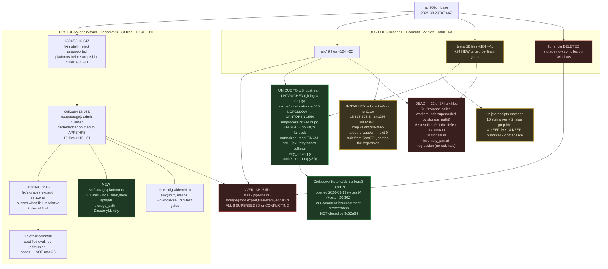

# Map: skillranker (`sr`) framework, our fork, and the 12 jev receipts

**Date:** 2026-09-20 · **Level:** `[receipt]` · **Mode:** read-only inventory (no build, no merge, no branch change, no push)
**Fork clone:** `/Users/josh/Developer/skillranker-mac` — worktree on branch `probe-upstream` @ `0e61cc6` (= `origin/main`); our port lives on `refs/heads/main` @ `8cca771`, never checked out during this pass.
**Upstream:** `Dicklesworthstone/skillranker` (MIT + OpenAI/Anthropic rider).

---

## 1. Commands run (re-derivable by a stranger)

```bash
SR=/Users/josh/Developer/skillranker-mac

# --- topology ---
git -C $SR for-each-ref --format='%(refname) %(objectname:short)' refs/heads refs/remotes
git -C $SR merge-base 8cca771 origin/main                  # -> abf909d1e0106be…
git -C $SR merge-base --is-ancestor abf909d 8cca771; echo $?   # -> 0

# --- timeline (UTC) ---
for c in abf909d 6394f33 9c52a64 8119163 0e61cc6 8cca771; do
  TZ=UTC git -C $SR log -1 --date=iso-local --format='%h %ad %an %s' $c
done

# --- divergence size ---
git -C $SR diff --numstat abf909d 8cca771      | awk '{a+=$1;d+=$2;n++} END{print n" +"a" -"d}'
git -C $SR diff --numstat abf909d 8cca771 -- src/   | awk '{a+=$1;d+=$2;n++} END{print n" +"a" -"d}'
git -C $SR diff --numstat abf909d 8cca771 -- tests/ | awk '{a+=$1;d+=$2;n++} END{print n" +"a" -"d}'
git -C $SR diff --numstat abf909d origin/main  | awk '{a+=$1;d+=$2;n++} END{print n" +"a" -"d}'

# --- WHICH FILES OVERLAP ---
git -C $SR diff --name-only abf909d 8cca771     | sort > /tmp/sr-ours.txt
git -C $SR diff --name-only abf909d origin/main | sort > /tmp/sr-upstream.txt
comm -23 /tmp/sr-ours.txt /tmp/sr-upstream.txt   # ours only   -> 21
comm -13 /tmp/sr-ours.txt /tmp/sr-upstream.txt   # upstream only-> 27
comm -12 /tmp/sr-ours.txt /tmp/sr-upstream.txt   # OVERLAP      ->  6

# --- the core divergence, all three revisions ---
for r in abf909d 8cca771 origin/main; do
  echo "== $r"; git -C $SR show $r:src/lib.rs | grep -n -B1 'pub mod storage'
done
git -C $SR diff 8cca771 origin/main -- src/lib.rs

# --- which upstream commits touch macOS/storage ---
git -C $SR log --oneline --no-decorate abf909d..origin/main -- src/storage install.sh src/lib.rs

# --- upstream's replacement module, and what it did NOT fix ---
git -C $SR show origin/main:src/storage/platform.rs
git -C $SR grep -n 'SQLITE_OPEN_NOFOLLOW' origin/main -- src/
git -C $SR log --oneline abf909d..origin/main -- src/subprocess.rs src/cache/coordination.rs  # empty

# --- how each side moved the cfg needle in tests ---
git -C $SR diff abf909d 8cca771 -- tests/ | rg '^\+.*#\[cfg\(' | sort | uniq -c | sort -rn
git -C $SR show 9c52a64 -- tests/ | rg '^[-+].*cfg\(target_os'

# --- our fork's unexplained edit ---
git -C $SR show origin/main:src/context/signals.rs | grep -n inventory_partial
git -C $SR show 8cca771:src/context/signals.rs     | grep -n inventory_partial

# --- installed binary ---
command -v sr; sr --version
cmp ~/.local/bin/sr /tmp/sr-mac-target/release/sr; echo "cmp exit=$?"
shasum -a 256 ~/.local/bin/sr /tmp/sr-mac-target/release/sr

# --- jev-side receipts (vgrep exits 3 on zero matches) ---
cd /Users/josh/Developer/jev
ls docs/demos/upstream-repro/ | grep -i skill
./scripts/vgrep.sh -rn '1550\|CANTOPEN\|NOFOLLOW' docs/demos/upstream-repro/   # exit 0, 6 hits
gh issue view 3 --repo Dicklesworthstone/skillranker --json number,state,closedAt,comments
```

---

## 2. The measured picture

### 2.1 Divergence size

| | commits | files | +lines | −lines |
|---|---|---|---|---|
| ours `abf909d..8cca771` | **1** | **27** | 308 | 63 |
| — of which `src/` | | 9 | 124 | 22 |
| — of which `tests/` | | 18 | 184 | 41 |
| upstream `abf909d..origin/main` | **17** | **33** | 2548 | 111 |
| **overlap (same file both sides)** | | **6** | | |
| ours only | | 21 | | |
| upstream only | | 27 | | |

### 2.2 The timeline that decides the ruling

| UTC | rev | author | subject |
|---|---|---|---|
| 07:48:04 | `abf909d` | Dicklesworthstone | chore(beads): record sr-gl5j resolved… ← **our base** |
| 16:24:14 | `6394f33` | Dicklesworthstone | fix(install): reject unsupported platforms before acquisition |
| **18:05:28** | `9c52a64` | Dicklesworthstone | **feat(storage): admit a qualified cache/ledger on macOS APFS/HFS** |
| **18:06:16** | `8119163` | Dicklesworthstone | **fix(storage): expand macOS /tmp and /var aliases even when the link is relative** |
| 18:10:15 | `0e61cc6` | Dicklesworthstone | chore(beads): retain allocation proof… ← `origin/main` |
| **18:17:33** | `8cca771` | Josh | macOS port: storage admission by volume name… ← **our fork, 11m17s LATE** |

Upstream shipped its own macOS storage port **11 minutes and 17 seconds before** our port commit landed. Our port was superseded at the instant it was created. Nobody re-fetched.

### 2.3 The core divergence, verified three ways

```
abf909d   src/lib.rs:27   #[cfg(target_os = "linux")]
8cca771   src/lib.rs:27   (blank — cfg DELETED)                       ← ours
origin/m  src/lib.rs:27   #[cfg(any(target_os = "linux", target_os = "macos"))]   ← upstream
```

Ours deletes the gate outright, so `pub mod storage` now compiles on **every** target including Windows, where the module's `nix` descriptor walk (`O_NOFOLLOW`, `fstatfs`, `AtFlags`) has no meaning. Upstream widens the gate by exactly one platform. Upstream's is the correct shape; ours is a strictly wider, unaudited blast radius.

Same divergence in direction shows up in the test suite:

| side | net effect on `target_os` gates in `tests/` |
|---|---|
| ours | **+24 new `target_os = "linux"` gates** (+5 `not(macos/ios)`), i.e. *disabling* coverage on macOS |
| upstream `9c52a64` | **−7 whole-file `#![cfg(target_os = "linux")]`** widened to `any(linux, macos)`, i.e. *enabling* coverage on macOS |

We narrowed; they widened. Our test edits do not merely miss upstream's fix — several of them **pin the broken behaviour as the expected contract** (`cache_identity.rs` asserts `repeat_hit = false` off Linux; `roster_cli.rs` skips snapshot export off Linux).

### 2.4 Upstream's replacement: `src/storage/platform.rs` (new, 110 lines)

One shared module replaces our per-file `#[cfg]` duplication:
- `local_filesystem(&Statfs)` — macOS arm admits **`"apfs" | "hfs"` only**. Ours admitted `apfs, hfs, ufs, exfat, msdos` — **looser**: `exfat`/`msdos` carry no POSIX uid/mode the `trusted_ancestor` walk depends on.
- `storage_path(PathBuf)` — expands only root-owned `/tmp`→`/private/tmp`, `/var`→`/private/var`, verifying symlink + uid 0 + link target (absolute *or* relative, per `8119163`). This is applied **inside the store** (`filesystem.rs:76`, `ledger.rs:1392`, `export.rs:170,239`), which makes every one of our seven test-side `fs::canonicalize()` workarounds unnecessary.
- `DirectoryIdentity = (dev_t, ino_t)` — replaces our `st_dev as u64` casts.

### 2.5 What upstream did **not** fix (our only durable technical content)

`rg`-verified on `origin/main`:

| site | upstream state | our fork |
|---|---|---|
| `src/cache/coordination.rs:645` | `\| OpenFlags::SQLITE_OPEN_NOFOLLOW` — **unconditional** | gated off Apple |
| `src/storage/mod.rs:522` | `\| OpenFlags::SQLITE_OPEN_NOFOLLOW` — **unconditional** | gated off Apple |
| `src/subprocess.rs:344` | `Err(_) => Err(SubprocessError::Cleanup)` — **untouched since base** | `kill(2)` leader fallback |

`git log abf909d..origin/main -- src/subprocess.rs src/cache/coordination.rs` → **empty**. Both files are untouched upstream.

Our evidence for the NOFOLLOW claim is in `skillranker-mac-port-20260920.md:39-40` and `skillranker-lifecycle-20260920.md:46-48`: bundled SQLite (`rusqlite = "=0.40.2"`, features `["bundled", …]`) returns **CANTOPEN 1550** with `SQLITE_OPEN_NOFOLLOW` on Apple; isolated with a 10-line rusqlite probe (NOFOLLOW FAIL, plain OK). If that holds, **upstream's macOS port compiles but cannot open its own cache or ledger at runtime** — and `9c52a64` does not mention the flag.

### 2.6 The installed binary

```
command -v sr            -> /Users/josh/.local/bin/sr        (exit 0)
sr --version             -> sr 0.1.0                          (exit 0)
cmp ~/.local/bin/sr /tmp/sr-mac-target/release/sr -> exit 0    (byte-identical)
sha256 (both)            -> 38f023e257ba8fca70052d466cf52745727386fc08a050d1bb19fe75f9481db0
size (both)              -> 15,835,696 bytes
mtimes                   -> build 12:12 MDT, install 12:20 MDT
```

Byte-identical, confirmed. It is built from **`8cca771` (our fork)**, not from the `origin/main` tree currently in the worktree. The installed `sr` therefore carries the looser filesystem allowlist, the `inventory_partial` regression (§3, row 9), and none of upstream's `platform.rs`.

### 2.7 Upstream issue #3

`OPEN`, `closedAt: null`, created 2026-09-19T19:06:15Z by `jwross24`, who had already attached a working native-macOS patch at 20:30Z on 09-19. Our corroboration (`JYeswak`, `issuecomment-5750779980`) is the last substantive comment. Upstream shipped `9c52a64`/`8119163` a day later without closing the issue.

---

## 3. Artifact table

Verdict column: **SUPERSEDED BY UPSTREAM** / **UNIQUE TO US** / **CONFLICTING**.
Disposition: **KEEP** / **DISCARD** / **ALIGN** (= carry to upstream as a comment, not as a fork).

### 3.1 Fork source — 6 overlapping files

| path | what it is | verdict | KEEP/DISCARD/ALIGN | reason |
|---|---|---|---|---|
| `src/lib.rs` | our blanket cfg deletion vs upstream `any(linux,macos)` | CONFLICTING | DISCARD | Verified `git show <rev>:src/lib.rs` all three revs. Ours compiles `storage` on Windows where its `nix` descriptor walk has no meaning; upstream's widens by exactly one audited platform. |
| `src/storage/filesystem.rs` | per-file `#[cfg]` volume-name allowlist `{apfs,hfs,ufs,exfat,msdos}` | SUPERSEDED BY UPSTREAM | DISCARD | `9c52a64` extracts the same logic to `platform::local_filesystem`, admitting `{apfs,hfs}` only. Ours also admits `exfat`/`msdos`, which have no POSIX uid/mode for `trusted_ancestor` — ours is the **less safe** of the two. |
| `src/storage/ledger.rs` | identical duplicated allowlist for the ledger walk | SUPERSEDED BY UPSTREAM | DISCARD | Same `platform::` extraction; upstream removed the duplication we preserved. |
| `src/storage/export.rs` | test-only `TEST_TMP = "/private/tmp"` const | SUPERSEDED BY UPSTREAM | DISCARD | Upstream routes `open_destination_directory` and `export_private_atomic` through `platform::storage_path()` in **production** code (`export.rs:170,239`), so no test-side constant is needed. |
| `src/storage/mod.rs` | (a) no `platform` mod; (b) `SQLITE_OPEN_NOFOLLOW` gated off Apple | CONFLICTING | ALIGN | (a) superseded. (b) is real and **unrefuted**: upstream still has the flag unconditional at `mod.rs:522`. Carry (b) upstream; discard the file. |
| `src/pipeline.rs` | non-Linux `persistent::Store::open` returns `Ok(None)` when the effect gate disabled the cache | CONFLICTING | ALIGN | Upstream instead moved macOS into the *real* `persistent` module, so our stub never runs there. But upstream's stub still reports `UnqualifiedEngine` for `--no-cache` on genuinely unqualified targets (BSD/Windows) — a small honest-reporting fix that still applies. Low value; comment only. |

### 3.2 Fork source — 3 files only we touched

| path | what it is | verdict | KEEP/DISCARD/ALIGN | reason |
|---|---|---|---|---|
| `src/cache/coordination.rs` | drops `SQLITE_OPEN_NOFOLLOW` on Apple; keeps `validate_sqlite_path` pre-check | UNIQUE TO US | **ALIGN** | `git log abf909d..origin/main -- src/cache/coordination.rs` is **empty**; flag still unconditional at `:645`. Backed by an isolated 10-line rusqlite probe (CANTOPEN 1550). **Highest-value upstream comment.** |
| `src/subprocess.rs` | `killpg` EPERM → direct `kill(2)` on the leader before giving up | UNIQUE TO US | **ALIGN** | Upstream untouched since base; `Err(_) => Err(SubprocessError::Cleanup)` still at `:344`. macOS session-isolated children answer EPERM to `killpg`, so upstream leaks a cleanup failure. Second upstream comment. |
| `src/context/signals.rs` | **deletes** the only `result.inventory_partial = false;` (upstream `:267`) | UNIQUE TO US — **defect** | **DISCARD** | `grep -n inventory_partial` on both revs: upstream has assignments at `:183 true`, `:207 true`, `:267 false`; ours has only the two `true`. `gather()` sets it true on entry, so after our edit the flag is **permanently true** for every run that reaches `gather`. No test demands it, the commit subject never mentions it, and this ships in the installed binary. Pure regression. |

### 3.3 Fork tests — 18 files only we touched

| path | what it is | verdict | KEEP/DISCARD/ALIGN | reason |
|---|---|---|---|---|
| `tests/ledger_fencing_contract.rs` | `fs::canonicalize` on the temp ledger dir | SUPERSEDED BY UPSTREAM | DISCARD | `platform::storage_path()` expands `/tmp` inside `PrivateLedgerDirectory::open` (`ledger.rs:1392`); the test no longer needs to pre-canonicalize. |
| `tests/ledger_migration_contract.rs` | same | SUPERSEDED BY UPSTREAM | DISCARD | same mechanism. |
| `tests/ledger_quota_headroom_contract.rs` | same | SUPERSEDED BY UPSTREAM | DISCARD | same mechanism. |
| `tests/ledger_retention_contract.rs` | same | SUPERSEDED BY UPSTREAM | DISCARD | same mechanism. |
| `tests/ledger_schema_contract.rs` | same | SUPERSEDED BY UPSTREAM | DISCARD | same mechanism. |
| `tests/replay_contract.rs` | `fs::canonicalize` on the replay temp dir | SUPERSEDED BY UPSTREAM | DISCARD | `storage_path()` applied in `export.rs:239 open_destination_directory`. |
| `tests/save_case_contract.rs` | `fs::canonicalize` on the workspace root | SUPERSEDED BY UPSTREAM | DISCARD | same export path. |
| `tests/cache_live_reuse.rs` | `store_may_live_under` returns `false` under `cfg!(not(linux))` | CONFLICTING | DISCARD | Hard-codes "no qualified store off Linux". `9c52a64` makes that false on macOS; this would silently pass a test that no longer exercises anything. |
| `tests/cache_identity.rs` | dual expectation tuples: `repeat_hit=false, served=4/6` off Linux | CONFLICTING | DISCARD | **Pins the defect as the contract.** With upstream's store live on macOS the real answer is `(true, 2, 4)`; our version asserts the cache must miss. |
| `tests/rank_acceptance.rs` | +5 `#[cfg(target_os = "linux")]` on cache-dependent acceptance tests | CONFLICTING | DISCARD | Deletes the highest-value acceptance coverage on the exact platform upstream just enabled. |
| `tests/real_rank_coordination.rs` | linux-only gates on coordination tests | CONFLICTING | DISCARD | same; upstream widened `coordination_contract.rs` instead. |
| `tests/trace_continuation.rs` | linux-only gates on pagination tests needing cached responses | CONFLICTING | DISCARD | same. |
| `tests/roster_snapshot.rs` | linux-only gates on snapshot export | CONFLICTING | DISCARD | Upstream's `storage_path()` makes snapshot export work on macOS. |
| `tests/roster_cli.rs` | macOS `~/Library/Application Support/sr` config root **+** linux-only skip of `--snapshot`/`--diff` | CONFLICTING (mixed) | DISCARD | The config-root half is correct and matches `user_config_root`, but it is inseparable here from the snapshot skip, which upstream's fix invalidates. Re-derive the 6-line config-root arm against `origin/main` if it is still needed; do not carry this file. |
| `tests/project_signals.rs` | warm the fake-git exec before the 250 ms measured stage; gate the non-UTF-8 arm off Apple | UNIQUE TO US | ALIGN (weak) | Both observations are true and platform-independent in kind (macOS first-exec assessment latency ~1 s; Apple VFS rejects non-UTF-8 names). Worth a sentence in a comment, not a fork. |
| `tests/authorized_read_contract.rs` | accepts `ReadError::InvalidRelativePath` in the component-swap race; gates the non-UTF-8 round-trip off Apple | UNIQUE TO US | **ALIGN** | `authorized_read` is **not** storage-gated, so this test already runs on macOS at `origin/main` and the EINVAL→`InvalidRelativePath` arm is a live flake upstream has not seen. Third upstream comment candidate. |
| `tests/jev_retry.rs` | atomic counter in the temp-dir name (pid+nanos collide under parallel tests) | UNIQUE TO US | **ALIGN** | Platform-independent real bug in upstream's fixture; nothing to do with macOS. Cheap upstream comment. |
| `tests/fixtures/jev-tls/retry_server.py` | catches `socket.timeout` alongside `TimeoutError` | UNIQUE TO US | **ALIGN** | `socket.timeout` is a distinct class before Python 3.10 and macOS ships 3.9; upstream's happy path raises instead of reporting zero extras. Two-word fix, real portability bug. |

### 3.4 jev-side receipts — 12 files

| path | what it is | verdict | KEEP/DISCARD/ALIGN | reason |
|---|---|---|---|---|
| `docs/demos/upstream-repro/skillranker-lifecycle-20260920.md` (106 L) | end-to-end port narrative; carries the CANTOPEN 1550 probe result at `:46-48` | UNIQUE TO US | **KEEP** | Sole written home of the NOFOLLOW evidence that survives the fork's death. Cited by §2.5. |
| `docs/demos/upstream-repro/skillranker-mac-port-20260920.md` (78 L) | install receipt; duplicate CANTOPEN evidence at `:39-40` | UNIQUE TO US | KEEP | Second independent statement of the probe; also the only record of the install approval. |
| `docs/demos/upstream-repro/skillranker-issue-filed-20260920.md` (24 L) | records `issuecomment-5750779980` on #3 | UNIQUE TO US | KEEP | Audit trail for what we already told upstream; prevents re-filing the same comment. |
| `docs/demos/upstream-repro/skillranker-build-20260920.md` (60 L) | BLOCKED tick at `abf909d` | SUPERSEDED BY UPSTREAM | KEEP (historical) | The block it records is fixed by `9c52a64`. Keep as the dated reason the port started; add no weight to its conclusions. |
| `docs/demos/upstream-repro/skillranker-process-archaeology-20260919.md` (501 L) | deep PROCESS read of public HEAD `6a74cca` | UNIQUE TO US | KEEP | Largest artifact in the slice; about their *method*, not their macOS code — untouched by any of the 17 commits. |
| `docs/demos/upstream-repro/skillranker-process-mirror-20260919.md` (160 L) | "copy the loop, not the corpus"; lands in `work/omp-jev-route/` | UNIQUE TO US | KEEP | Only receipt with a product landing outside this slice. |
| `docs/demos/upstream-repro/skillranker-corpus-measured-20260919.md` (75 L) | their corpus judged 8/10 by `work/skillranker-eval/oracle.mjs` | UNIQUE TO US | KEEP | `[live]` oracle result; independent of the macOS question entirely. |
| `docs/demos/upstream-repro/skillranker-origin-main-20260919.md` (56 L) | build+corpus read at `ba5da08` | SUPERSEDED BY UPSTREAM | KEEP (historical) | Pinned 3 tips back; superseded as a state report, valid as a dated observation. |
| `docs/demos/upstream-repro/skillranker-20260919.md` (205 L) | first run at `3fe85c4`, blocked then Docker | SUPERSEDED BY UPSTREAM | KEEP (historical) | Same. |
| `docs/demos/upstream-repro/skillranker-0bp-native-20260919.md` (47 L) | native build boundary at `4ed4c9b` | SUPERSEDED BY UPSTREAM | KEEP (historical) | Same boundary `9c52a64` moved. |
| `docs/demos/upstream-repro/deep-jev-skills-todo-20260919.md` (135 L) | Muse epic seed, mentions skillranker in passing | — (not in slice) | KEEP | Not a skillranker receipt; matched the filename grep for `skill` only. Owned by another slice. |
| `docs/demos/upstream-repro/sdk-js-and-skills-20260919.md` (60 L) | `typesafe-sdk-js` + `typesafe-ai/skills` clones | — (not in slice) | KEEP | Same: different repos, matched on `skills`. Owned by another slice. |

---

## 4. Flowchart



**DEAD** (red) = 21 of the 27 files our fork touched have no future: 7 superseded workarounds, 6 contract-pinning test edits, 1 unexplained regression, plus the 6 overlapping source files upstream rewrote better. **OVERLAP** and **lib.rs cfg deletion** are dead by the same measurement.

---

## 5. NO-CLAIM

Not checked, on purpose or for lack of authority:

1. **Whether `origin/main` actually builds or passes tests on macOS.** The assignment forbids building. `9c52a64` is asserted to work by its author; §2.5 predicts a *runtime* CANTOPEN 1550 on first cache/ledger open even though it compiles. **Unverified either way.** This is the single most important open question in the slice and the next command to run is `cargo build --locked --release --bin sr` followed by one real `sr rank` on `origin/main`.
2. **Whether the CANTOPEN 1550 probe is still reproducible.** I read it from two jev receipts (`skillranker-mac-port-20260920.md:39`, `skillranker-lifecycle-20260920.md:46`); I did not re-run the 10-line rusqlite probe, and the probe source is not in either receipt.
3. **The 14 non-macOS upstream commits.** `src/evaluation/stratified.rs` (+783), `src/jev/admission.rs` (+155), sampling, install contract, beads — read only as diffstat. No judgement on their correctness or on whether they interact with storage.
4. **`.beads/issues.jsonl`** on either side. Not parsed; bead state for `sr-3nga` ("macOS installer/capability lookup", filed in `1f01b8c`) unknown.
5. **Whether `~/.local/bin/sr` runs correctly.** Only `sr --version` was invoked. No `sr rank`, no `sr roster`, no cache/ledger exercise — so the `inventory_partial` regression and the volume allowlist are proven by source reading, not by observed behaviour.
6. **Provenance of `/tmp/sr-mac-target/`.** `cmp` proves the two files are identical; it does not prove the target dir was produced from a clean `8cca771` tree. No build log was inspected.
7. **The `probe-upstream` worktree's untracked `.slb/`.** Seen in `git status --porcelain`, not opened, not ours to touch.
8. **Anything upstream may have pushed after `0e61cc6`.** No `git fetch` was run in this pass; `origin/main` is as of the clone's last fetch.
9. **License compatibility** of carrying our diffs anywhere. MIT + OpenAI/Anthropic rider noted in a prior receipt, not re-read.
10. **Whether maintainer wants any of this.** #3 is open with a competing patch from `jwross24` already attached; upstream shipped its own fix without using it. Our comments may be equally ignored.

---

## 6. Ruling

**The fork is not worth keeping. Delete `refs/heads/main` @ `8cca771`; the durable artifact is a comment on upstream issue #3.**

Three independent measurements force this:

1. **It was obsolete 11 minutes and 17 seconds before it was written.** Upstream's `9c52a64`+`8119163` landed 18:05:28Z/18:06:16Z; `8cca771` is 18:17:33Z. Every one of the 6 overlapping files was rewritten upstream in the same hour, more cleanly (one shared `platform.rs` vs our per-file `#[cfg]` duplication) and more safely (`{apfs,hfs}` vs our `{apfs,hfs,ufs,exfat,msdos}`).

2. **It moves the codebase the wrong way.** Our `lib.rs` deletes the platform gate entirely; upstream widens it by one audited target. Our tests add **24** `target_os = "linux"` gates while upstream removes **7** whole-file ones. Six of our test files do not merely miss the fix — `cache_identity.rs` and `cache_live_reuse.rs` **assert that the cache must miss on macOS**, which is now false. Merging any of it would re-break what upstream fixed.

3. **It carries an unexplained regression into an installed binary.** `src/context/signals.rs` deletes the only `inventory_partial = false`, so after `gather()` the flag can never clear. No test demanded it, the commit subject does not mention it, and `~/.local/bin/sr` (sha256 `38f023e2…`, `cmp` exit 0) ships it. A fork that silently degrades a privacy/completeness signal is a liability, not an asset.

**What survives, and where it goes.** Exactly five observations are UNIQUE TO US and unrefuted at `origin/main` — verified by `git log abf909d..origin/main -- <path>` returning empty and by `rg` on the tip:

| # | finding | upstream site, still unfixed |
|---|---|---|
| 1 | bundled SQLite + `SQLITE_OPEN_NOFOLLOW` → CANTOPEN 1550 on Apple; the macOS port compiles but may never open its cache or ledger | `src/cache/coordination.rs:645`, `src/storage/mod.rs:522` |
| 2 | macOS session-isolated children answer EPERM to `killpg`; `Err(_) => Err(Cleanup)` leaks a cleanup failure where same-uid `kill(2)` would succeed | `src/subprocess.rs:344` |
| 3 | component-swap race surfaces EINVAL on Apple → `ReadError::InvalidRelativePath`, absent from the accepted set; this test is **not** storage-gated so it runs on macOS today | `tests/authorized_read_contract.rs` |
| 4 | `sr-retry-{pid}-{nanos}` temp dirs collide under parallel tests — platform-independent | `tests/jev_retry.rs` |
| 5 | `socket.timeout` is a distinct class before Python 3.10; macOS ships 3.9, so the happy path raises instead of reporting zero extras | `tests/fixtures/jev-tls/retry_server.py` |

Finding 1 is the load-bearing one: if it holds, `9c52a64` closed the *compile* half of #3 and left the *runtime* half open, which is precisely the kind of thing a comment on an already-open issue is for. Post all five as **one comment on #3** (we already hold `issuecomment-5750779980` there — reply in thread, do not open #4), each with its `origin/main` file:line and the observed errno/error code. **No patch, no PR, no branch** — upstream demonstrably prefers its own implementation and has already declined one attached patch.

Before posting, run the §5 NO-CLAIM item 1 (`cargo build --locked --release --bin sr` on `origin/main`, then one real `sr rank`). If the cache opens cleanly on `origin/main`, finding 1 evaporates and only the four small portability bugs remain — still worth one comment, but no longer urgent.

The installed `~/.local/bin/sr` should be rebuilt from `origin/main` once that build is verified, or removed. Leaving a binary in `PATH` that carries a regression upstream never had is the worst of the three options.

## Ledger line

MAP skillranker — DONE — fork superseded 11m17s before commit; 21/27 files dead; 5 unique findings → one comment on open #3 — NO-CLAIM: did not build `origin/main` on macOS, so the CANTOPEN-1550-still-present hypothesis is unverified at tip.
