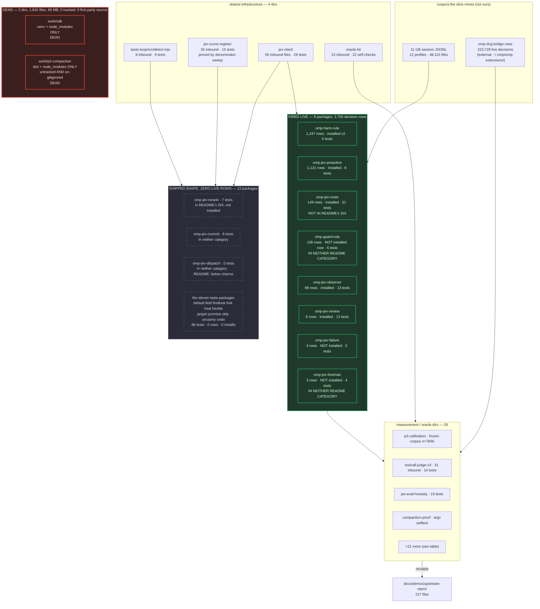

# `work/` slice map — 53 directories, measured

**Date:** 2026-09-20 · **Level:** `[receipt]` · **Tree:** `22f959b` (+8 dirty files at scan time)
· **node:** v22.22.0 · **Scope:** every directory under `work/`. Read-only on code; this file is
the only thing this pass created.

**Headline, in one line.** The README's partition — *"six installable omp packages plus eleven
unpromoted taste packages"* — does not survive measurement. There are **22** `omp-*` packages, not
17. **Five** are in neither README category (`omp-guard-rule`, `omp-jev-commit`,
`omp-jev-dispatch`, `omp-jev-foreman`, `omp-jev-route`), and two of those five have **fired live**
— `omp-jev-route` is the third-largest decision emitter in the whole tree (147 rows) and is
installed in a working profile. Meanwhile two packages *inside* the six (`omp-jev-rerank`,
`omp-jev-failure`) are **not installed anywhere on this machine**.

---

## 1. Exact commands

Every number below came from one of these. All run from the repo root.

```bash
# --- inventory: files, LOC, last commit, appendEntry writers, test files, README
for d in work/*/; do n=$(basename "$d")
  nf=$(find "$d" -type f | wc -l)
  loc=$(find "$d" -type f \( -name '*.mjs' -o -name '*.js' -o -name '*.py' -o -name '*.sh' \) -exec cat {} + 2>/dev/null | wc -l)
  d1=$(git log -1 --format=%cs -- "$d")
  ae=$(rg -l 'appendEntry' "$d" | wc -l)
  t=$(find "$d" -type f -name '*test*' | wc -l)
  printf '%-24s files=%-4s loc=%-6s last=%s appendEntry=%-2s tests=%-2s\n' "$n" "$nf" "$loc" "$d1" "$ae" "$t"
done

# --- tracked vs on-disk (finds the untracked bulk)
for d in work/*/; do n=$(basename "$d")
  tr=$(git ls-files "$d" | wc -l); tot=$(find "$d" -type f | wc -l)
  [ "$tr" != "$tot" ] && echo "$n tracked=$tr total=$tot"
done

# --- INSTALLED anywhere?
ls ~/.omp/profiles/*/agent/extensions/ ~/.omp/agent/extensions/
find ~/.omp -name 'omp-*' -not -path '*/sessions/*'

# --- decision identifiers this repo can emit
rg -oN --no-filename 'com\.zeststream\.[a-zA-Z0-9._-]+' work/ | sort | uniq -c | sort -rn

# --- HAS IT FIRED? the honest count. NOTE the key is "customType", not "type".
#     A bare `com.zeststream.X` grep over sessions counts the agent TALKING about X
#     (11 GB of transcripts discussing this repo) and overstates by ~40x. Proof of shape:
#     grep -o '.\{0,110\}omp-harm-rule.decision.v1.\{0,160\}' <a jev-lab session>.jsonl
#     -> {"type":"custom","customType":"com.zeststream.omp-harm-rule.decision.v1","data":{...}}
for p in ~/.omp/profiles/*/agent/sessions ~/.omp/agent/sessions; do [ -d "$p" ] || continue
  rg -oIN '"customType"\s*:\s*"(com\.zeststream\.[a-zA-Z0-9._-]+)"' -r '$1' "$p" \
    | sort | uniq -c | sort -rn
done

# --- tests, RUN ALONE, per file, pass count read off the RUN (never off a summary)
for f in $(find work -type f -name '*.test.mjs' -not -path '*/node_modules/*' | sort); do
  out=$(node --test "$f" 2>&1); rc=$?                  # rc captured UNPIPED
  p=$(printf '%s' "$out" | sed -n 's/^# pass \([0-9]*\)$/\1/p')
  fl=$(printf '%s' "$out" | sed -n 's/^# fail \([0-9]*\)$/\1/p')
  printf '%-52s rc=%-3s pass=%-4s fail=%-4s\n' "$f" "$rc" "${p:-?}" "${fl:-?}"
done

# --- the two runnables that are NOT node:test files (see trap #2 below)
node work/oracle-kit/test.mjs                       # hand-rolled: 22/22 checks
node work/compaction-proof/oracle-selftest.mjs "$(find ~/.omp/profiles/jev-lab/agent/sessions -name '*.jsonl' -size +100k | head -1)"

# --- inbound references (the DISCARD proof)
for d in work/*/; do n=$(basename "$d")
  rg -lN "work/$n" --glob "!work/$n/**" --glob '!**/node_modules/**' --glob '!**/.venv/**' . | wc -l
done

# --- registry / gate coupling
bash foundation/gates.d/70-tests-registry-sync.sh; echo "RC=$?"
rg -nN 'work/' foundation/gates.d/ scripts/denominator-sweep.sh scripts/selftest-*.sh
scripts/vgrep.sh -n 'omp-guard-rule' TESTS.md   # exits 3 = ZERO MATCHES = inconclusive, not clean

# --- installed-vs-source drift
E=~/.omp/profiles/jev-lab/agent/extensions
cmp -s work/omp-jev-preaction/src/index.ts "$E/omp-jev-preaction.ts" && echo IDENTICAL

# --- corroborating instrument
ripwire work --for="inventory every package under work/: entry points, dead code, unreferenced modules"
```

### Two selector traps this pass hit and defused

1. **`"type"` is not the key.** Counting `"type":"com.zeststream.…"` returns 3 rows for
   `omp-jev-observer` across 11 GB. The real key is `"customType"` (the row is
   `{"type":"custom","customType":"com.zeststream.…","data":{…}}`). A plain text grep for the bare
   identifier returns **3,339-style inflated numbers** because the codex/claude transcripts are
   this repo's own development sessions *discussing* these identifiers. Every fire count in §3 is
   the `customType` count.
2. **`node --test` on a hand-rolled runner lies quietly.** `node --test work/oracle-kit/test.mjs`
   prints `pass=1`. Running it directly prints `oracle-kit: 22/22 checks passed`. And
   `node --test work/compaction-proof/oracle-selftest.mjs` prints `fail=1` — because that file
   takes a session path in `process.argv[2]` and is not a `node:test` file at all. Neither number
   is a test result. Both are reported below as what they are.

---

## 2. Flowchart of the slice



---

## 3. Live fire, measured (`customType` counts, all 12 profiles + the default profile)

Anything not in this table emitted **zero** rows: the scan was unfiltered per profile, so absence
from the histogram is a measured zero, not an unchecked one.

| decision id | claude | codex | jev-lab | default profile | total |
|---|---:|---:|---:|---:|---:|
| `omp-harm-rule.{decision,diagnostic}` | 0 | 66 | 1,181 | 0 | **1,247** |
| `omp-jev-preaction.{decision,diagnostic}` | 0 | 0 | 1,121 | 0 | **1,121** |
| `omp-jev-route.{decision,diagnostic}` | 0 | 0 | 149 | 0 | **149** |
| `omp-guard-rule.{decision,diagnostic}` | 2 | 0 | 2 | 132 | **136** |
| `omp-jev-observer.{decision,diagnostic}` | 0 | 6 | 83 | 0 | **89** |
| `omp-jev-review.{decision,diagnostic}` | 0 | 0 | 6 | 0 | **6** |
| `omp-jev-failure.{decision,diagnostic}` | 0 | 2 | 2 | 0 | **4** |
| `omp-jev-foreman.decision` | 0 | 1 | 2 | 0 | **3** |
| *(external, for scale)* `omp-dcg-bridge.decision` | 50,753 | 139,611 | 76 | 0 | **223,728** |

`omp-jev-route.process.v1` appears in source but has **0** live rows; only
`omp-jev-route.decision.v1` (147) and `.diagnostic.v1` (2) fired.

**Installed right now** (`~/.omp/profiles/*/agent/extensions/`, `~/.omp/agent/extensions/`):

| file | profile | byte-identical to repo source? |
|---|---|---|
| `omp-harm-rule.ts` | `jev-lab`, `codex` | **no** — 48 differing lines; installed 78 lines vs source 110 |
| `omp-jev-observer.ts` | `jev-lab` | **no repo counterpart exists** — repo has `src/observer.mjs` (117 lines), installed is a 109-line `.ts` |
| `omp-jev-preaction.ts` | `jev-lab` | **yes** — the only one |
| `omp-jev-review.ts` | `jev-lab` | **no** — 89 differing lines; 124 installed vs 113 source |
| `omp-jev-route.ts` | `jev-lab` | **no** — 15 differing lines; 111 installed vs 124 source |
| `dcg-guard.ts` | default | external (`dcg install --omp`), not ours |
| `zz-probe.ts`, `zz-probe2.ts`, `zz-route-dbg.ts` | `jev-lab` | debug scaffolds, no repo source |

All five installed copies carry mtime **2026-09-19**; four of five have since drifted from the
repo. **Every live row in the table above was produced by an older build than the one committed.**

---

## 4. The per-directory table

`rows` = live `customType` decision+diagnostic rows. `tests` = pass count from running each
`*.test.mjs` **alone** with `node --test`; `0 fail` everywhere. `in` = files outside the directory
that reference it by path.

| path | what it is | rows | tests | in | last commit | verdict | reason |
|---|---|---:|---:|---:|---|---|---|
| `work/jev-client` | the one typed Jev caller every package shares | – | 29 | 50 | 2026-09-20 | KEEP | highest fan-in in the slice; README names it as the single caller |
| `work/oracle-kit` | scoring/guard primitives (AUC, ECE, decisionLoss, selector guard) | – | 22 checks (hand-rolled; `node --test` says 1) | 23 | 2026-09-20 | KEEP | 23 inbound files; `selector-guard.mjs` is registered in TESTS.md |
| `work/jev-score-register` | append-only score ledger + replay | 0 | 15 | 34 | 2026-09-20 | KEEP | `denominator-sweep.sh` pins `pinned-replay-55` and `pinned-replay-api0` against it |
| `work/taste-loop` | shared `detect.mjs` gates + index for the eleven | 0 | 9 | 8 | 2026-09-20 | KEEP | every taste package imports `src/detect.mjs`; README links it as the index |
| `work/omp-harm-rule` | 4 regexes flagging destructive bash; **no Jev call**; has `install-harm-rule.sh` | 1,247 | 5 | 38 | 2026-09-20 | KEEP | largest first-party emitter; installed in 2 profiles |
| `work/omp-jev-preaction` | deterministic wipe/format/forkbomb logger; no Jev call | 1,121 | 6 | 5 | 2026-09-19 | KEEP | installed **and byte-identical** to source — the only one |
| `work/omp-jev-observer` | observe-and-log seam for `tool_call` | 89 | 13 | 22 | 2026-09-20 | ALIGN | installed `.ts` has **no repo counterpart**; repo ships `src/observer.mjs` |
| `work/omp-jev-route` | turn-level routing advice (never routes) | 149 | 31 | 16 | 2026-09-20 | ALIGN | installed + 3rd-largest emitter, yet **absent from both README lists** |
| `work/omp-jev-review` | diff-review scorer | 6 | 13 | 10 | 2026-09-20 | ALIGN | installed copy drifted 89 lines from source |
| `work/omp-guard-rule` | 3-class epistemic bash scorer, observe-only | 136 | 5 | 2 | 2026-09-20 | ALIGN | fired 132 rows in the default profile, **not installed now**, in neither README list, excluded from the repo's own `census-packages-21` glob, and its test is the one tracked suite TESTS.md never names |
| `work/omp-jev-failure` | multiclass classification of errored tool executions | 4 | 5 | 18 | 2026-09-20 | ALIGN | listed in README's *six installable*, but **installed in zero profiles** |
| `work/omp-jev-rerank` | relevance scoring for 8+-hit grep/glob results | 0 | 7 | 8 | 2026-09-19 | ALIGN | listed in README's *six*; not installed; README already concedes 0 rows |
| `work/omp-jev-foreman` | progress supervision after a local stall trigger | 3 | 4 | 4 | 2026-09-19 | ALIGN | **fired live** yet in neither README category |
| `work/omp-jev-commit` | does the commit message describe the staged diff | 0 | 6 | 11 | 2026-09-19 | ALIGN | in neither README category; `jev-score-register/prove-wired.mjs` drives its real handler |
| `work/omp-jev-dispatch` | scores a subagent dispatch packet | 0 | 0 | 3 | 2026-09-19 | ALIGN | in neither category, **no tests**, 0 rows — but its README records a measured below-chance result, so the evidence is the asset, not the code |
| `work/omp-jev-default` | preselected-default taste scorer | 0 | 8 | 1 | 2026-09-19 | KEEP | one of the eleven; only inbound is `TESTS.md` — by design |
| `work/omp-jev-field` | form-field taste scorer | 0 | 7 | 1 | 2026-09-19 | KEEP | one of the eleven |
| `work/omp-jev-firstlook` | first-screen job-to-be-done scorer | 0 | 8 | 1 | 2026-09-19 | KEEP | one of the eleven |
| `work/omp-jev-fork` | successive copy-variant scorer | 0 | 8 | 1 | 2026-09-19 | KEEP | one of the eleven |
| `work/omp-jev-heat` | attention (not taste) scorer | 0 | 7 | 1 | 2026-09-19 | KEEP | one of the eleven; README flags the category caveat itself |
| `work/omp-jev-heckle` | error/empty/loading copy scorer | 0 | 8 | 4 | 2026-09-19 | KEEP | one of the eleven |
| `work/omp-jev-jargon` | engineering-words-in-UI scorer | 0 | 8 | 1 | 2026-09-19 | KEEP | one of the eleven |
| `work/omp-jev-promise` | headline-vs-CTA scorer | 0 | 9 | 1 | 2026-09-19 | KEEP | one of the eleven |
| `work/omp-jev-skip` | onboarding-exit scorer | 0 | 8 | 1 | 2026-09-19 | KEEP | one of the eleven |
| `work/omp-jev-uncanny` | product-as-observer copy scorer | 0 | 7 | 1 | 2026-09-19 | KEEP | one of the eleven |
| `work/omp-jev-undo` | destructive-UI scorer | 0 | 8 | 1 | 2026-09-19 | KEEP | one of the eleven |
| `work/toolcall-judge-v3` | judge-vs-regex scoring harness on the tool_call corpus | – | 14 | 31 | 2026-09-20 | KEEP | 31 inbound; the corpus behind the harm-rule decision |
| `work/p3-calibration` | frozen tool-call corpus + Python calibration probes | – | 0 | 25 | 2026-09-19 | KEEP | `denominator-sweep.sh` pins `frozen-corpus-7846` and `frozen-iserror-315` against its JSONL |
| `work/jev-eval-honesty` | outcome-join + random-judge + co-presence honesty checks | – | 19 | 5 | 2026-09-19 | KEEP | `joinOutcomes` / `randomBaseline` reused by `jev-persona-eval` |
| `work/jev-real-corpus-eval` | one-command offline scorer over the frozen corpus | – | 10 | 6 | 2026-09-20 | KEEP | scores the pinned n=7846 corpus; package shape mirrors `skillranker-eval` |
| `work/skillranker-eval` | mirrored upstream EVAL CONTRACT harness | – | 12 | 17 | 2026-09-20 | KEEP | 17 inbound; the reusable eval-contract shape |
| `work/compaction-proof` | "needed later" retention oracle + fair oracle + planted-negative selftest | – | selftest needs `argv[2]`; run on a real session → `n=46 real_needed=36 NOISE_needed=0` | 14 | 2026-09-19 | KEEP | 14 inbound; `fair-oracle.mjs:22` holds the preregistered SAVE_BAR/LOSS_BAR |
| `work/jev-retransmit-killer` | CEILING re-beat for compaction, no Jev call | – | 5 | 5 | 2026-09-20 | KEEP | the omniscient-judge arm that bounds the whole compaction claim |
| `work/jev-question-writing` | question-shape passes + trial labels | – | 7 | 8 | 2026-09-19 | KEEP | live-measurement lane for CANDIDATE_QUESTION |
| `work/jev-prevalence-first` | DEGENERATE/WEAK/DISCRIMINATES prevalence check | – | 3 | 4 | 2026-09-20 | KEEP | the base-rate guard every scorer is supposed to clear |
| `work/jev-exec-data` | R44 blanking probe (data-literal suppression) | – | 11 | 2 | 2026-09-20 | KEEP | drives the shipped harm rule via `omp-harm-rule/organic-fires.mjs` |
| `work/jev-persona-eval` | persona adopt-delta mechanics | – | 3 | 2 | 2026-09-20 | KEEP | reuses `jev-eval-honesty`; small but wired |
| `work/jev-dcg-override` | structural test over `OVERRIDE-RULE.md` | – | 3 | 2 | 2026-09-20 | KEEP | the doc *is* the artifact and the test pins its shape |
| `work/dogfood-logger` | JSONL decision log + replay | – | 4 | 6 | 2026-09-19 | KEEP | the logging shape the packages copied |
| `work/jevcache-probe` | measured verification of jevcache memoization | – | 0 | 4 | 2026-09-19 | KEEP | README records a verified positive; 4 inbound docs |
| `work/jev-usage-router` | shadow-first usage router spec + `src/router.mjs` | – | 0 | 8 | 2026-09-19 | KEEP | 7 docs receipts cite it |
| `work/bicameral-gate` | oracle asking whether Jev can gate a tool call | – | 0 | 11 | 2026-09-19 | KEEP | result recorded in `NEGATIVE_EVIDENCE.md`; 11 inbound |
| `work/router-spec` | single-file oracle: does the router's TIER predict turn difficulty | – | 0 | 6 | 2026-09-19 | KEEP | 4 docs receipts cite it; one file, no residue |
| `work/commit-mine` | mines all 1,140 commits into structured rows | – | 0 | 5 | 2026-09-20 | KEEP | falsifier committed first; landed today |
| `work/cass-mail-mines` | thin runner index over 24 CASS/mail approaches | – | 0 | 16 | 2026-09-20 | KEEP | `denominator-sweep.sh` pins `locked-dig-138` against its exports |
| `work/ruling-closure` | STATUS.tsv projection with receipt-digest verification | – | 0 (but `scripts/selftest-ruling-closure.sh`, auto-discovered by `gates.d/80`) | 3 | 2026-09-20 | KEEP | the only `work/` dir a gate stage actually executes |
| `work/guardpack` | "is the guardpack observed?" usage probe | – | 0 | 1 | 2026-09-20 | ALIGN | landed today, only inbound is `omp-guard-rule/guard-rule.ts`; undocumented in README |
| `work/jev-align-probe` | standalone repro of jev-align's flat GEPA objective | – | 0 | 5 | 2026-09-19 | KEEP | upstream-defect repro; 3 docs receipts |
| `work/jev-beads-eval` | 2 data files: `policy.v1.json` + `cases.v1.jsonl` | – | 0 | 2 | 2026-09-19 | KEEP | corpus, not code; cited by `EVAL.md` |
| `work/pysdk` | Python SDK probe (`probe.py`) + `.venv` (427 untracked files) | – | 0 | 13 | 2026-09-19 | ALIGN | 4 tracked files are real and cited by 5 receipts; the 427-file `.venv` is un-gitignored residue |
| `work/p2-localjev` | local Bun Jev-compatible `/v1/systemone` server (**gitignored clone**, 813 files, 32 MB) | – | 3 TS suites, not run here (gitignored, outside first-party scope) | 2 | *(untracked)* | ALIGN | legitimately a clone, correctly gitignored; not first-party |
| `work/p2-compaction` | **`dist/` + `node_modules/` only** — 1,061 files, 60 MB, **0 tracked, 0 first-party source files**, and **not gitignored** | – | 0 first-party | 4 | *(untracked)* | **DISCARD** | `ls -a work/p2-compaction` → `dist node_modules`; `git ls-files work/p2-compaction` → 0; `git check-ignore -q` → **no** (it pollutes `git status`). Superseded by the tracked `compaction/` tree at repo root |
| `work/sdk` | **`.venv/` + `node_modules/` only** — 580 files, 9.1 MB, **0 tracked, 0 first-party source files** | – | 0 first-party | 5 | *(untracked)* | **DISCARD** | `ls -a work/sdk` → `.venv node_modules`; `git ls-files work/sdk` → 0; the 5 "inbound" hits are a path string in `docs/demos/SDK-SURFACE.md` and inside other untracked/gitignored files — no tracked code imports it |

**Group counts, one row per directory, 53 rows total: KEEP 39 · ALIGN 12 · DISCARD 2.**

- **ALIGN (12)** — `omp-jev-observer`, `omp-jev-route`, `omp-jev-review`, `omp-guard-rule`,
  `omp-jev-failure`, `omp-jev-rerank`, `omp-jev-foreman`, `omp-jev-commit`, `omp-jev-dispatch`
  (nine packages whose install / live-fire / README status disagree), plus `guardpack`, `pysdk`,
  `p2-localjev` (three dirs carrying un-gitignored or undocumented residue around real content).
- **DISCARD (2)** — `work/p2-compaction`, `work/sdk`. Both proved with the same three commands:
  `ls -a` shows only dependency/build directories, `git ls-files` returns 0, and no tracked
  first-party file imports them.
- **KEEP (39)** — everything else: 4 shared-infrastructure dirs, the 11 taste packages, 2
  installed-and-in-sync-enough emitters, and 22 measurement/oracle/corpus dirs.

---

## 5. The README partition, verified

Repo claim: *"Six installable omp packages"* + *"Eleven more `omp-jev-*` taste packages"* = 17.

```
$ ls -d work/omp-jev-* work/omp-harm-rule | wc -l
21
$ ls -d work/omp-* | wc -l
22          # the 22nd is omp-guard-rule, which the repo's own census glob cannot see
```

`scripts/denominator-sweep.sh` pins `census-packages-21`, so the repo already knows about 21 and
still describes 17.

| package | README's six | README's eleven | installed | live rows | verdict |
|---|---|---|---|---:|---|
| `omp-harm-rule` | ✓ | | ✓ ×2 | 1,247 | claim holds |
| `omp-jev-preaction` | ✓ | | ✓ | 1,121 | claim holds |
| `omp-jev-observer` | ✓ | | ✓ | 89 | holds; README's "3,339 rows" is the inflated text-grep number, real is **89** |
| `omp-jev-review` | ✓ | | ✓ | 6 | holds (README already says "ran live, never scored") |
| `omp-jev-rerank` | ✓ | | **✗** | **0** | "installable" but installed nowhere |
| `omp-jev-failure` | ✓ | | **✗** | 4 | "installable" but installed nowhere; the 4 rows predate the current tree |
| the eleven taste pkgs | | ✓ | ✗ | 0 | claim holds exactly |
| **`omp-jev-route`** | **✗** | **✗** | **✓** | **149** | **in neither list, yet installed and the 3rd-largest emitter** |
| **`omp-guard-rule`** | **✗** | **✗** | ✗ (was) | **136** | **in neither list, fired 132 rows into the default profile** |
| **`omp-jev-foreman`** | **✗** | **✗** | ✗ | **3** | **in neither list, fired live** |
| **`omp-jev-commit`** | **✗** | **✗** | ✗ | 0 | **in neither list** |
| **`omp-jev-dispatch`** | **✗** | **✗** | ✗ | 0 | **in neither list** (README body documents it as below-chance) |

**Five packages sit in neither category.** Two of the five have fired live.

---

## 6. Two defects found (reported, not fixed)

**D1 — `gates.d/70-tests-registry-sync` has a `.test.mjs` blind spot, and one suite is slipping
through it.** The gate's selector is
`grep -iE '(^|/)(test|tests)/|\.test\.[tj]s$|\.spec\.[tj]s$|_test\.py$|test_.*\.py$|probe.*\.mts$'`.
`.test.mjs` matches **neither** `\.test\.[tj]s$` (that is `ts`/`js`, not `mjs`) nor the `test/`
directory branch when the file sits at package root.

```
$ bash foundation/gates.d/70-tests-registry-sync.sh; echo RC=$?
70-tests-registry-sync: 43 tracked test file(s), all enumerated
RC=0
$ git ls-files | grep -E '\.test\.mjs$' | grep -vE '(^|/)(test|tests)/' | wc -l
18                      # tracked, and invisible to the gate
$ scripts/vgrep.sh -n 'omp-guard-rule' TESTS.md; echo rc=$?
vgrep: ZERO MATCHES for: -n omp-guard-rule TESTS.md
rc=3
```

17 of those 18 are in `TESTS.md` by discipline alone. The 18th,
`work/omp-guard-rule/guard-rule.test.mjs` (tracked; 5 passing tests), is not — and the gate is
green. Widening the selector to `\.test\.[mc]?[tj]s$` closes it.

**D2 — every installed extension except one has drifted from its repo source, so no live row in
§3 was produced by committed code.** `omp-harm-rule` 48 lines apart, `omp-jev-review` 89,
`omp-jev-route` 15; `omp-jev-observer` has no `.ts` source in the tree at all. Only
`omp-jev-preaction` is byte-identical. There is no gate comparing
`~/.omp/profiles/*/agent/extensions/*.ts` to `work/*/src/`.

---

## 7. Slice totals

| measure | value | how |
|---|---:|---|
| directories under `work/` | 53 | `ls -d work/*/ \| wc -l` |
| tracked files under `work/` | 336 | `git ls-files work \| wc -l` |
| files on disk under `work/` | 3,230 | `find work -type f \| wc -l` |
| bytes under `work/` | 162 MB | `du -sh work` |
| of which untracked bulk (`sdk`+`p2-compaction`+`p2-localjev`+`pysdk/.venv`) | 109 MB / 2,885 files | `du -sm work/sdk work/p2-compaction work/p2-localjev work/pysdk` |
| files writing `appendEntry` under `work/` | 57 | `rg -lN 'appendEntry' work/ --glob '!**/node_modules/**' \| wc -l` (repo-wide: 89) |
| `*.test.mjs` files run alone | 46 | all `rc=0` |
| tests passed | **325** | sum of `# pass` per file |
| tests failed | **0** | sum of `# fail` per file |
| first-party live decision rows | 2,755 | §3 `customType` totals excluding `omp-dcg-bridge` |
| packages that have fired live | 8 of 22 | §3 |
| packages installed right now | 5 of 22 | `ls ~/.omp/profiles/*/agent/extensions/` |

---

## 8. NO-CLAIM

Things this pass deliberately did **not** check, and must not be read as clean:

1. **I did not run `foundation/gates.sh`.** I ran exactly one stage alone
   (`70-tests-registry-sync.sh`, read-only) to substantiate D1. The other 12 stages are unmeasured
   by me.
2. **I did not run the three `work/p2-localjev/test/*.ts` suites** (Bun/TS, gitignored clone) nor
   anything under `work/sdk`, `work/p2-compaction`, or `work/pysdk/.venv`. Their pass counts are
   unknown to me, not zero.
3. **I did not run any Python** in `work/p3-calibration` (28 tracked files), `work/jev-align-probe`,
   `work/jev-real-corpus-eval/*.py`, or `work/oracle-kit/*.py`. "0 tests" for those rows means "no
   node test file", not "no verification exists".
4. **I made zero Jev/network calls.** Every `measure.mjs` in the 22 packages is unrun by me; the
   "live-proven" column in the README's six was checked only against session rows, not re-measured.
5. **Row attribution is by decision identifier, not by writer.** `omp-jev-observer`'s
   `tool_call_observed` kind is shared with other writers (the README says so); I counted the
   `customType`, which *is* package-specific, so the 89 is attributable — but I did not verify that
   no third party emits `com.zeststream.omp-jev-observer.*`.
6. **Session scan covers `~/.omp` only.** Rows written to other OMP_HOMEs (e.g. the `/tmp/p3t3/omp`
   used by `toolcall-judge-v3/jev-vs-regex.json`) are not counted. Deleted/rotated sessions are
   invisible.
7. **`git log -1` dates are per-directory last-touch**, not creation dates, and are meaningless for
   the four untracked dirs.
8. **I did not read every README in full** — one per directory, first 6 lines or the entry file's
   top comment. A package whose README contradicts its code deeper down would not show here.
9. **I did not verify the DISCARD pair is unreferenced at runtime**, only that zero tracked
   first-party code references them and that they contain zero tracked files. If something outside
   this repo points at `work/sdk/node_modules`, deleting it breaks that.
10. **8 files were dirty in the working tree at scan time** (including
    `work/omp-guard-rule/guard-rule.{ts,test.mjs}`, modified by a sibling lane). The 5 passing
    guard-rule tests are the *working-tree* version, not `HEAD`.
